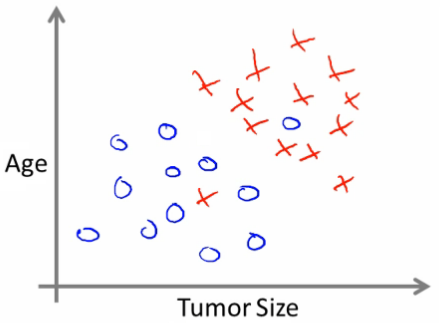
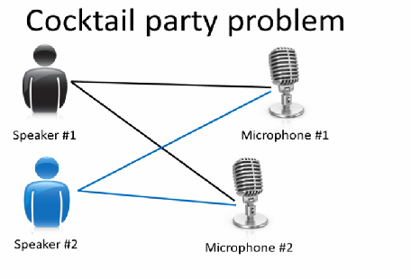

# 01: Introduction

[Next](02_Linear_Regression_with_One_Variable.md) [Index](README.md)

## Introduction to the course

- We will learn about
  - State of the art
  - How to do the implementation
- Applications of machine learning include
  - Search
  - Photo tagging
  - Spam filters
- The AI dream of building machines as intelligent as humans
  - Many people believe best way to do that is mimic how humans learn
- What the course covers
  - Learn about state of the art algorithms
  - But the algorithms and math alone are no good
  - Need to know how to get these to work in problems
- Why is ML so prevalent?
  - Grew out of AI
  - Build intelligent machines
    - You can program a machine how to do some simple thing
      - For the most part hard-wiring AI is too difficult
    - Best way to do it is to have some way for machines to learn things themselves
      - A mechanism for learning - if a machine can learn from input then it does the hard work for you

**_Examples_**

- Database mining
  - Machine learning has recently become so big party because of the huge amount of data being generated
  - Large datasets from growth of automation web
  - Sources of data include
    - Web data (click-stream or click through data)
      - Mine to understand users better
      - Huge segment of silicon valley
    - Medical records
      - Electronic records -> turn records in knowledges
    - Biological data
      - Gene sequences, ML algorithms give a better understanding of human genome
    - Engineering info
      - Data from sensors, log reports, photos etc
- Applications that we cannot program by hand
  - Autonomous helicopter
  - Handwriting recognition
    - This is very inexpensive because when you write an envelope, algorithms can automatically route envelopes through the post
  - Natural language processing (NLP)
    - AI pertaining to language
  - Computer vision
    - AI pertaining vision
- Self customizing programs
  - Netflix
  - Amazon
  - iTunes genius
  - Take users info
    - Learn based on your behavior
- Understand human learning and the brain
  - If we can build systems that mimic (or try to mimic) how the brain works, this may push our own understanding of the associated neurobiology

## What is machine learning?

- Here we...

  - Define what it is
  - When to use it

- Not a well defined definition

  - Couple of examples of how people have tried to define it

- Arthur Samuel (1959)

  - _**Machine learning:**_**"Field of study that gives computers the ability to learn without being explicitly programmed"**
    - Samuels wrote a checkers playing program
      - Had the program play 10000 games against itself
      - Work out which board positions were good and bad depending on wins/losses

- Tom Michel (1999)

  - _**Well posed learning problem:** "_**A computer program is said to learn from experience E with respect to some class of tasks T and performance measure P, if its performance at tasks in T, as measured by P, improves with experience E."**
    - The checkers example,
      - E = 10000s games
      - T is playing checkers
      - P if you win or not

- Several types of learning algorithms

  - **Supervised learning**
    - Teach the computer how to do something, then let it use it;s new found knowledge to do it
  - **Unsupervised learning**
    - Let the computer learn how to do something, and use this to determine structure and patterns in data
  - Reinforcement learning
  - Recommender systems

- This course
  - Look at practical advice for applying learning algorithms
  - Learning a set of tools and **how** to apply them

## Supervised learning - introduction

- Probably the most common problem type in machine learning
- Starting with an example
  - How do we predict housing prices
    - Collect data regarding housing prices and how they relate to size in feet

- **Example problem:** "Given this data, a friend has a house 750 square feet - how much can they be expected to get?"

- What approaches can we use to solve this?

  - Straight line through data
    - Maybe \$150 000
  - Second order polynomial
    - Maybe \$200 000
  - One thing we discuss later - how to chose straight or curved line?
  - Each of these approaches represent a way of doing supervised learning

- _What does this mean?_

  - We gave the algorithm a data set where a "right answer" was provided
  - So we know actual prices for houses
    - The idea is we can learn what makes the price a certain value from the **training data**
    - The algorithm should then produce more right answers based on new training data where we don't know the price already
      - i.e. predict the price

- We also call this a **regression problem**

  - Predict continuous valued output (price)
  - No real discrete delineation

- Another example

  - Can we definer breast cancer as malignant or benign based on tumour size

- Looking at data
  - Five of each
  - Can you estimate prognosis based on tumor size?
  - This is an example of a **classification problem**
    - Classify data into one of two discrete classes - no in between, either malignant or not
    - In classification problems, can have a discrete number of possible values for the output
      - e.g. maybe have four values
        - 0 - benign
        - 1 - type 1
        - 2 - type 2
        - 3 - type 4
- In classification problems we can plot data in a different way

- Use only one attribute (size)
  - In other problems may have multiple attributes
  - We may also, for example, know age and tumor size

- Based on that data, you can try and define separate classes by

  - Drawing a straight line between the two groups
  - Using a more complex function to define the two groups (which we'll discuss later)
  - Then, when you have an individual with a specific tumor size and who is a specific age, you can hopefully use that information to place them into one of your classes

- You might have many features to consider

  - Clump thickness
  - Uniformity of cell size
  - Uniformity of cell shape

- The most exciting algorithms can deal with an infinite number of features

  - How do you deal with an infinite number of features?
  - Neat mathematical trick in support vector machine (which we discuss later)
    - If you have an infinitely long list - we can develop and algorithm to deal with that

- _**Summary**_

  - Supervised learning lets you get the "right" data a
  - Regression problem
  - Classification problem

## Unsupervised learning - introduction

- Second major problem type
- In unsupervised learning, we get unlabeled data
  - Just told - here is a data set, can you structure it
- One way of doing this would be to cluster data into to groups
  - This is a **clustering algorithm**

**Clustering algorithm**

- Example of clustering algorithm

  - Google news
    - Groups news stories into cohesive groups
  - Used in any other problems as well
    - Genomics
    - Microarray data
      - Have a group of individuals
      - On each measure expression of a gene
      - Run algorithm to cluster individuals into types of people  
        
    - Organize computer clusters
      - Identify potential weak spots or distribute workload effectively
    - Social network analysis
      - Customer data
    - Astronomical data analysis
      - Algorithms give amazing results

- Basically

  - Can you automatically generate structure
  - Because we don't give it the answer, it's unsupervised learning

**Cocktail party algorithm**

- Cocktail party problem
  - Lots of overlapping voices - hard to hear what everyone is saying
    - Two people talking
    - Microphones at different distances from speakers

- Record sightly different versions of the conversation depending on where your microphone is
  - But overlapping none the less
- Have recordings of the conversation from each microphone
  - Give them to a cocktail party algorithm
  - Algorithm processes audio recordings
    - Determines there are two audio sources
    - Separates out the two sources
- Is this a very complicated problem
  - Algorithm can be done with one line of code!
  - **\[W,s,v\] = svd((repmat(sum(x.\*x,1), size(x,1),1).\*x)\*x');**
    - Not easy to identify
    - But, programs can be short!
    - Using octave (or MATLAB) for examples
      - Often prototype algorithms in octave/MATLAB to test as it's very fast
      - Only when you show it works migrate it to C++
      - Gives a much faster agile development
- Understanding this algorithm
  - **svd** - linear algebra routine which is built into octave
    - In C++ this would be very complicated!
  - Shown that using MATLAB to prototype is a really good way to do this
