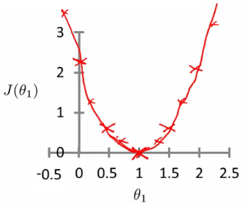
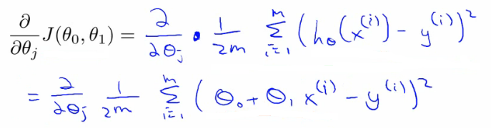

# 02: Linear Regression with One Variable

[Previous](01_Introduction.md) [Next](03_Linear_algebra_review.md) [Index](README.md)

## Linear Regression

- Housing price data example used earlier
  - Supervised learning regression problem
- What do we start with?
  - Training set (this is your data set)
  - Notation (_used throughout the course_)
    - m = number of **training examples**
    - x's = input variables / features
    - y's = output variable "target" variables
      - (x,y) - single training example
      - (xi, yj) \- specific example (ith training example)
        - i is an index to training set

- With our training set defined - how do we used it?
  - Take training set
  - Pass into a learning algorithm
  - Algorithm outputs a function (denoted _h_ ) (h = **hypothesis**)
    - This function takes an input (e.g. size of new house)
    - Tries to output the estimated value of Y
- How do we represent hypothesis _h_ ?
  - Going to present h as;
    - hθ(x) = θ0 + θ1x
      - h(x) (shorthand)

- What does this mean?

  - Means Y is a linear function of x!
  - θi are **parameters**
    - θ0 is zero condition
    - θ1 is gradient

- This kind of function is a linear regression with one variable

  - Also called **univariate linear regression**

- So in summary

  - A hypothesis takes in some variable
  - Uses parameters determined by a learning system
  - Outputs a prediction based on that input

## Linear regression - implementation (cost function)

- A cost function lets us figure out how to fit the best straight line to our data
- Choosing values for θi (parameters)
  - Different values give you different functions
  - If θ0 is 1.5 and θ1 is 0 then we get straight line parallel with X along 1.5 @ y
  - If θ1 is > 0 then we get a positive slope
- Based on our training set we want to generate parameters which make the straight line
  - Chosen these parameters so hθ(x) is close to y for our training examples
    - Basically, uses xs in training set with hθ(x) to give output which is as close to the actual y value as possible
    - Think of hθ(x) as a "y imitator" - it tries to convert the x into y, and considering we already have y we can evaluate how well hθ(x) does this
- To formalize this;
  - We want to want to solve a **minimization problem**
  - Minimize (hθ(x) - y)2
    - i.e. minimize the difference between h(x) and y for each/any/every example
  - Sum this over the training set

- Minimize squared different between predicted house price and actual house price
  - 1/2m
    - 1/m - means we determine the average
    - 1/2m the 2 makes the math a bit easier, and doesn't change the constants we determine at all (i.e. half the smallest value is still the smallest value!)
  - Minimizing θ0/θ1 means we get the values of θ0 and θ1 which find on average the minimal deviation of x from y when we use those parameters in our hypothesis function
- More cleanly, this is a cost function

- And we want to minimize this cost function
  - Our cost function is (because of the summartion term) inherently looking at ALL the data in the training set at any time
- **So to recap**
  - **Hypothesis** - is like your prediction machine, throw in an *x* value, get a putative *y* value  
    
  - **Cost** - is a way to, using your training data, determine values for your θ values which make the hypothesis as accurate as possible  
    
    - This cost function is also called the squared error cost function
      - This cost function is reasonable choice for most regression functions
      - Probably most commonly used function
  - In case J(θ0,θ1) is a bit abstract, going into what it does, why it works and how we use it in the coming sections

**Cost function - a deeper look**

- Lets consider some intuition about the cost function and why we want to use it
  - The cost function determines parameters
  - The value associated with the parameters determines how your hypothesis behaves, with different values generate different
- Simplified hypothesis
  - Assumes θ0 = 0

- Cost function and goal here are very similar to when we have θ0, but with a simpler parameter

  - Simplified hypothesis makes visualizing cost function J() a bit easier

- So hypothesis pass through 0,0

- Two key functins we want to understand

  - hθ(x)
    - Hypothesis is a function of x - function of what the size of the house is
  - J(θ1)
    - Is a function of the parameter of θ1
  - So for example
    - θ1 = 1
    - J(θ1) = 0
  - Plot

    - θ1 vs J(θ1)
    - Data
      - 1)
        - θ1 = 1
        - J(θ1) = 0
      - 2.
        - θ1 = 0.5
        - J(θ1) = ~0.58
      - 3)
        - θ1 = 0
        - J(θ1) = ~2.3

  - If we compute a range of values plot
    - J(θ1) vs θ1 we get a polynomial (looks like a quadratic)  
      

- The optimization objective for the learning algorithm is find the value of θ1 which minimizes J(θ1)

  - So, here θ1 = 1 is the best value for θ1

## A deeper insight into the cost function - simplified cost function

- Assume you're familiar with contour plots or contour figures
  - Using same cost function, hypothesis and goal as previously
  - It's OK to skip parts of this section if you don't understand cotour plots
- Using our original complex hyothesis with two pariables,
  - So cost function is
    - J(θ0, θ1)
- Example,
  - Say
    - θ0 = 50
    - θ1 = 0.06
  - Previously we plotted our cost function by plotting
    - θ1 vs J(θ1)
  - Now we have two parameters
    - Plot becomes a bit more complicated
    - Generates a 3D surface plot where axis are
      - X = θ1
      - Z = θ0
      - Y = J(θ0,θ1)

- We can see that the height (y) indicates the value of the cost function, so find where y is at a minimum

- Instead of a surface plot we can use a **contour figures/plots**

  - Set of ellipses in different colors
  - Each colour is the same value of J(θ0, θ1), but obviously plot to different locations because θ1 and θ0 will vary
  - Imagine a bowl shape function coming out of the screen so the middle is the concentric circles

- Each point (like the red one above) represents a pair of parameter values for θ0 and θ1
  - Our example here put the values at
    - θ0 = ~800
    - θ1 = ~-0.15
  - Not a good fit
    - i.e. these parameters give a value on our contour plot far from the center
  - If we have
    - θ0 = ~360
    - θ1 = 0
    - This gives a better hypothesis, but still not great - not in the center of the countour plot
  - Finally we find the minimum, which gives the best hypothesis
- Doing this by eye/hand is a pain in the ass
  - What we really want is an efficient algorithm fro finding the minimum for θ0 and θ1

## Gradient descent algorithm

- Minimize cost function J
- Gradient descent
  - Used all over machine learning for minimization
- Start by looking at a general J() function
- Problem
  - We have J(θ0, θ1)
  - We want to get **min J(θ0, θ1)**
- Gradient descent applies to more general functions
  - J(θ0, θ1, θ2 .... θn)
  - min J(θ0, θ1, θ2 .... θn)

**How does it work?**

- Start with initial guesses
  - Start at 0,0 (or any other value)
  - Keeping changing θ0 and θ1 a little bit to try and reduce J(θ0,θ1)
- Each time you change the parameters, you select the gradient which reduces J(θ0,θ1) the most possible
- Repeat
- Do so until you converge to a local minimum
- Has an interesting property
  - Where you start can determine which minimum you end up  
    
  - Here we can see one initialization point led to one local minimum
  - The other led to a different one

**A more formal definition**

- Do the following until covergence

- What does this all mean?

  - Update θj by setting it to (θj - α) times the partial derivative of the cost function with respect to θj

- Notation

  - :=
    - Denotes assignment
    - NB a = b is a _truth assertion_
  - α (alpha)
    - Is a number called the **learning rate**
    - Controls how big a step you take
      - If α is big have an aggressive gradient descent
      - If α is small take tiny steps

- Derivative term  
  

  - Not going to talk about it now, derive it later

- There is a subtly about how this gradient descent algorithm is implemented

  - Do this for θ0 and θ1
  - For j = 0 and j = 1 means we **simultaneously** update both
  - How do we do this?
    - Compute the right hand side for both θ0 and θ1
      - So we need a temp value
    - Then, update θ0 and θ1 at the same time
    - We show this graphically below

- If you implement the non-simultaneous update it's not gradient descent, and will behave weirdly
  - But it might look sort of right - so it's important to remember this!

**Understanding the algorithm**

- To understand gradient descent, we'll return to a simpler function where we minimize one parameter to help explain the algorithm in more detail

  - min θ1 J(θ1) where θ1 is a real number

- Two key terms in the algorithm

  - Alpha
  - Derivative term

- Notation nuances

  - Partial derivative vs. derivative
    - Use partial derivative when we have multiple variables but only derive with respect to one
    - Use derivative when we are deriving with respect to all the variables

- Derivative term  
  

  - Derivative says
    - Lets take the tangent at the point and look at the slope of the line
    - So moving towards the mimum (down) will greate a negative derivative, alpha is always positive, so will update j(θ1) to a smaller value
    - Similarly, if we're moving up a slope we make j(θ1) a bigger numbers

- Alpha term (α)

  - What happens if alpha is too small or too large
  - Too small
    - Take baby steps
    - Takes too long
  - Too large
    - Can overshoot the minimum and fail to converge

- When you get to a local minimum

  - Gradient of tangent/derivative is 0
  - So derivative term = 0
  - alpha \* 0 = 0
  - So θ1 = θ1\- 0
  - So θ1 remains the same

- As you approach the global minimum the derivative term gets smaller, so your update gets smaller, even with alpha is fixed

  - Means as the algorithm runs you take smaller steps as you approach the minimum
  - So no need to change alpha over time

## Linear regression with gradient descent

- Apply gradient descent to minimize the squared error cost function J(θ0, θ1)
- Now we have a partial derivative

- So here we're just expanding out the first expression
  - J(θ0, θ1) = 1/2m....
  - hθ(x) = θ0 + θ1\*x
- So we need to determine the derivative for each parameter - i.e.
  - When j = 0
  - When j = 1
- Figure out what this partial derivative is for the θ0 and θ1 case
  - When we derive this expression in terms of j = 0 and j = 1 we get the following

- To check this you need to know multivariate calculus
  - So we can plug these values back into the gradient descent algorithm
- How does it work
  - Risk of meeting different local optimum
  - The linear regression cost function is always a **convex function** \- always has a single minimum
    - Bowl shaped
    - One global optima
      - So gradient descent will always converge to global optima
  - In action
    - Initialize values to
      - θ0 = 900
      - θ1 = -0.1

- End up at a global minimum
- This is actually **Batch Gradient Descent**
  - Refers to the fact that over each step you look at all the training data
    - Each step compute over m training examples
  - Sometimes non-batch versions exist, which look at small data subsets
    - We'll look at other forms of gradient descent (to use when m is too large) later in the course
- There exists a numerical solution for finding a solution for a minimum function
  - **Normal equations** method
  - Gradient descent scales better to large data sets though
  - Used in lots of contexts and machine learning

**What's next - important extensions**  
_Two extension to the algorithm_

- **1) Normal equation for numeric solution**
  - To solve the minimization problem we can solve it \[ min J(θ0, θ1) \] exactly using a numeric method which avoids the iterative approach used by gradient descent
  - Normal equations method
  - Has advantages and disadvantages
    - Advantage
      - No longer an alpha term
      - Can be much faster for some problems
    - Disadvantage
      - Much more complicated
  - We discuss the normal equation in the **linear regression with multiple features** section
- **2) We can learn with a larger number of features**
  - So may have other parameters which contribute towards a prize
    - e.g. with houses
      - Size
      - Age
      - Number bedrooms
      - Number floors
    - x1, x2, x3, x4
  - With multiple features becomes hard to plot
    - Can't really plot in more than 3 dimensions
    - Notation becomes more complicated too
      - Best way to get around with this is the notation of linear algebra
      - Gives notation and set of things you can do with matrices and vectors
      - e.g. Matrix

- We see here this matrix shows us
  - Size
  - Number of bedrooms
  - Number floors
  - Age of home
- All in one variable
  - Block of numbers, take all data organized into one big block
- Vector
  - Shown as _y_
  - Shows us the prices
- Need linear algebra for more complex linear regression modles
- Linear algebra is good for making computationally efficient models (as seen later too)
  - Provide a good way to work with large sets of data sets
  - Typically vectorization of a problem is a common optimization technique
