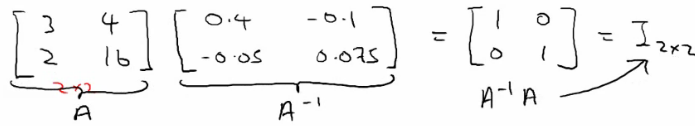

# 03: Linear Algebra - Review

[Previous](02_Linear_Regression_with_One_Variable.md) [Next](04_Linear_Regression_with_multiple_variables.md) [Index](README.md)

## Matrices - overview

- Rectangular array of numbers written between square brackets
  - 2D array
  - Named as capital letters (A,B,X,Y)
- Dimension of a matrix are \[Rows x Columns\]

  - Start at top left
  - To bottom left
  - To bottom right
  - R\[r x c\]means a matrix which has r rows and c columns  
    
    - Is a \[4 x 2\] matrix

- Matrix elements
  - A(i,j) = entry in ith row and jth column

- Provides a way to organize, index and access a lot of data

## Vectors - overview

- Is an n by 1 matrix
  - Usually referred to as a lower case letter
  - n rows
  - 1 column
  - e.g.

- Is a 4 dimensional vector
  - Refer to this as a vector R4
- Vector elements
  - vi = ith element of the vector
  - Vectors can be 0-indexed (C++) or 1-indexed (MATLAB)
  - In math 1-indexed is most common
    - But in machine learning 0-index is useful
  - Normally assume using 1-index vectors, but be aware sometimes these will (explicitly) be 0 index ones

## Matrix manipulation

- **_Addition_**
  - Add up elements one at a time
  - Can only add matrices of the _same dimensions_
    - Creates a new matrix of the same dimensions of the ones added

- **_Multiplication by scalar_**
  - Scalar = real number
  - Multiply each element by the scalar
  - Generates a matrix of the same size as the original matrix

- **_Division by a scalar_**
  - Same as multiplying a matrix by 1/4
  - Each element is divided by the scalar
- **_Combination of operands_**
  - Evaluate multiplications first

- **Matrix by vector multiplication**
  - \[3 x 2\] matrix \* \[2 x 1\] vector
    - New matrix is \[3 x 1\]
      - More generally if \[a x b\] \* \[b x c\]
        - Then new matrix is \[a x c\]
    - How do you do it?
      - Take the two vector numbers and multiply them with the first row of the matrix
        - Then add results together - this number is the first number in the new vector
      - The multiply second row by vector and add the results together
      - Then multiply final row by vector and add them together

- Detailed explanation
  - A \* x = y
    - A is m x n matrix
    - x is n x 1 matrix
    - n must match between vector and matrix
      - i.e. inner dimensions must match
    - Result is an m-dimensional vector
  - To get yi - multiply A's ith row with all the elements of vector x and add them up
- Neat trick

  - Say we have a data set with four values
  - Say we also have a hypothesis hθ(x) = -40 + 0.25x
    - Create your data as a matrix which can be multiplied by a vector
    - Have the parameters in a vector which your matrix can be multiplied by
  - Means we can do
    - Prediction = Data Matrix \* Parameters  
      
    - Here we add an extra column to the data with 1s - this means our θ0 values can be calculated and expressed

- The diagram above shows how this works

  - This can be far more efficient computationally than lots of for loops
  - This is also easier and cleaner to code (assuming you have appropriate libraries to do matrix multiplication)

- **_Matrix-matrix multiplication_**

  - General idea
    - Step through the second matrix one column at a time
    - Multiply each column vector from second matrix by the entire first matrix, each time generating a vector
    - The final product is these vectors combined (not added or summed, but literally just put together)
  - Details
    - A x B = C
      - A = \[m x n\]
      - B = \[n x o\]
      - C = \[m x o\]
        - With vector multiplications o = 1
    - Can only multiply matrix where columns in A match rows in B
  - Mechanism
    - Take column 1 of B, treat as a vector
    - Multiply A by that column - generates an \[m x 1\] vector
    - Repeat for each column in B
      - There are o columns in B, so we get o columns in C
  - Summary
    - _The ith column of matrix C is obtained by multiplying A with the ith column of B_
  - Start with an example
  - A x B

- Initially
  - Take matrix A and multiply by the first column vector from B
  - Take the matrix A and multiply by the second column vector from B

- 2 x 3 times 3 x 2 gives you a 2 x 2 matrix

## Implementation/use

- House prices, but now we have three hypothesis and the same data set
- To apply all three hypothesis to all data we can do this efficiently using matrix-matrix multiplication
  - Have
    - Data matrix
    - Parameter matrix
  - Example
    - Four houses, where we want to predict the prize
    - Three competing hypotheses
    - Because our hypothesis are one variable, to make the matrices match up we make our data (houses sizes) vector into a 4x2 matrix by adding an extra column of 1s

- What does this mean
  - Can quickly apply three hypotheses at once, making 12 predictions
  - Lots of good linear algebra libraries to do this kind of thing very efficiently

## Matrix multiplication properties

- Can pack a lot into one operation
  - However, should be careful of how you use those operations
  - Some interesting properties
- **Commutativity**

  - When working with raw numbers/scalars multiplication is commutative
    - 3 \* 5 == 5 \* 3
  - This is not true for matrix
    - A x B != B x A
    - **Matrix multiplication is not commutative**

- **Associativity**
  - 3 x 5 x 2 == 3 x 10 = 15 x 2
    - Associative property
  - **Matrix multiplications is associative**
    - A x (B x C) == (A x B) x C
- **Identity matrix**

  - 1 is the identity for any scalar

    - i.e. 1 x z = z
      - for any real number

  - In matrices we have an identity matrix called _I_

    - Sometimes called _I{n x n}_

      

- See some identity matrices above

  - Different identity matrix for each set of dimensions
  - Has
    - 1s along the diagonals
    - 0s everywhere else
  - 1x1 matrix is just "1"

- Has the property that any matrix A which can be multiplied by an identity matrix gives you matrix A back
  - So if A is \[m x n\] then
    - A \* I
      - I = n x n
    - I \* A
      - I = m x m
    - (To make inside dimensions match to allow multiplication)
- Identity matrix dimensions are implicit
- Remember that matrices are not commutative AB != BA
  - Except when B is the identity matrix
  - Then AB == BA

## Inverse and transpose operations

- **Matrix inverse**
- How does the concept of "the inverse" relate to real numbers?

  - 1 = "identity element" (as mentioned above)
    - Each number has an inverse
      - This is the number you multiply a number by to get the identify element
      - i.e. if you have x, x \* 1/x = 1
  - e.g. given the number 3
    - 3 \* 3-1 = 1 (the identity number/matrix)
  - In the space of real numbers **not everything has an inverse**
    - e.g. 0 does not have an inverse
  - What is the inverse of a matrix
    - If A is an m x m matrix, then A inverse = A-1
    - So A\*A-1 = _I_
    - Only matrices which are m x m have inverses
      - Square matrices only!
  - Example
    - 2 x 2 matrix  
      
    - How did you find the inverse
      - Turns out that you can sometimes do it by hand, although this is very hard
      - Numerical software for computing a matrices inverse
        - Lots of open source libraries
  - If A is all zeros then there is no inverse matrix
    - Some others don't, intuition should be matrices that don't have an inverse are a singular matrix or a degenerate matrix (i.e. when it's too close to 0)
    - So if all the values of a matrix reach zero, this can be described as reaching singularity

- **Matrix transpose**
  - Have matrix A (which is \[n x m\]) how do you change it to become \[m x n\] while keeping the same values
    - i.e. swap rows and columns!
  - How you do it;
    - Take first row of A - becomes 1st column of A_T_
    - Second row of A - becomes 2nd column...
  - A is an m x n matrix
    - B is a transpose of A
    - Then B is an n x m matrix
    - A(i,j) = B(j,i)

