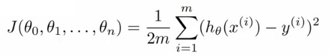
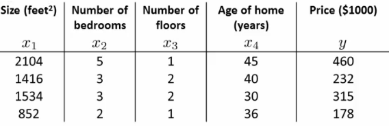

# 04: Linear Regression with Multiple Variables

[Previous](03_Linear_algebra_review.md) [Next](05_Octave.md) [Index](README.md)

## Linear regression with multiple features

_New version of linear regression with multiple features_

- Multiple variables = multiple features
- In original version we had
  - X = house size, use this to predict
  - y = house price
- If in a new scheme we have more variables (such as number of bedrooms, number floors, age of the home)
  - x1, x2, x3, x4 are the four features
    - x1 - size (feet squared)
    - x2 - Number of bedrooms
    - x3 - Number of floors
    - x4 - Age of home (years)
  - y is the output variable (price)
- More notation
  - **n**
    - number of features (n = 4)
  - **m**
    - number of examples (i.e. number of rows in a table)
  - **xi**
    - vector of the input for an example (so a vector of the four parameters for the ith input example)
    - i is an index into the training set
    - So
      - x is an n-dimensional feature vector
      - x3 is, for example, the 3rd house, and contains the four features associated with that house
  - **xji**
    - The value of feature j in the ith training example
    - So
      - x23 is, for example, the number of bedrooms in the third house
- Now we have multiple features
  - What is the form of our hypothesis?
  - Previously our hypothesis took the form;
    - hθ(x) = θ0 + θ1x
      - Here we have two parameters (theta 1 and theta 2) determined by our cost function
      - One variable x
  - Now we have multiple features
    - hθ(x) = θ0 + θ1x1 + θ2x2 + θ3x3 + θ4x4
  - For example
    - hθ(x) = 80 + 0.1x1 \+ 0.01x2 \+ 3x3 - 2x4
      - An example of a hypothesis which is trying to predict the price of a house
      - Parameters are still determined through a cost function
  - For convenience of notation, x0 = 1
    - For every example i you have an additional 0th feature for each example
    - So now your **feature vector** is n + 1 dimensional feature vector indexed from 0
      - This is a column vector called x
      - Each example has a column vector associated with it
      - So let's say we have a new example called "X"
    - **Parameters** are also in a 0 indexed n+1 dimensional vector
      - This is also a column vector called θ
      - This vector is the same for each example
  - Considering this, hypothesis can be written
    - hθ(x) = θ0x0 + θ1x1 + θ2x2 + θ3x3 + θ4x4
  - If we do
    - hθ(x) =θ_T_ X
      - θ_T_ is an \[1 x n+1\] matrix
      - In other words, because θ is a column vector, the transposition operation transforms it into a row vector
      - So before
        - θ was a matrix \[n+1 x 1\]
      - Now
        - θ_T_ is a matrix \[1 x n+1\]
      - Which means the inner dimensions of θ_T_ and X match, so they can be multiplied together as
        - \[1 x n+1\] \* \[n+1 x 1\]
        - = hθ(x)
        - So, in other words, the transpose of our parameter vector \* an input example X gives you a predicted hypothesis which is \[1 x 1\] dimensions (i.e. a single value)
    - This x0 = 1 lets us write this like this
  - This is an example of multivariate linear regression

## Gradient descent for multiple variables

- Fitting parameters for the hypothesis with gradient descent
  - Parameters are θ0 to θn
  - Instead of thinking about this as n separate values, think about the parameters as a single vector (θ)
    - Where θ is n+1 dimensional
- Our cost function is

- Similarly, instead of thinking of J as a function of the n+1 numbers, J() is just a function of the parameter vector
  - J(θ)
- **Gradient descent**

- Once again, this is
  - θj = θj - learning rate (α) times the partial derivative of J(θ) with respect to θJ(...)
  - We do this through a **simultaneous update** of every θj value
- Implementing this algorithm
  - When n = 1

- Above, we have slightly different update rules for θ0 and θ1
  - Actually they're the same, except the end has a previously undefined x0(i) as 1, so wasn't shown
- We now have an almost identical rule for multivariate gradient descent

- What's going on here?

  - We're doing this for each j (0 until n) as a simultaneous update (like when n = 1)

  - So, we re-set θj to

    - θj minus the learning rate (α) times the partial derivative of of the θ vector with respect to θj
    - In non-calculus words, this means that we do
      - Learning rate
      - Times 1/m (makes the maths easier)
      - Times the sum of
        - The hypothesis taking in the variable vector, minus the actual value, times the j-th value in that variable vector for EACH example

  - It's important to remember that

    

- These algorithm are highly similar

## Gradient Decent in practice: 1 Feature Scaling

- Having covered the theory, we now move on to learn about some of the practical tricks
- Feature scaling
  - If you have a problem with multiple features
  - You should make sure those features have a similar scale
    - Means gradient descent will converge more quickly
  - e.g.
    - x1 = size (0 - 2000 feet)
    - x2 = number of bedrooms (1-5)
    - Means the contours generated if we plot θ1 vs. θ2 give a very tall and thin shape due to the huge range difference
  - Running gradient descent on this kind of cost function can take a long time to find the global minimum

- Pathological input to gradient descent
  - So we need to rescale this input so it's more effective
  - So, if you define each value from x1 and x2 by dividing by the max for each feature
  - Contours become more like circles (as scaled between 0 and 1)
- May want to get everything into -1 to +1 range (approximately)
  - Want to avoid large ranges, small ranges or very different ranges from one another
  - Rule a thumb regarding acceptable ranges
    - \-3 to +3 is generally fine - any bigger bad
    - \-1/3 to +1/3 is ok - any smaller bad
- Can do **mean normalization**
  - Take a feature xi
    - Replace it by (xi - mean)/max
    - So your values all have an average of about 0

- Instead of max can also use standard deviation

## Learning Rate α

- Focus on the learning rate (α)
- Topics
  - Update rule
  - Debugging
  - How to chose α

**Make sure gradient descent is working**

- Plot min J(θ) vs. no of iterations

  - (i.e. plotting J(θ) over the course of gradient descent

- If gradient descent is working then J(θ) should decrease after every iteration
- Can also show if you're not making huge gains after a certain number

  - Can apply heuristics to reduce number of iterations if need be
  - If, for example, after 1000 iterations you reduce the parameters by nearly nothing you could chose to only run 1000 iterations in the future
  - Make sure you don't accidentally hard-code thresholds like this in and then forget about why they're their though!

- 

  - Number of iterations varies a lot
    - 30 iterations
    - 3000 iterations
    - 3000 000 iterations
    - Very hard to tel in advance how many iterations will be needed
    - Can often make a guess based a plot like this after the first 100 or so iterations
  - Automatic convergence tests
    - Check if J(θ) changes by a small threshold or less
      - Choosing this threshold is hard
      - So often easier to check for a straight line
        - Why? - Because we're seeing the straightness in the context of the whole algorithm
        - Could you design an automatic checker which calculates a threshold based on the systems preceding progress?
  - Checking its working
    - If you plot J(θ) vs iterations and see the value is increasing - means you probably need a smaller α
      - Cause is because your minimizing a function which looks like this

  

  - But you overshoot, so reduce learning rate so you actually reach the minimum (green line)

  

  - So, use a smaller α

- Another problem might be if J(θ) looks like a series of waves

  - Here again, you need a smaller α

- However
  - If α is small enough, J(θ) will decrease on every iteration
  - BUT, if α is too small then rate is too slow
    - A less steep incline is indicative of a slow convergence, because we're decreasing by less on each iteration than a steeper slope
- Typically
  - Try a range of alpha values
  - Plot J(θ) vs number of iterations for each version of alpha
  - Go for roughly threefold increases
    - 0.001, 0.003, 0.01, 0.03. 0.1, 0.3

## Features and polynomial regression

- Choice of features and how you can get different learning algorithms by choosing appropriate features
- Polynomial regression for non-linear function

- Example
  - House price prediction
    - Two features
      - Frontage - width of the plot of land along road (x1)
      - Depth - depth away from road (x2)
  - You don't have to use just two features
    - **Can create new features**
  - Might decide that an important feature is the land area
    - So, create a new feature = frontage \* depth (x3)
    - h(x) = θ0 + θ1x3
      - Area is a better indicator
  - Often, by defining new features you may get a better model
- Polynomial regression
  - May fit the data better
  - θ0 + θ1x + θ2x2 e.g. here we have a quadratic function
  - For housing data could use a quadratic function
    - But may not fit the data so well - inflection point means housing prices decrease when size gets really big
    - So instead must use a cubic function

- How do we fit the model to this data
  - To map our old linear hypothesis and cost functions to these polynomial descriptions the easy thing to do is set
    - x1 = x
    - x2 = x2
    - x3 = x3
  - By selecting the features like this and applying the linear regression algorithms you can do polynomial linear regression
  - Remember, feature scaling becomes even more important here
- Instead of a conventional polynomial you could do variable ^(1/something) - i.e. square root, cubed root etc
- Lots of features - later look at developing an algorithm to chose the best features

## Normal equation

- For some linear regression problems the normal equation provides a better solution
- So far we've been using gradient descent
  - Iterative algorithm which takes steps to converse
- Normal equation solves θ analytically
  - Solve for the optimum value of theta
- Has some advantages and disadvantages

**How does it work?**

- Simplified cost function
  - J(θ) = aθ2 \+ bθ + c
    - θ is just a real number, not a vector
  - Cost function is a quadratic function
  - How do you minimize this?
    - Do
      - 
        - Take derivative of J(θ) with respect to θ
        - Set that derivative equal to 0
        - Allows you to solve for the value of θ which minimizes J(θ)
- In our more complex problems;
  - Here θ is an n+1 dimensional vector of real numbers
  - Cost function is a function of the vector value
    - How do we minimize this function
      - Take the partial derivative of J(θ) with respect θj and set to 0 for every j
      - Do that and solve for θ0 to θn
      - This would give the values of θ which minimize J(θ)
  - If you work through the calculus and the solution, the derivation is pretty complex
    - Not going to go through here
    - Instead, what do you need to know to implement this process

**Example of normal equation**

- Here
  - m = 4
  - n = 4
- To implement the normal equation

  - Take examples

  - Add an extra column (x0 feature)

  - Construct a matrix (X - **the design matrix**) which contains all the training data features in an \[m x n+1\] matrix

  - Do something similar for y

    - Construct a column vector y vector \[m x 1\] matrix

  - Using the following equation (X transpose \* X) inverse times X transpose y

    

- If you compute this, you get the value of theta which minimize the cost function

**General case**

- Have m training examples and n features

  - The design matrix (X)

    - Each training example is a n+1 dimensional feature column vector
    - X is constructed by taking each training example, determining its transpose (i.e. column -> row) and using it for a row in the design A
    - This creates an \[m x (n+1)\] matrix

  - **Vector y**
    - Used by taking all the y values into a column vector

- What is this equation?!
  - (X_T_ \* X)\-1
    - What is this --> the inverse of the matrix (X_T_ \* X)
      - i.e. A = X_T_ X
      - A\-1 = (X_T_ \* X)\-1
- In octave and MATLAB you could do;

  **pinv(X'\*x)\*x'\*y**

  - X' is the notation for X transpose
  - pinv is a function for the inverse of a matrix

- In a previous lecture discussed feature scaling

  - If you're using the normal equation then no need for feature scaling

**When should you use gradient descent and when should you use feature scaling?**

- **_Gradient descent_**
  - Need to chose learning rate
  - Needs many iterations - could make it slower
  - Works well even when *n* is massive (millions)
    - Better suited to big data
    - What is a big *n* though
      - 100 or even a 1000 is still (relativity) small
      - If n is 10 000 then look at using gradient descent
- **_Normal equation_**
  - No need to chose a learning rate
  - No need to iterate, check for convergence etc.
  - Normal equation needs to compute  (X_T_ X)\-1
    - This is the inverse of an n x n matrix
    - With most implementations computing a matrix inverse grows by O(n3 )
      - So not great
  - Slow of *n* is large
    - Can be much slower

## Normal equation and non-invertibility

- Advanced concept
  - Often asked about, but quite advanced, perhaps optional material
  - Phenomenon worth understanding, but not probably necessary
- When computing (X_T_ X)\-1 \* X_T_ \* y)
  - What if (X_T_ X) is non-invertible (singular/degenerate)
    - Only some matrices are invertible
    - This should be quite a rare problem
      - Octave can invert matrices using
        - pinv (pseudo inverse)
          - This gets the right value even if (X_T_ X) is non-invertible
        - inv (inverse)
  - What does it mean for (X_T_ X) to be non-invertible
    - Normally two common causes
      - **Redundant features** in learning model
        - e.g.
          - x1 = size in feet
          - x2 = size in meters squared
      - **Too many features**
        - e.g. m <= n (m is much larger than n)
          - m = 10
          - n = 100
        - Trying to fit 101 parameters from 10 training examples
        - Sometimes work, but not always a good idea
        - Not enough data
        - Later look at *why* this may be too little data
        - To solve this we
          - Delete features
          - Use **regularization** (let's you use lots of features for a small training set)
  - If you find (X_T_ X) to be non-invertible
    - Look at features --> are features linearly dependent?
      - So just delete one, will solve problem
