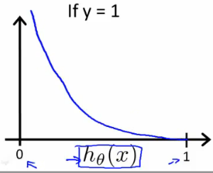
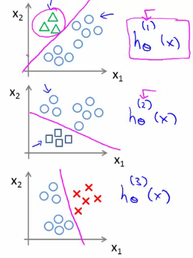

# 06: Logistic Regression

[Previous](05_Octave.md) [Next](07_Regularization.md) [Index](README.md)

## Classification

- Where y is a discrete value
  - Develop the logistic regression algorithm to determine what class a new input should fall into
- Classification problems
  - Email -> spam/not spam?
  - Online transactions -> fraudulent?
  - Tumor -> Malignant/benign
- Variable in these problems is Y
  - Y is either 0 or 1
    - 0 = negative class (absence of something)
    - 1 = positive class (presence of something)
- Start with **binary class problems**
  - Later look at multiclass classification problem, although this is just an extension of binary classification
- How do we develop a classification algorithm?
  - Tumour size vs malignancy (0 or 1)
  - We *could* use linear regression
    - Then threshold the classifier output (i.e. anything over some value is yes, else no)
    - In our example below linear regression with thresholding seems to work


- We can see above this does a reasonable job of stratifying the data points into one of two classes
  - But what if we had a single Yes with a very small tumour
  - This would lead to classifying all the existing yeses as nos
- Another issues with linear regression
  - We know Y is 0 or 1
  - Hypothesis can give values large than 1 or less than 0
- So, logistic regression generates a value where is always either 0 or 1
  - Logistic regression is a **classification algorithm** - don't be confused

## Hypothesis representation

- What function is used to represent our hypothesis in classification
- We want our classifier to output values between 0 and 1
  - When using linear regression we did h<sub>θ</sub>(x) = (θ<sup>_T_</sup> x)
  - For classification hypothesis representation we do h<sub>θ</sub>(x) = g((θ<sup>_T_</sup> x))
    - Where we define g(z)
      - z is a real number
    - g(z) = 1/(1 + e<sup>_\-z_</sup>)
      - This is the **sigmoid function**, or the **logistic function**
    - If we combine these equations we can write out the hypothesis as
      
- What does the sigmoid function look like
- Crosses 0.5 at the origin, then flattens out
  - Asymptotes at 0 and 1


- Given this we need to fit θ to our data

**Interpreting hypothesis output**

- **When our hypothesis (h<sub>θ</sub>(x)) outputs a number, we treat that value as the estimated probability that y=1 on input x**
  - Example
    - If X is a feature vector with x<sub>0</sub> = 1 (as always) and x<sub>1</sub> = tumourSize
    - h<sub>θ</sub>(x) = 0.7
      - Tells a patient they have a 70% chance of a tumor being malignant
  - We can write this using the following notation
    - h<sub>θ</sub>(x) = P(y=1|x ; θ)
  - What does this mean?
    - Probability that y=1, given x, parameterized by θ
- Since this is a binary classification task we know y = 0 or 1
  - So the following must be true
    - P(y=1|x ; θ) + P(y=0|x ; θ) = 1
    - P(y=0|x ; θ) = 1 - P(y=1|x ; θ)

## Decision boundary

- Gives a better sense of what the hypothesis function is computing
- Better understand of what the hypothesis function looks like
  - One way of using the sigmoid function is;
    - When the probability of y being 1 is greater than 0.5 then we can predict y = 1
    - Else we predict y = 0
  - When is it exactly that h<sub>θ</sub>(x) is greater than 0.5?
    - Look at sigmoid function
      - g(z) is greater than or equal to 0.5 when z is greater than or equal to 0  
        
    - So if z is positive, g(z) is greater than 0.5
      - z = (θ<sup>_T_</sup> x)
    - So when
      - θ<sup>_T_</sup> x >= 0
    - Then h<sub>θ</sub> >= 0.5
- So what we've shown is that the hypothesis predicts y = 1 when θ<sup>_T_</sup> x >= 0
  - The corollary of that when θ<sup>_T_</sup> x <= 0 then the hypothesis predicts y = 0
  - Let's use this to better understand how the hypothesis makes its predictions

**Decision boundary**

- h<sub>θ</sub>(x) = g(θ<sub>0</sub> + θ<sub>1</sub>x<sub>1</sub> + θ<sub>2</sub>x<sub>2</sub>)


- So, for example
  - θ<sub>0</sub> = -3
  - θ<sub>1</sub> = 1
  - θ<sub>2</sub> = 1
- So our parameter vector is a column vector with the above values
  - So, θ<sup>_T_</sup> is a row vector = \[-3,1,1\]
- What does this mean?
  - The z here becomes θ<sup>_T_</sup> x
  - We predict "y = 1" if
    - \-3x<sub>0</sub> + 1x<sub>1</sub> + 1x<sub>2</sub> >= 0
    - \-3 + x<sub>1</sub> \+ x<sub>2</sub> >= 0
- We can also re-write this as
  - If (x<sub>1</sub> + x<sub>2</sub> >= 3) then we predict y = 1
  - If we plot
    - x<sub>1</sub> + x<sub>2</sub> = 3 we graphically plot our **decision boundary**


- Means we have these two regions on the graph
  - Blue = false
  - Magenta = true
  - Line = decision boundary
    - Concretely, the straight line is the set of points where h<sub>θ</sub>(x) = 0.5 exactly
  - The decision boundary is a property of the hypothesis
    - Means we can create the boundary with the hypothesis and parameters without any data
      - Later, we use the data to determine the parameter values
    - i.e. y = 1 if
      - 5 - x<sub>1</sub> > 0
      - 5 > x<sub>1</sub>

## Non-linear decision boundaries

- Get logistic regression to fit a complex non-linear data set
  - Like polynomial regress add higher order terms
  - So say we have
    - h<sub>θ</sub>(x) = g(θ<sub>0</sub> + θ<sub>1</sub>x<sub>1</sub>+ θ<sub>3</sub>x<sub>1</sub><sup>2</sup> + θ<sub>4</sub>x<sub>2</sub><sup>2</sup>)
    - We take the transpose of the θ vector times the input vector
      - Say θ<sup>_T_</sup> was \[-1,0,0,1,1\] then we say;
      - Predict that "y = 1" _if_
        - \-1 + x<sub>1</sub><sup>2</sup> + x<sub>2</sub><sup>2</sup> >= 0  
          or
        - x<sub>1</sub><sup>2</sup> + x<sub>2</sub><sup>2</sup> >= 1
      - If we plot x<sub>1</sub><sup>2</sup> + x<sub>2</sub><sup>2</sup> = 1
        - This gives us a circle with a radius of 1 around 0


- Mean we can build more complex decision boundaries by fitting complex parameters to this (relatively) simple hypothesis
- More complex decision boundaries?
  - By using higher order polynomial terms, we can get even more complex decision boundaries


## Cost function for logistic regression

- Fit θ parameters
- Define the optimization object for the cost function we use the fit the parameters
  - Training set of *m* training examples
    - Each example has is n+1 length column vector


- This is the situation
  - Set of m training examples
  - Each example is a feature vector which is n+1 dimensional
  - x0 = 1
  - y ∈ {0,1}
  - Hypothesis is based on parameters (θ)
    - Given the training set how to we chose/fit θ?
- Linear regression uses the following function to determine θ


- Instead of writing the squared error term, we can write
  - If we define "cost()" as;
    - cost(h<sub>θ</sub>(x<sup>i</sup>), y) = 1/2(h<sub>θ</sub>(x<sup>i</sup>) - y<sup>i</sup>)<sup>2</sup>
    - Which evaluates to the cost for an individual example using the same measure as used in linear regression
  - We can **redefine J(θ) as**
    
    - Which, appropriately, is the sum of all the individual costs over the training data (i.e. the same as linear regression)
- To further simplify it we can get rid of the superscripts

  - So
    

- What does this actually mean?
  - This is the cost you want the learning algorithm to pay if the outcome is h<sub>θ</sub>(x) and the actual outcome is y
  - If we use this function for logistic regression this is a **non-convex function** for parameter optimization
    - Could work....
- What do we mean by non convex?
  - We have some function - J(θ) - for determining the parameters
  - Our hypothesis function has a non-linearity (sigmoid function of h<sub>θ</sub>(x) )
    - This is a complicated non-linear function
  - If you take h<sub>θ</sub>(x) and plug it into the Cost() function, and them plug the Cost() function into J(θ) and plot J(θ) we find many local optimum -> _non convex function_
  - Why is this a problem
    - Lots of local minima mean gradient descent may not find the global optimum - may get stuck in a global minimum
  - We would like a convex function so if you run gradient descent you converge to a global minimum

**A convex logistic regression cost function**

- To get around this we need a different, convex Cost() function which means we can apply gradient descent


- **This is our logistic regression cost function**
  - This is the penalty the algorithm pays
  - Plot the function
- Plot y = 1
  - So h<sub>θ</sub>(x) evaluates as -log(h<sub>θ</sub>(x))



- So when we're right, cost function is 0
  - Else it slowly increases cost function as we become "more" wrong
  - X axis is what we predict
  - Y axis is the cost associated with that prediction
- This cost functions has some interesting properties
  - If y = 1 and h<sub>θ</sub>(x) = 1
    - If hypothesis predicts exactly 1 and thats exactly correct then that corresponds to 0 (exactly, not nearly 0)
  - As h<sub>θ</sub>(x) goes to 0
    - Cost goes to infinity
    - This captures the intuition that if h<sub>θ</sub>(x) = 0 (predict _P_ (y=1|x; θ) = 0) but y = 1 this will penalize the learning algorithm with a massive cost
- What about if y = 0
- then cost is evaluated as -log(1- h<sub>θ</sub>( x ))
  - Just get inverse of the other function


- Now it goes to plus infinity as h<sub>θ</sub>(x) goes to 1
- With our particular cost functions J(θ) is going to be convex and avoid local minimum

## Simplified cost function and gradient descent

- Define a simpler way to write the cost function and apply gradient descent to the logistic regression
  - By the end should be able to implement a fully functional logistic regression function
- Logistic regression cost function is as follows


- This is the cost for a single example
  - For binary classification problems y is always 0 or 1
    - Because of this, we can have a simpler way to write the cost function
      - Rather than writing cost function on two lines/two cases
      - Can compress them into one equation - more efficient
  - Can write cost function is
    - **cost(h<sub>θ</sub>, (x),y) = -ylog( h<sub>θ</sub>(x) ) - (1-y)log( 1- h<sub>θ</sub>(x) )**
      - This equation is a more compact of the two cases above
  - We know that there are only two possible cases
    - y = 1
      - Then our equation simplifies to
        - \-log(h<sub>θ</sub>(x)) - (0)log(1 - h<sub>θ</sub>(x))
          - \-log(h<sub>θ</sub>(x))
          - Which is what we had before when y = 1
    - y = 0
      - Then our equation simplifies to
        - \-(0)log(h<sub>θ</sub>(x)) - (1)log(1 - h<sub>θ</sub>(x))
        - = \-log(1- h<sub>θ</sub>(x))
        - Which is what we had before when y = 0
    - Clever!
- So, in summary, our cost function for the θ parameters can be defined as


- Why do we chose this function when other cost functions exist?
  - This cost function can be derived from statistics using the principle of **maximum likelihood estimation**
    - Note this does mean there's an underlying Gaussian assumption relating to the distribution of features
  - Also has the nice property that it's convex
- To fit parameters θ:
  - Find parameters θ which minimize J(θ)
  - This means we have a set of parameters to use in our model for future predictions
- Then, if we're given some new example with set of features x, we can take the θ which we generated, and output our prediction using  
          
  - This result is
    - p(y=1 | x ; θ)
      - Probability y = 1, given x, parameterized by θ

**How to minimize the logistic regression cost function**

- Now we need to figure out how to minimize J(θ)
  - Use gradient descent as before
  - Repeatedly update each parameter using a learning rate


- If you had _n_ features, you would have an n+1 column vector for θ
- This equation is the same as the linear regression rule
  - The only difference is that our definition for the hypothesis has changed
- Previously, we spoke about how to monitor gradient descent to check it's working
  - Can do the same thing here for logistic regression
- When implementing logistic regression with gradient descent, we have to update all the θ values (θ<sub>0</sub> to θ<sub>n</sub>) simultaneously
  - Could use a for loop
  - Better would be a vectorized implementation
- Feature scaling for gradient descent for logistic regression also applies here

## Advanced optimization

- Previously we looked at gradient descent for minimizing the cost function
- Here look at advanced concepts for minimizing the cost function for logistic regression
  - Good for large machine learning problems (e.g. huge feature set)
- _What is gradient descent actually doing?_
  - We have some cost function J(θ), and we want to minimize it
  - We need to write code which can take θ as input and compute the following
    - J(θ)
    - Partial derivative if J(θ) with respect to j (where j=0 to j = n)


- Given code that can do these two things
  - Gradient descent repeatedly does the following update


- So update each j in θ sequentially
- So, we must;
  - Supply code to compute J(θ) and the derivatives
  - Then plug these values into gradient descent
- Alternatively, instead of gradient descent to minimize the cost function we could use
  - **Conjugate gradient**
  - **BFGS** (Broyden-Fletcher-Goldfarb-Shanno)
  - **L-BFGS** (Limited memory - BFGS)
- These are more optimized algorithms which take that same input and minimize the cost function
- These are _very_ complicated algorithms
- Some properties
  - **Advantages**
    - No need to manually pick alpha (learning rate)
      - Have a clever inner loop (line search algorithm) which tries a bunch of alpha values and picks a good one
    - Often faster than gradient descent
      - Do more than just pick a good learning rate
    - Can be used successfully without understanding their complexity
  - **Disadvantages**
    - Could make debugging more difficult
    - Should not be implemented themselves
    - Different libraries may use different implementations - may hit performance

**Using advanced cost minimization algorithms**

- How to use algorithms
  - Say we have the following example


- Example above
  - θ<sub>1</sub> and θ<sub>2</sub> (two parameters)
  - Cost function here is J(θ) = (θ<sub>1</sub> \- 5)<sup>2</sup> + ( θ<sub>2</sub> \- 5)<sup>2</sup>
  - The derivatives of the J(θ) with respect to either θ<sub>1</sub> and θ<sub>2</sub> turns out to be the 2(θ<sub>i</sub> - 5)
- First we need to define our cost function, which should have the following signature

**function \[jval, gradent\] = costFunction(THETA)**

- Input for the cost function is **THETA**, which is a vector of the θ parameters
- Two return values from **costFunction** are
  - **jval**
    - How we compute the cost function θ (the underived cost function)
      - In this case = (θ<sub>1</sub> \- 5)<sup>2</sup> + (θ<sub>2</sub> \- 5)<sup>2</sup>
  - **gradient**
    - 2 by 1 vector
    - 2 elements are the two partial derivative terms
    - i.e. this is an n-dimensional vector
      - Each indexed value gives the partial derivatives for the partial derivative of J(θ) with respect to θ<sub>i</sub>
      - Where i is the index position in the **gradient** vector
- With the cost function implemented, we can call the advanced algorithm using

```octave
options= optimset('GradObj', 'on', 'MaxIter', '100'); % define the options data structure
initialTheta= zeros(2,1); # set the initial dimensions for theta % initialize the theta values
[optTheta, funtionVal, exitFlag]= fminunc(@costFunction, initialTheta, options); % run the algorithm
```

- Here
  - **options** is a data structure giving options for the algorithm
  - **fminunc**
    - function minimize the cost function (**f**ind **min**imum of **unc**onstrained multivariable function)
  - **@costFunction** is a pointer to the costFunction function to be used
- For the octave implementation

  - **initialTheta** must be a matrix of at least two dimensions

- How do we apply this to logistic regression?
  - Here we have a vector


- Here
  - theta is a n+1 dimensional column vector
  - Octave indexes from 1, not 0
- Write a cost function which captures the cost function for logistic regression

## Multiclass **classification problems**

- Getting logistic regression for multiclass classification using **one vs. all**
- Multiclass - more than yes or no (1 or 0)
  - Classification with multiple classes for assignment


- Given a dataset with three classes, how do we get a learning algorithm to work?
  - Use one vs. all classification make binary classification work for multiclass classification
- **One vs. all classification**
  - Split the training set into three separate binary classification problems
    - i.e. create a new fake training set
      - Triangle (1) vs crosses and squares (0) h<sub>θ</sub><sup>1</sup>(x)
        - P(y=1 | x<sub>1</sub>; θ)
      - Crosses (1) vs triangle and square (0) h<sub>θ</sub><sup>2</sup>(x)
        - P(y=1 | x<sub>2</sub>; θ)
      - Square (1) vs crosses and square (0) h<sub>θ</sub><sup>3</sup>(x)
        - P(y=1 | x<sub>3</sub>; θ)



- **Overall**
  - Train a logistic regression classifier h<sub>θ</sub><sup>(i)</sup>(x) for each class i to predict the probability that y = i
  - On a new input, *x* to make a prediction, pick the class *i* that maximizes the probability that h<sub>θ</sub><sup>(i)</sup>(x) = 1
