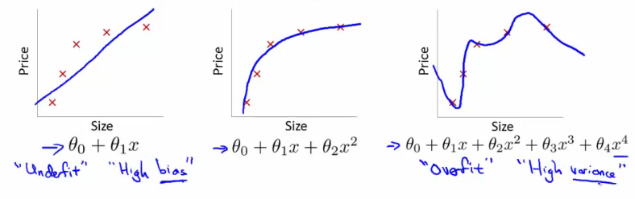

# 07: Regularization

[Previous](06_Logistic_Regression.md) [Next](08_Neural_Networks_Representation.md) [Index](README.md)

## The problem of overfitting

- So far we've seen a few algorithms - work well for many applications, but can suffer from the problem of overfitting
- What is overfitting?
- What is regularization and how does it help

**Overfitting with linear regression**

- Using our house pricing example again
  - Fit a linear function to the data - not a great model
    - This is **underfitting** - also known as **high bias**
    - Bias is a historic/technical one - if we're fitting a straight line to the data we have a strong preconception that there should be a linear fit
      - In this case, this is not correct, but a straight line can't help being straight!
  - Fit a quadratic function
    - Works well
  - Fit a 4th order polynomial
    - Now curve fit's through all five examples
      - Seems to do a good job fitting the training set
      - But, despite fitting the data we've provided very well, this is actually not such a good model
    - This is **overfitting** - also known as **high variance**
  - Algorithm has high variance
    - High variance - if fitting high order polynomial then the hypothesis can basically fit any data
    - Space of hypothesis is too large

- To recap, if we have too many features then the learned hypothesis may give a cost function of exactly zero
  - But this tries too hard to fit the training set
  - Fails to provide a *general* solution - **unable to generalize** (apply to new examples)

**Overfitting with logistic regression**

- Same thing can happen to logistic regression
  - Sigmoidal function is an underfit
  - But a high order polynomial gives and overfitting (high variance hypothesis)

**Addressing overfitting**

- Later we'll look at identifying when overfitting and underfitting is occurring
- Earlier we just plotted a higher order function - saw that it looks "too curvy"
  - Plotting hypothesis is one way to decide, but doesn't always work
  - Often have lots of a features - here it's not just a case of selecting a degree polynomial, but also harder to plot the data and visualize to decide what features to keep and which to drop
  - If you have lots of features and little data - overfitting can be a problem
- How do we deal with this?

  - 1. **Reduce number of features**

    - Manually select which features to keep

    - Model selection algorithms are discussed later (good for reducing number of features)
    - But, in reducing the number of features we lose some information
      - Ideally select those features which minimize data loss, but even so, some info is lost

  - 2. **Regularization**
    - Keep all features, but reduce magnitude of parameters θ
    - Works well when we have a lot of features, each of which contributes a bit to predicting y

## Cost function optimization for regularization

- Penalize and make some of the θ parameters really small
  - e.g. here θ3 and θ4

- The addition in blue is a modification of our cost function to help penalize θ3 and θ4
  - So here we end up with θ3 and θ4 being close to zero (because the constants are massive)
  - So we're basically left with a quadratic function

- In this example, we penalized two of the parameter values

  - More generally, regularization is as follows

- Regularization
  - Small values for parameters corresponds to a simpler hypothesis (you effectively get rid of some of the terms)
  - A simpler hypothesis is less prone to overfitting
- Another example
  - Have 100 features x1, x2, ..., x100
  - Unlike the polynomial example, we don't know what are the high order terms
    - How do we pick the ones to pick to shrink?
  - With regularization, take cost function and modify it to shrink all the parameters
    - Add a term at the end
      - This regularization term shrinks every parameter
      - By convention you don't penalize θ0 - minimization is from θ1 onwards

- In practice, if you include θ0 has little impact
- **λ** is the **regularization parameter**
  - Controls a trade off between our two goals
    - 1. Want to fit the training set well
    - 2. Want to keep parameters small
- With our example, using the **regularized objective** (i.e. the cost function with the regularization term) you get a much smoother curve which fits the data and gives a much better hypothesis
  - If **λ** is very large we end up penalizing ALL the parameters (θ1, θ2 etc.) so all the parameters end up being close to zero
    - If this happens, it's like we got rid of all the terms in the hypothesis
      - This results here is then underfitting
    - So this hypothesis is too biased because of the absence of any parameters (effectively)
- So, **λ** should be chosen carefully - not too big...
  - We look at some automatic ways to select **λ** later in the course

## Regularized linear regression

- Previously, we looked at two algorithms for linear regression
  - Gradient descent
  - Normal equation
- Our linear regression with regularization is shown below

- Previously, gradient descent would repeatedly update the parameters θj, where j = 0,1,2...n simultaneously
  - Shown below

- We've got the θ0 update here shown explicitly
  - This is because for regularization we don't penalize θ0 so treat it slightly differently
- How do we regularize these two rules?
  - Take the term and add λ/m \* θj
    - Sum for every θ (i.e. j = 0 to n)
  - This gives regularization for gradient descent
- We can show using calculus that the equation given below is the partial derivative of the regularized J(θ)

- The update for θj
  - θj gets updated to
    - θj \- α \* \[a big term which also depends on θj\]
- So if you group the θj terms together

- The term

  

  - Is going to be a number less than 1 usually
  - Usually learning rate is small and m is large
    - So this typically evaluates to (1 - a small number)
    - So the term is often around 0.99 to 0.95

- This in effect means θj gets multiplied by 0.99
  - Means the squared norm of θj a little smaller
  - The second term is exactly the same as the original gradient descent

## Regularization with the normal equation

- Normal equation is the other linear regression model
  - Minimize the J(θ) using the normal equation
  - To use regularization we add a term (+ λ \[n+1 x n+1\]) to the equation
    - \[n+1 x n+1\] is the n+1 identity matrix

## Regularization for logistic regression

- We saw earlier that logistic regression can be prone to overfitting with lots of features
- Logistic regression cost function is as follows;

- To modify it we have to add an extra term  
  
- This has the effect of penalizing the parameters θ1, θ2 up to θn

  - Means, like with linear regression, we can get what appears to be a better fitting lower order hypothesis

- How do we implement this?
  - Original logistic regression with gradient descent function was as follows  
    
- Again, to modify the algorithm we simply need to modify the update rule for θ1, onwards

  - Looks cosmetically the same as linear regression, except obviously the hypothesis is very different

    

## Advanced optimization of regularized linear regression

- As before, define a costFunction which takes a θ parameter and gives jVal and gradient back

- use **fminunc**
  - Pass it an **@costfunction** argument
  - Minimizes in an optimized manner using the cost function
- **jVal**
  - Need code to compute J(θ)
    - Need to include regularization term
- Gradient
  - Needs to be the partial derivative of J(θ) with respect to θi
  - Adding the appropriate term here is also necessary

- Ensure summation doesn't extend to to the lambda term!
  - It doesn't, but, you know, don't be daft!
