# 08: Neural Networks - Representation

[Previous](07_Regularization.md) [Next](09_Neural_Networks_Learning.md) [Index](README.md)

## Neural networks - Overview and summary

**Why do we need neural networks?**

- Say we have a complex supervised learning classification problem
  - Can use logistic regression with many polynomial terms
  - Works well when you have 1-2 features
  - If you have 100 features

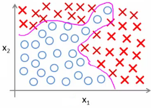

- e.g. our housing example
  - 100 house features, predict odds of a house being sold in the next 6 months
  - Here, if you included all the quadratic terms (second order)
    - There are lots of them (x12 ,x1x2, x1x4, ..., x1x100)
    - For the case of n = 100, you have about 5000 features
    - Number of features grows O(n2)
    - This would be computationally expensive to work with as a feature set
- A way around this to only include a subset of features
  - However, if you don't have enough features, often a model won't let you fit a complex dataset
- If you include the cubic terms
  - e.g. (x12x2, x1x2x3, x1x4x23 etc)
  - There are even more features grows O(n3)
  - About 170 000 features for n = 100
- Not a good way to build classifiers when n is large

**Example: Problems where n is large - computer vision**

- Computer vision sees a matrix of pixel intensity values
  - Look at matrix - explain what those numbers represent
- To build a car detector
  - Build a training set of
    - Not cars
    - Cars
  - Then test against a car
- How can we do this
  - Plot two pixels (two pixel locations)
  - Plot car or not car on the graph

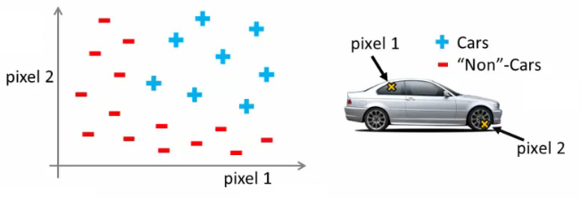

- Need a non-linear hypothesis to separate the classes
- Feature space
  - If we used 50 x 50 pixels --> 2500 pixels, so n = 2500
  - If RGB then 7500
  - If 100 x 100 RB then --> 50 000 000 features
- Too big - wayyy too big
  - So - simple logistic regression here is not appropriate for large complex systems
  - Neural networks are much better for a complex nonlinear hypothesis even when feature space is huge

**Neurons and the brain**

- **Neural networks** (**NNs**) were originally motivated by looking at machines which replicate the brain's functionality
  - Looked at here as a machine learning technique
- Origins
  - To build learning systems, why not mimic the brain?
  - Used a lot in the 80s and 90s
  - Popularity diminished in late 90s
  - Recent major resurgence
    - NNs are computationally expensive, so only recently large scale neural networks became computationally feasible
- Brain
  - Does loads of crazy things
    - Hypothesis is that the brain has a single learning algorithm
  - Evidence for hypothesis
    - Auditory cortex --> takes sound signals
      - If you cut the wiring from the ear to the auditory cortex
      - Re-route optic nerve to the auditory cortex
      - Auditory cortex learns to see
    - Somatosensory context (touch processing)
      - If you rewrite optic nerve to somatosensory cortex then it learns to see
  - With different tissue learning to see, maybe they all learn in the same way
    - Brain learns by itself how to learn
- Other examples
  - Seeing with your tongue
    - Brainport
      - Grayscale camera on head
      - Run wire to array of electrodes on tongue
      - Pulses onto tongue represent image signal
      - Lets people see with their tongue
  - Human echolocation
    - Blind people being trained in schools to interpret sound and echo
    - Lets them move around
  - Haptic belt direction sense
    - Belt which buzzes towards north
    - Gives you a sense of direction
- Brain can process and learn from data from any source

## Model representation I

- How do we represent neural networks (NNs)?
  - Neural networks were developed as a way to simulate networks of neurones
- What does a neurone look like

- Three things to notice
  - Cell body
  - Number of input wires (dendrites)
  - Output wire (axon)
- Simple level
  - Neurone gets one or more inputs through dendrites
  - Does processing
  - Sends output down axon
- Neurons communicate through electric spikes
  - Pulse of electricity via axon to another neurone

**Artificial neural network - representation of a neurone**

- In an artificial neural network, a neurone is a logistic unit
  - Feed input via input wires
  - Logistic unit does computation
  - Sends output down output wires
- That logistic computation is just like our previous logistic regression hypothesis calculation

- Very simple model of a neuron's computation
  - Often good to include an x0 input - the **bias unit**
    - This is equal to 1
- This is an artificial neurone with a sigmoid (logistic) activation function
  - Ɵ vector may also be called the **weights** of a model
- The above diagram is a single neurone
  - Below we have a group of neurones strung together

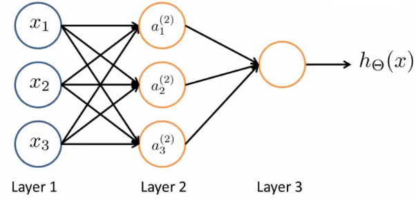

- Here, input is x1, x2 and x3
  - We could also call input activation on the first layer - i.e. (a11, a21 and a31 )
  - Three neurones in layer 2 (a12, a22 and a32 )
  - Final fourth neurone which produces the output
    - Which again we \*could\* call a13
- First layer is the **input layer**
- Final layer is the **output layer** - produces value computed by a hypothesis
- Middle layer(s) are called the **hidden layers**
  - You don't observe the values processed in the hidden layer
  - Not a great name
  - Can have many hidden layers

**Neural networks - notation**

- **ai(j) - activation of unit *i* in layer *j***
  - So, a12 - is the **activation** of the 1st unit in the second layer
  - By activation, we mean the value which is computed and output by that node
- **Ɵ(j) \- matrix of parameters controlling the function mapping from layer *j* to layer *j* + 1**
  - Parameters for controlling **mapping** from one layer to the next
  - If network has
    - sj units in layer *j* and
    - sj+1 units in layer j + 1
    - Then Ɵj will be of dimensions \[sj+1 x sj + 1\]
      - Because
        - sj+1 is equal to the number of units in layer (j + 1)
        - is equal to the number of units in layer j, plus an additional unit
  - Looking at the Ɵ matrix
    - Column length is the number of units in the following layer
    - Row length is the number of units in the current layer + 1 (because we have to map the bias unit)
    - So, if we had two layers - 101 and 21 units in each
      - Then Ɵj would be = \[21 x 102\]
- What are the computations which occur?
  - We have to calculate the activation for each node
  - That activation depends on
    - The input(s) to the node
    - The parameter associated with that node (from the Ɵ vector associated with that layer)
- Below we have an example of a network, with the associated calculations for the four nodes below

- As you can see
  - We calculate each of the layer-2 activations based on the input values with the bias term (which is equal to 1)
    - i.e. x0 to x3
  - We then calculate the final hypothesis (i.e. the single node in layer 3) using exactly the same logic, except in input is not x values, but the activation values from the preceding layer
- The activation value on each hidden unit (e.g. a12 ) is equal to the sigmoid function applied to the linear combination of inputs
  - Three input units
    - So Ɵ(1) is the matrix of parameters governing the mapping of the input units to hidden units
      - Ɵ(1) here is a \[3 x 4\] dimensional matrix
  - Three hidden units
    - Then Ɵ(2) is the matrix of parameters governing the mapping of the hidden layer to the output layer
      - Ɵ(2) here is a \[1 x 4\] dimensional matrix (i.e. a row vector)
  - One output unit
- Something conceptually important (that I hadn't really grasped the first time) is that

  - **Every input/activation goes to every node in following layer**
    - Which means each "layer transition" uses a matrix of parameters with the following significance
      - For the sake of consistency with later nomenclature, we're using j,i and l as our variables here (although later in this section we use j to show the layer we're on)
      - **Ɵ**jil
        - j (first of two subscript numbers)= ranges from 1 to the number of units in layer l+1
        - i (second of two subscript numbers) = ranges from 0 to the number of units in layer l
        - l is the layer you're moving FROM
      - This is perhaps more clearly shown in my slightly over the top example below

- 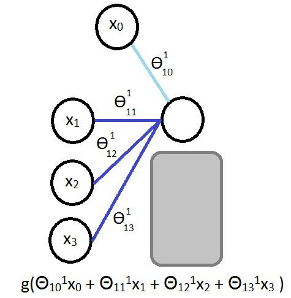

* For example
  - Ɵ**13****1** = means
    - **1** - we're mapping to node 1 in layer l+1
    - **3** - we're mapping from node 3 in layer l
    - **1** - we're mapping from layer 1

## Model representation II

_Here we'll look at how to carry out the computation efficiently through a vectorized implementation. We'll also consider_

_why NNs are good and how we can use them to learn complex non-linear things_

- Below is our original problem from before
  - Sequence of steps to compute output of hypothesis are the equations below

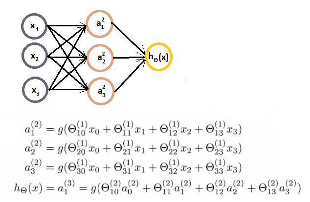

- Define some additional terms
  - z12 = Ɵ101x0 + Ɵ111x1 + Ɵ121x2 + Ɵ131x3
  - Which means that
    - a12 = g(z12)
  - NB, superscript numbers are the layer associated
- Similarly, we define the others as
  - z22 and z32
  - These values are just a linear combination of the values
- If we look at the block we just redefined
  - We can vectorize the neural network computation
  - So lets define
    - x as the feature vector x
    - z2 as the vector of z values from the second layer

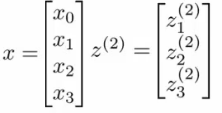

- z2 is a 3x1 vector
- We can vectorize the computation of the neural network as as follows in two steps
  - z2 = Ɵ(1)x
    - i.e. Ɵ(1) is the matrix defined above
    - x is the feature vector
  - a2 = g(z(2))
    - To be clear, z2 is a 3x1 vecor
    - a2 is also a 3x1 vector
    - g() applies the sigmoid (logistic) function element wise to each member of the z2 vector
- To make the notation with input layer make sense;
  - a1 = x
    - a1 is the activations in the input layer
    - Obviously the "activation" for the input layer is just the input!
  - So we define x as a1 for clarity
    - So
      - a1 is the vector of inputs
      - a2 is the vector of values calculated by the g(z2) function
- Having calculated then z2 vector, we need to calculate a02 for the final hypothesis calculation

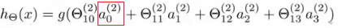

- To take care of the extra bias unit add a02 = 1
  - So add a02 to a2 making it a 4x1 vector
- So,
  - z3 = Ɵ2a2
    - This is the inner term of the above equation
  - hƟ(x) = a3 = g(z3)
- This process is also called **forward propagation**
  - Start off with activations of input unit
    - i.e. the x vector as input
  - Forward propagate and calculate the activation of each layer sequentially
  - This is a vectorized version of this implementation

**Neural networks learning its own features**

- Diagram below looks a lot like logistic regression

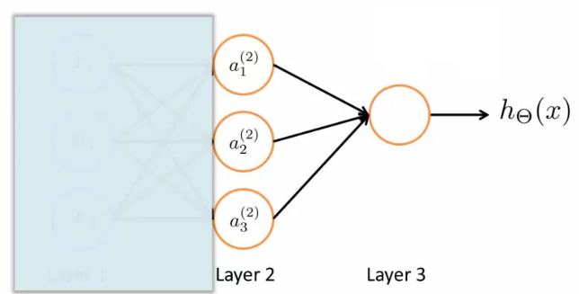

- Layer 3 is a logistic regression node
  - The hypothesis output = g(Ɵ102 a02 + Ɵ112 a12 + Ɵ122 a22 + Ɵ132 a32)
  - This is just logistic regression
    - The only difference is, instead of input a feature vector, the features are just values calculated by the hidden layer
- The features a12, a22, and a32 are calculated/learned - not original features
- So the mapping from layer 1 to layer 2 (i.e. the calculations which generate the a2 features) is determined by another set of parameters - Ɵ1
  - So instead of being constrained by the original input features, a neural network can learn its own features to feed into logistic regression
  - Depending on the Ɵ1 parameters you can learn some interesting things
    - Flexibility to learn whatever features it wants to feed into the final logistic regression calculation
      - So, if we compare this to previous logistic regression, you would have to calculate your own exciting features to define the best way to classify or describe something
      - Here, we're letting the hidden layers do that, so we feed the hidden layers our input values, and let them learn whatever gives the best final result to feed into the final output layer
- As well as the networks already seen, other architectures (topology) are possible
  - More/less nodes per layer
  - More layers
  - Once again, layer 2 has three hidden units, layer 3 has 2 hidden units by the time you get to the output layer you get very interesting non-linear hypothesis

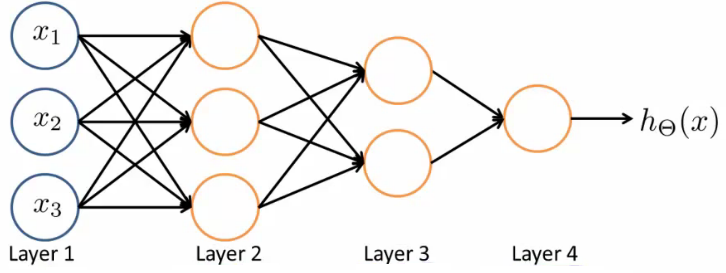

- Some of the intuitions here are complicated and hard to understand
  - In the following lectures we're going to go though a detailed example to understand how to do non-linear analysis

## Neural network example - computing a complex, nonlinear function of the input

- Non-linear classification: XOR/XNOR
  - x1, x2 are binary

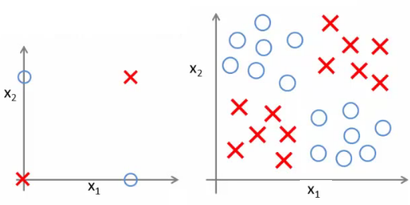

- Example on the right shows a simplified version of the more complex problem we're dealing with (on the left)
- We want to learn a non-linear decision boundary to separate the positive and negative examples

y =  x1 XOR x2

​ x1 XNOR x2

Where XNOR = NOT (x1 XOR x2)

- Positive examples when both are true and both are false
  - Let's start with something a little more straight forward...
  - Don't worry about how we're determining the weights (Ɵ values) for now - just get a flavor of how NNs work

**Neural Network example 1: AND function**

- Simple first example

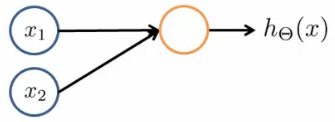

- Can we get a one-unit neural network to compute this logical AND function? (_probably..._)
  - Add a bias unit
  - Add some weights for the networks
    - What are weights?
      - Weights are the parameter values which multiply into the input nodes (i.e. Ɵ)

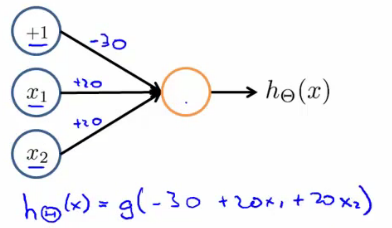

- Sometimes it's convenient to add the weights into the diagram
  - These values are in fact just the Ɵ parameters so
    - Ɵ101 = -30
    - Ɵ111 = 20
    - Ɵ121 = 20
  - To use our original notation
- Look at the four input values

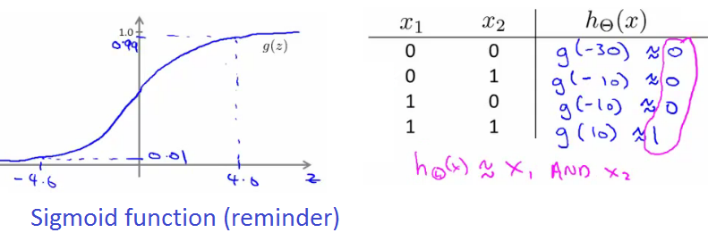

- So, as we can see, when we evaluate each of the four possible input, only (1,1) gives a positive output

**Neural Network example 2: NOT function**

- How about negation?

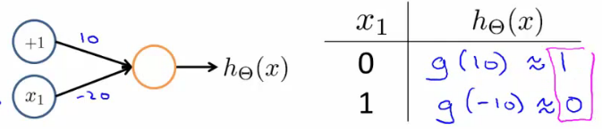

- Negation is achieved by putting a large negative weight in front of the variable you want to negative

**Neural Network example 3: XNOR function**

- So how do we make the XNOR function work?

  - XNOR is short for NOT XOR

    - i.e. NOT an exclusive or, so either go big (1,1) or go home (0,0)

  - So we want to structure this so the input which produce a positive output are

    - AND (i.e. both true)

      **OR**

    - Neither (which we can shortcut by saying not only one being true)

- So we combine these into a neural network as shown below;

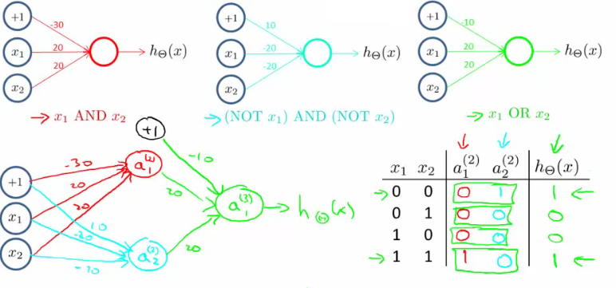

- Simplez!

**Neural network intuition - handwritten digit classification**

- Yann LeCun = machine learning pioneer
- Early machine learning system was postcode reading
  - Hilarious music, impressive demonstration!

## Multiclass classification

- Multiclass classification is, unsurprisingly, when you distinguish between more than two categories (i.e. more than 1 or 0)
- With handwritten digital recognition problem - 10 possible categories (0-9)
  - How do you do that?
  - Done using an extension of one vs. all classification
- Recognizing pedestrian, car, motorbike or truck
  - Build a neural network with four output units
  - Output a vector of four numbers
    - 1 is 0/1 pedestrian
    - 2 is 0/1 car
    - 3 is 0/1 motorcycle
    - 4 is 0/1 truck
  - When image is a pedestrian get \[1,0,0,0\] and so on
- Just like one vs. all described earlier
  - Here we have four logistic regression classifiers

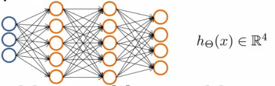

- Training set here is images of our four classifications

  - While previously we'd written y as an integer {1,2,3,4}
  - Now represent y as

  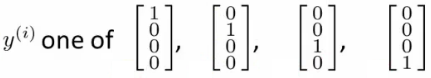
