# 09: Neural Networks - Learning

[Previous](08_Neural_Networks_Representation.md) [Next](10_Advice_for_applying_machine_learning.md) [Index](README.md)

## Neural network cost function

- NNs - one of the most powerful learning algorithms
  - Is a learning algorithm for fitting the derived parameters given a training set
  - Let's have a first look at a neural network cost function
- Focus on application of NNs for classification problems
- Here's the set up
  - Training set is {(x1, y1), (x2, y2), (x3, y3) ... (x_n_, y_m_)
  - *L* = number of layers in the network
    - In our example below L = 4
  - sl = number of units (not counting bias unit) in layer l

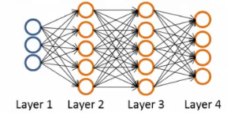

- So here
  - l   = 4
  - s1 = 3
  - s2 = 5
  - s3 = 5
  - s4 = 4

**Types of classification problems with NNs**

- Two types of classification, as we've previously seen
- **Binary classification**
  - 1 output (0 or 1)
  - So single output node - value is going to be a real number
  - k = 1
    - NB k is number of units in output layer
  - s_L_ = 1
- **Multi-class classification**
  - k distinct classifications
  - Typically k is greater than or equal to three
  - If only two just go for binary
  - s_L_ = k
  - So y is a k-dimensional vector of real numbers

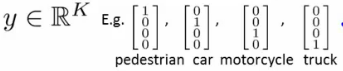

**Cost function for neural networks**

- The (regularized) logistic regression cost function is as follows;

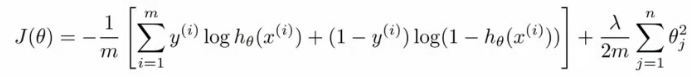

- For neural networks our cost function is a generalization of this equation above, so instead of one output we generate _k_ outputs

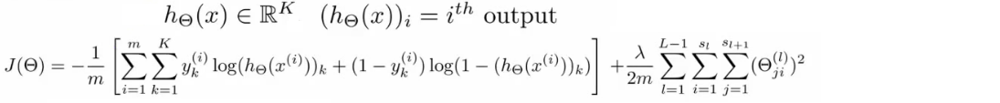

- Our cost function now outputs a *k* dimensional vector
  - hƟ(x) is a k dimensional vector, so hƟ(x)_i_ refers to the ith value in that vector
- Costfunction J(Ɵ) is
  - \[-1/m\] times a sum of a similar term to which we had for logic regression
  - But now this is also a sum from k = 1 through to K (K is number of output nodes)
    - Summation is a sum over the k output units - i.e. for each of the possible classes
    - So if we had 4 output units then the sum is k = 1 to 4 of the logistic regression over each of the four output units in turn
  - This looks really complicated, but it's not so difficult
    - We don't sum over the bias terms (hence starting at 1 for the summation)
      - Even if you do and end up regularizing the bias term this is not a big problem
    - Is just summation over the terms

**Woah there - lets take a second to try and understand this!**

- There are basically two halves to the neural network logistic regression cost function

**First half**

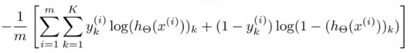

- This is just saying
  - For each training data example (i.e. 1 to m - the first summation)
    - Sum for each position in the output vector
- This is an average sum of logistic regression

**Second half**

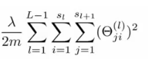

- This is a massive regularization summation term, which I'm not going to walk through, but it's a fairly straightforward triple nested summation
- This is also called a **weight decay** term
- As before, the lambda value determines the important of the two halves

- The regularization term is similar to that in logistic regression
- So, we have a cost function, but *how* do we minimize this bad boy?!

## Summary of what's about to go down

_The following section is, I think, the most complicated thing in the course, so I'm going to take a second to explain the general idea of what we're going to do;_

- We've already described **forward propagation**
  - This is the algorithm which takes your neural network and the initial input into that network and pushes the input through the network
    - It leads to the generation of an output hypothesis, which may be a single real number, but can also be a vector
- We're now going to describe **back propagation**

  - Back propagation basically takes the output you got from your network, compares it to the real value (y) and calculates how wrong the network was (i.e. how wrong the parameters were)
  - It then, using the error you've just calculated, back-calculates the error associated with each unit from the preceding layer (i.e. layer *L -* 1)
  - This goes on until you reach the input layer (where obviously there is no error, as the activation is the input)
  - These "error" measurements for each unit can be used to calculate the **partial derivatives**
    - Partial derivatives are the bomb, because gradient descent needs them to minimize the cost function
  - We use the partial derivatives with gradient descent to try minimize the cost function and update all the Ɵ values
  - This repeats until gradient descent reports convergence

- A few things which are good to realize from the get go
  - There is a Ɵ matrix for each layer in the network
    - This has each node in layer l as one dimension and each node in l+1 as the other dimension
  - Similarly, there is going to be a Δ matrix for each layer
    - This has each node as one dimension and each training data example as the other

## Back propagation algorithm

- We previously spoke about the neural network cost function
- Now we're going to deal with **back propagation**
  - Algorithm used to minimize the cost function, as it **allows us to calculate partial derivatives**!

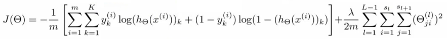

- The cost function used is shown above
  - We want to find parameters Ɵ which minimize J(Ɵ)
  - To do so we can use one of the algorithms already described such as
    - Gradient descent
    - Advanced optimization algorithms
- To minimize a cost function we just write code which computes the following

  - **J(Ɵ)**
    - i.e. the cost function itself!
    - Use the formula above to calculate this value, so we've done that
  - **Partial derivative terms**

    - So now we need some way to do that
      - This is not trivial! Ɵ is indexed in three dimensions because we have separate parameter values for each node in each layer going to each node in the following layer
      - i.e. each layer has a Ɵ matrix associated with it!
        - We want to calculate the partial derivative Ɵ with respect to a single parameter 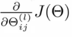
    - Remember that the partial derivative term we calculate above is a REAL number (not a vector or a matrix)
      - Ɵ is the input parameters
        - Ɵ1 is the matrix of weights which define the function mapping from layer 1 to layer 2
        - Ɵ101 is the real number parameter which you multiply the bias unit (i.e. 1) with for the bias unit input into the first unit in the second layer
        - Ɵ111 is the real number parameter which you multiply the first (real) unit with for the first input into the first unit in the second layer
        - Ɵ211 is the real number parameter which you multiply the first (real) unit with for the first input into the second unit in the second layer
        - As discussed, Ɵijl i
          - i here represents the unit in layer l+1 you're mapping to (destination node)
          - j is the unit in layer l you're mapping from (origin node)
          - l is the layer your mapping from (to layer l+1) (origin layer)
          - NB
            - _The terms destination node, origin node and origin layer are terms I've made up!_
    - So - this partial derivative term is
      - The partial derivative of a 3-way indexed dataset with respect to a real number (which is one of the values in that dataset)

  - **Gradient computation**
    - One training example
    - Imagine we just have a single pair (x,y) - entire training set
    - How would we deal with this example?
    - The forward propagation algorithm operates as follows
      - **Layer 1**
        - a1 = x
        - z2 = Ɵ1a1
      - **Layer 2**
        - a2 = g(z2) (add a02)
        - z3 = Ɵ2a2
      - **Layer 3**
        - a3 = g(z3) (add a03)
        - z4 = Ɵ3a3
      - **Output**
        - a4 = hƟ(x) = g(z4)

- This is the vectorized implementation of forward propagation
  - Lets compute activation values sequentially (below just re-iterates what we had above!)

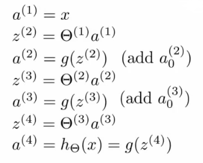

**What is back propagation?**

- Use it to compute the partial derivatives

- Before we dive into the mechanics, let's get an idea regarding the intuition of the algorithm

  - For each node we can calculate (δjl) - this is **the error of node j in layer l**
    - If we remember, ajl is the activation of node j in layer l
    - Remember the activation is a totally calculated value, so we'd expect there to be some error compared to the "real" value
      - The delta term captures this error
      - But the problem here is, "what is this 'real' value, and how do we calculate it?!"
        - The NN is a totally artificial construct
        - The only "real" value we have is our actual classification (our y value) - so that's where we start

- If we use our example and look at the fourth (output) layer, we can first calculate

  - δj4 = aj4 \- yj
    - \[Activation of the unit\] - \[the actual value observed in the training example\]
    - We could also write aj4 as hƟ(x)j
      - Although I'm not sure why we would?
  - This is an individual example implementation

- Instead of focussing on each node, let's think about this as a vectorized problem

  - δ4 = a4 \- y
    - So here δ4 is the vector of errors for the 4th layer
    - a4 is the vector of activation values for the 4th layer

- With δ4 calculated, we can determine the error terms for the other layers as follows;

  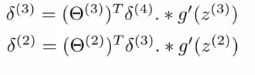

- Taking a second to break this down
  - Ɵ3 is the vector of parameters for the 3->4 layer mapping
  - δ4 is (as calculated) the error vector for the 4th layer
  - g'(z3) is the first derivative of the activation function g evaluated by the input values given by z3
    - You can do the calculus if you want (...), but when you calculate this derivative you get
    - g'(z3) = a3 **. \*** (1 - a3)
  - So, more easily
    - **δ3 = (Ɵ3)T δ4 .\* (a3 . \*(1 - a3))**
  - **. \*** is the element wise multiplication between the two vectors
    - Why element wise? Because this is essentially an extension of individual values in a vectorized implementation, so element wise multiplication gives that effect
    - We highlighted it just in case you think it's a typo!

**Analyzing the mathematics**

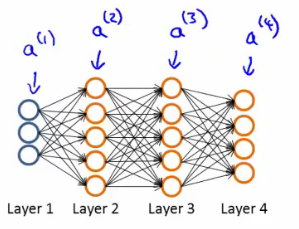

- And if we take a second to consider the vector dimensionality (with our example above \[3-5-5-4\])

  - **Ɵ3 **= is a matrix which is \[4 X 5\] (if we don't include the bias term, 4 X 6 if we do)
    - **(Ɵ3)T** = therefore, is a \[5 X 4\] matrix
  - **δ4** = is a 4x1 vector
  - So when we multiply a \[5 X 4\] matrix with a \[4 X 1\] vector we get a \[5 X 1\] vector
  - Which, low and behold, is the same dimensionality as the **a3** vector, meaning we can run our pairwise multiplication

- For δ3 when you calculate the derivative terms you get

  a3 **.\*** (1 - a3)

- Similarly For δ2 when you calculate the derivative terms you get

  a2 **.\*** (1 - a2)

  - So to calculate δ2 we do

    **δ2 = (Ɵ2)T δ3 .\* (a2 .\* (1 - a2))**

- There's no δ1 term

  - Because that was the input!

**Why do we do this?**

- We do all this to get all the δ terms, and we want the δ terms because through a very complicated derivation you can use δ to get the partial derivative of Ɵ with respect to individual parameters (if you ignore regularization, or regularization is 0, which we deal with later)

-  = ajl δi(l+1)
- By doing back propagation and computing the delta terms you can then compute the **partial derivative terms**
  - We need the partial derivatives to minimize the cost function!

**Putting it all together to get the partial derivatives!**

- What is really happening - lets look at a more complex example

- Training set of m examples

  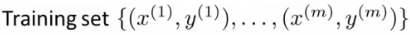

- **First**, set the delta values

  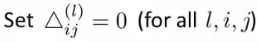

  - Set equal to 0 for all values
  - Eventually these Δ values will be used to compute the partial derivative
    - Will be used as accumulators for computing the partial derivatives

- **Next**, loop through the training set
  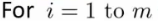

  - i.e. for each example in the training set (dealing with each example as (x,y)
  - Set a1 (activation of input layer) = xi
  - **Perform** **forward propagation** to compute al for each layer (l = 1,2, ... L)
    - i.e. run forward propagation
  - **Then**, use the output label for the specific example we're looking at to calculate δL where δL = aL \- yi
    - So we initially calculate the delta value for the output layer
    - Then, using **back propagation** we move back through the network from layer L-1 down to layer
  - Finally, use Δ to accumulate the partial derivative terms  
    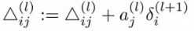
  - Note here
    - l = layer
    - j = node in that layer
    - i = the error of the affected node in the target layer
  - You can vectorize the Δ expression too, as  
    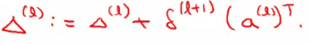

- **Finally**

  - After executing the body of the loop, exit the for loop and compute

    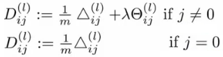

    - When j = 0 we have no regularization term

- At the end of ALL this

  - You've calculated all the *D* terms above using Δ
    - NB - each D term above is a real number!
  - We can show that each D is equal to the following
    - 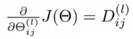
  - We have calculated the partial derivative for each parameter
    - We can then use these in gradient descent or one of the advanced optimization algorithms

- Phew!

  - What a load of hassle!

## Back propagation intuition

- Some additionally back propagation notes
  - In case you found the preceding unclear, which it shouldn't be as it's fairly heavily modified with my own explanatory notes
- Back propagation is hard(ish...)
  - But don't let that discourage you
  - It's hard in as much as it's confusing - it's not difficult, just complex
- Looking at mechanical steps of back propagation

**Forward propagation with pictures!**

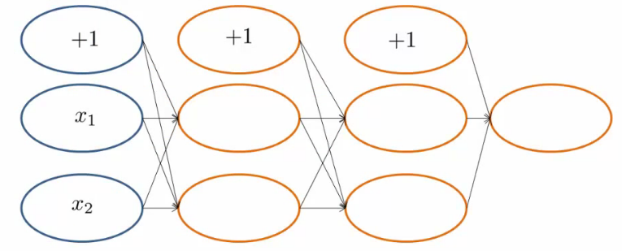

- Feeding input into the input layer (xi, yi)
  - Note that x and y here are vectors from 1 to n where n is the number of features
    - So above, our data has two features (hence x1 and x2)
- With out input data present we use **forward propagation**

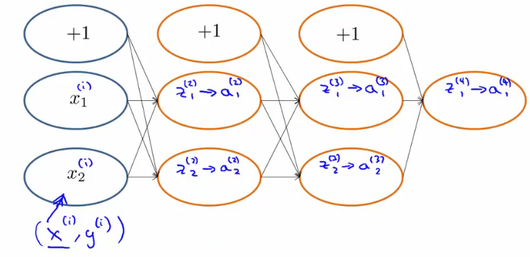

- The sigmoid function applied to the z values gives the activation values
  - Below we show exactly how the z value is calculated for an example

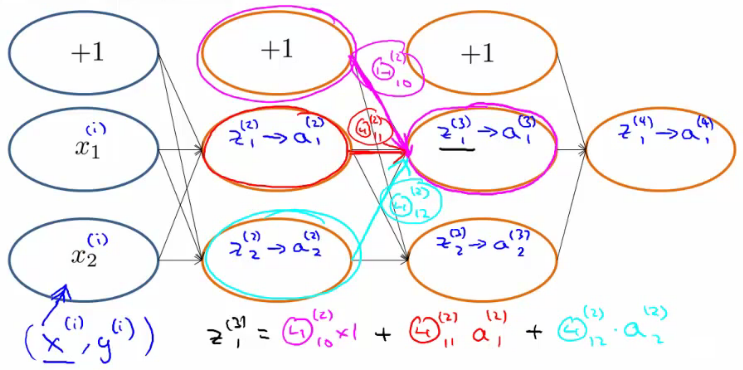

**Back propagation**

- With forwardprop done we move on to do back propagation
- Back propagation is doing something very similar to forward propagation, but backwards
  - Very similar though
- Let's look at the cost function again...
  - Below we have the cost function if there is a single output (i.e. binary classification)

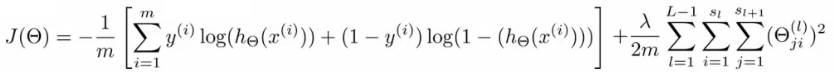

- This function cycles over each example, so the cost for one example really boils down to this

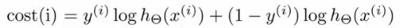

- Which, we can think of as a sigmoidal version of the squared difference (check out the derivation if you don't believe me)

  - So, basically saying, "how well is the network doing on example _i_ "?

- We can think about a δ term on a unit as the "error" of cost for the activation value associated with a unit

  - More formally (_don't worry about this..._), δ is

    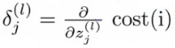

    - Where cost is as defined above
    - Cost function is a function of y value and the hypothesis function

- So - for the output layer, back propagation sets the δ value as \[a - y\]

  - Difference between activation and actual value

- We then propagate these values backwards;

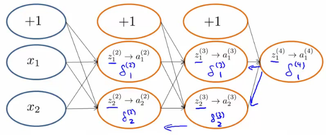

- Looking at another example to see *how* we actually calculate the delta value;

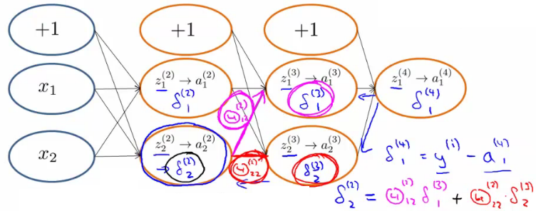

- So, in effect,
  - Back propagation calculates the δ, and those δ values are the weighted sum of the next layer's delta values, weighted by the parameter associated with the links
  - Forward propagation calculates the activation (a) values, which
- Depending on how you implement you may compute the delta values of the bias values
  - However, these aren't actually used, so it's a bit inefficient, but not a lot more!

## Implementation notes - unrolling parameters (matrices)

- Needed for using advanced optimization routines

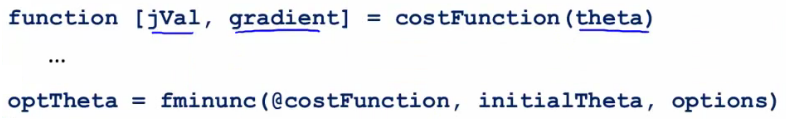

- Is the MATLAB/octave code
  - But theta is going to be matrices
- fminunc takes the costfunction and initial theta values
  - These routines assume theta is a parameter vector
  - Also assumes the gradient created by costFunction is a vector
- For NNs, our parameters are matrices
  - e.g.

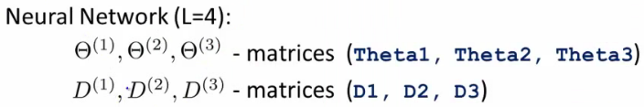

**Example**

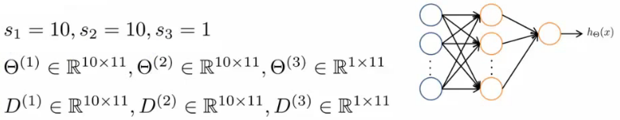

- Use the **thetaVec = \[ Theta1(:); Theta2(:); Theta3(:)\]**; notation to unroll the matrices into a long vector
- To go back you use
  - **Theta1 = resape(thetaVec(1:110), 10, 11)**

**Gradient checking**

- Backpropagation has a lot of details, small bugs can be present and ruin it :-(
  - This may mean it looks like J(Ɵ) is decreasing, but in reality it may not be decreasing by as much as it should
- So using a numeric method to check the gradient can help diagnose a bug
  - Gradient checking helps make sure an implementation is working correctly
- **Example**
  - Have an function J(Ɵ)
  - Estimate derivative of function at point Ɵ (where Ɵ is a real number)
  - How?
    - Numerically
      - Compute Ɵ + ε
      - Compute Ɵ - ε
      - Join them by a straight line
      - Use the slope of that line as an approximation to the derivative

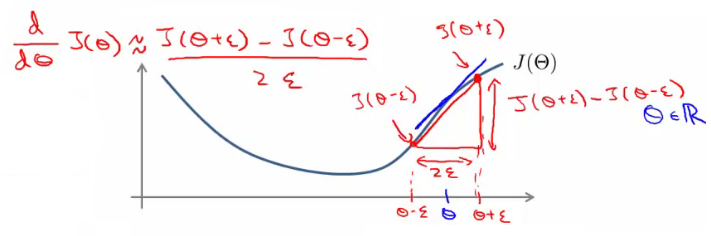

- Usually, epsilon is pretty small (0.0001)
  - If epsilon becomes REALLY small then the term BECOMES the slopes derivative
- The is the two sided difference (as opposed to one sided difference, which would be J(Ɵ + ε) - J(Ɵ) /ε
- If Ɵ is a vector with n elements we can use a similar approach to look at the partial derivatives

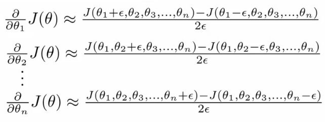

- So, in octave we use the following code the numerically compute the derivatives

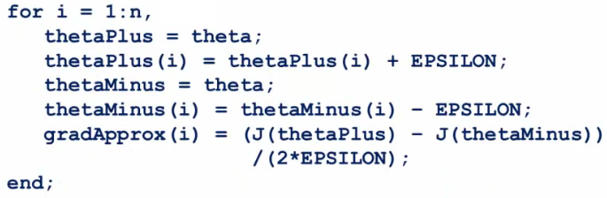

- So on each loop thetaPlus = theta except for thetaPlus(i)
  - Resets thetaPlus on each loop
- Create a vector of partial derivative approximations
- Using the vector of gradients from backprop (DVec)
  - Check that gradApprox is basically equal to DVec
  - Gives confidence that the Backproc implementation is correc
- Implementation note
  - Implement back propagation to compute DVec
  - Implement numerical gradient checking to compute gradApprox
  - Check they're basically the same (up to a few decimal places)
  - Before using the code for learning turn off gradient checking
    - Why?
      - GradAprox stuff is very computationally expensive
      - In contrast backprop is much more efficient (just more fiddly)

## Random initialization

- Pick random small initial values for all the theta values
  - If you start them on zero (which does work for linear regression) then the algorithm fails - all activation values for each layer are the same
- So chose random values!
  - Between 0 and 1, then scale by epsilon (where epsilon is a constant)

## Putting it all together

- **1) - pick a network architecture**

  - Number of

    - **Input units** - number of dimensions x (dimensions of feature vector)
    - **Output units** - number of classes in classification problem
    - **Hidden units**

      - Default might be
        - 1 hidden layer
      - Should probably have
        - Same number of units in each layer
        - Or 1.5-2 x number of input features
      - Normally

        - More hidden units is better
        - But more is more computational expensive

  - We'll discuss architecture more later

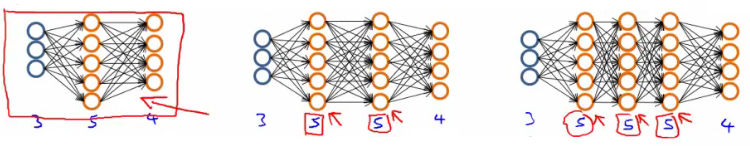

- **2) - Training a neural network**

  - **2.1)** Randomly initialize the weights
    - Small values near 0
  - **2.2)** Implement forward propagation to get hƟ(x)i for any xi
  - **2.3)** Implement code to compute the cost function J(Ɵ)
  - **2.4)** Implement back propagation to compute the partial derivatives

  * General implementation below

    **for i = 1:m {**
    **Forward propagation on (xi, yi) --> get activation (a) terms**
    **Back propagation on (xi, yi) --> get delta (δ) terms**
    **Compute Δ := Δl + δl+1(al)T**
    **}**
    **With this done compute the partial derivative terms**

  - Notes on implementation

    - Usually done with a for loop over training examples (for forward and back propagation)
    - *Can* be done without a for loop, but this is a much more complicated way of doing things
    - Be careful

  - **2.5)** Use gradient checking to compare the partial derivatives computed using the above algorithm and numerical estimation of gradient of J(Ɵ)

    - Disable the gradient checking code for when you actually run it

  - **2.6)** Use gradient descent or an advanced optimization method with back propagation to try to minimize J(Ɵ) as a function of parameters Ɵ
    - Here J(Ɵ) is non-convex
      - Can be susceptible to local minimum
      - In practice this is not usually a huge problem
      - Can't guarantee programs with find global optimum should find good local optimum at least

  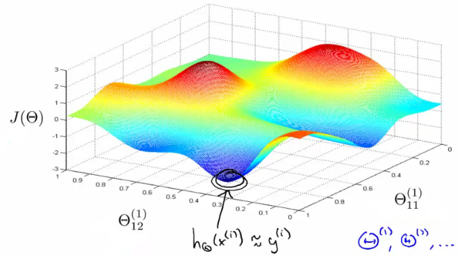

  - e.g. above pretending data only has two features to easily display what's going on
    - Our minimum here represents a hypothesis output which is pretty close to y
    - If you took one of the peaks hypothesis is far from y
  - Gradient descent will start from some random point and move downhill
    - Back propagation calculates gradient down that hill
