# 10: Advice for applying Machine Learning

[Previous](09_Neural_Networks_Learning.md) [Next](11_Machine_Learning_System_Design.md) [Index](README.md)

## Deciding what to try next

- We now know many techniques
  - But, there is a big difference between someone who knows an algorithm vs. someone less familiar and doesn't understand how to apply them
  - Make sure you know how to chose the best avenues to explore the various techniques
  - Here we focus deciding what avenues to try

**Debugging a learning algorithm**

- So, say you've implemented regularized linear regression to predict housing prices

- Trained it
- But, when you test on new data you find it makes unacceptably large errors in its predictions
- :-(
- What should you try next?

  - There are many things you can do;
    - **Get more training data**
      - Sometimes more data doesn't help
      - Often it does though, although you should always do some preliminary testing to make sure more data will actually make a difference (discussed later)
    - **Try a smaller set a features**
      - Carefully select small subset
      - You can do this by hand, or use some dimensionality reduction technique (e.g. PCA - we'll get to this later)
    - **Try getting additional features**
      - Sometimes this isn't helpful
      - LOOK at the data
      - Can be very time consuming
    - **Adding polynomial features**
      - You're grasping at straws, aren't you...
    - **Building your own, new, better features** based on your knowledge of the problem
      - Can be risky if you accidentally over fit your data by creating new features which are inherently specific/relevant to your training data
    - **Try decreasing or increasing** **λ**
      - Change how important the regularization term is in your calculations
  - These changes can become MAJOR projects/headaches (6 months +)

    - Sadly, most common method for choosing one of these examples is to go by gut feeling (randomly)
    - Many times, see people spend huge amounts of time only to discover that the avenue is fruitless
      - No apples, pears, or any other fruit. Nada.

  - There are some simple techniques which can let you rule out half the things on the list
    - Save you a lot of time!

- **Machine learning diagnostics**
  - Tests you can run to see what is/what isn't working for an algorithm
  - See what you can change to improve an algorithm's performance
  - These can take time to implement and understand (week)
    - But, they can also save you spending months going down an avenue which will _never_ work

## Evaluating a hypothesis

- When we fit parameters to training data, try and minimize the error
  - We might think a low error is good - doesn't necessarily mean a good parameter set
    - Could, in fact, be indicative of overfitting
    - This means you model will fail to generalize
  - How do you tell if a hypothesis is overfitting?
    - Could plot hθ(x)
    - But with lots of features may be impossible to plot
- Standard way to evaluate a hypothesis is
  - Split data into two portions
    - 1st portion is **training set**
    - 2nd portion is **test set**
  - Typical split might be 70:30 (training:test)

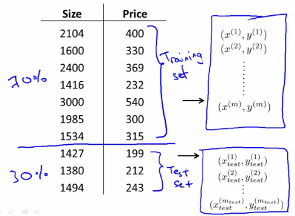

- NB if data is ordered, send a random percentage
  - (Or randomly order, then send data)
  - Data is typically ordered in some way anyway
- So a typical **train and test scheme** would be
  - 1. Learn parameters θ from training data, minimizing J(θ) using 70% of the training data\]
  - 2. Compute the test error
    - Jtest(θ) = average square error as measured on the test set
      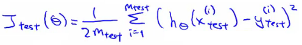
  - This is the definition of the **test set error**
- What about if we were using logistic regression
  - The same, learn using 70% of the data, test with the remaining 30%
    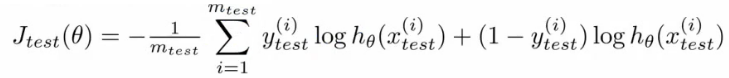
  - Sometimes there a better way - misclassification error (0/1 misclassification)
    - We define the error as follows 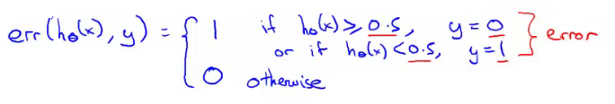
    - Then the test error is 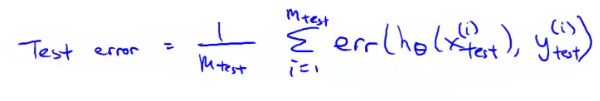
      - i.e. its the fraction in the test set the hypothesis mislabels
- These are the standard techniques for evaluating a learned hypothesis

## Model selection and training validation test sets

- How to chose regularization parameter or degree of polynomial (**model selection problems**)
- We've already seen the problem of overfitting
  - More generally, this is why training set error is a poor predictor of hypothesis accuracy for new data (generalization)
- Model selection problem
  - Try to chose the degree for a polynomial to fit data  
    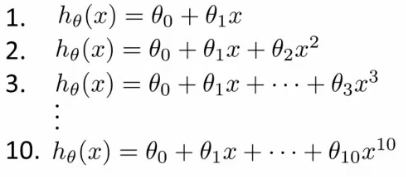
  - d = what degree of polynomial do you want to pick
    - An additional parameter to try and determine your training set
      - d =1 (linear)
      - d=2 (quadratic)
      - ...
      - d=10
    - Chose a model, fit that model and get an estimate of how well you hypothesis will generalize
  - You could
    - Take model 1, minimize with training data which generates a parameter vector θ1 (where d =1)
    - Take mode 2, do the same, get a *different* θ2 (where d = 2)
    - And so on
    - Take these parameters and look at the test set error for each using the previous formula
      - Jtest(θ1)
      - Jtest(θ2)
      - ...
      - Jtest(θ10)
  - You could then
    - See which model has the lowest test set error
  - Say, for example, d=5 is the lowest
    - Now take the d=5 model and say, how well does it generalize?
      - You could use Jtest(θ5)
      - BUT, this is going to be an optimistic estimate of generalization error, because our parameter is fit to that test set (i.e. specifically chose it because the test set error is small)
      - So not a good way to evaluate if it will generalize
  - To address this problem, we do something a bit different for model selection
- Improved model selection
  - Given a training set instead split into three pieces
    - 1 - **Training set** (60%) - m values
    - 2 - **Cross validation** (CV) set (20%)mcv
    - 3 - **Test set** (20%) mtest
  - As before, we can calculate
    - Training error
    - Cross validation error
    - Test error
      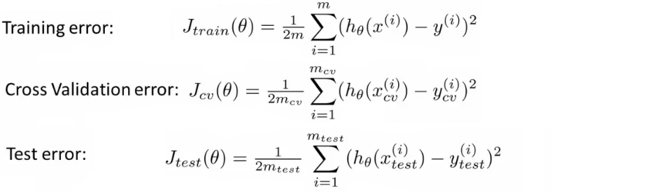
  - So
    - Minimize cost function for each of the models as before
    - Test these hypothesis on the cross validation set to generate the cross validation error
    - Pick the hypothesis with the lowest cross validation error
      - e.g. pick θ5
    - Finally
      - Estimate generalization error of model using the test set
- Final note
  - In machine learning as practiced today - many people will select the model using the test set and then check the model is OK for generalization using the test error (which we've said is bad because it gives a bias analysis)
    - With a MASSIVE test set this is maybe OK
  - But considered much better practice to have separate training and validation sets

## Diagnosis - bias vs. variance

- If you get bad results usually because of one of
  - **High bias** - under fitting problem
  - **High variance** - over fitting problem
- Important to work out which is the problem
  - Knowing which will help let you improve the algorithm
- Bias/variance shown graphically below

- The degree of a model will increase as you move towards overfitting
- Lets define training and cross validation error as before
- Now plot
  - x = degree of polynomial d
  - y = error for both training and cross validation (two lines)
    - CV error and test set error will be very similar  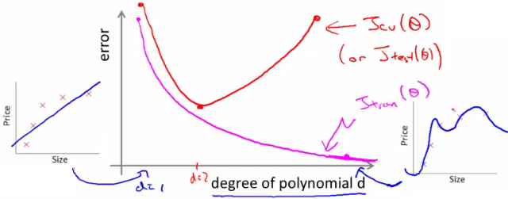
    - This plot helps us understand the error
  - We want to minimize both errors
    - Which is why that d=2 model is the sweet spot
- How do we apply this for diagnostics
  - If cv error is high we're either at the high or the low end of d 
  - if d is too small --> this probably corresponds to a high bias problem
  - if d is too large --> this probably corresponds to a high variance problem
- **For the high bias case, we find both cross validation and training error are high**
  - Doesn't fit training data well
  - Doesn't generalize either
- **For high variance, we find the cross validation error is high but training error is low**
  - So we suffer from overfitting (training is low, cross validation is high)
  - i.e. training set fits well
  - But generalizes poorly

## Regularization and bias/variance

- How is bias and variance effected by regularization?

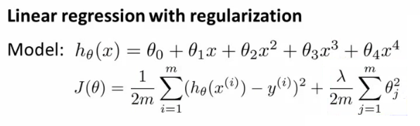

- The equation above describes fitting a high order polynomial with regularization (used to keep parameter values small)
  - Consider three cases
    - **λ = large**
      - All θ values are heavily penalized
      - So most parameters end up being close to zero
      - So hypothesis ends up being close to 0
      - So **high bias -> under fitting data**
    - **λ = intermediate**
      - Only this values gives the fitting which is reasonable
    - **λ = small**
      - Lambda = 0
      - So we make the regularization term 0
      - So **high variance -> Get overfitting** (minimal regularization means it obviously doesn't do what it's meant to)

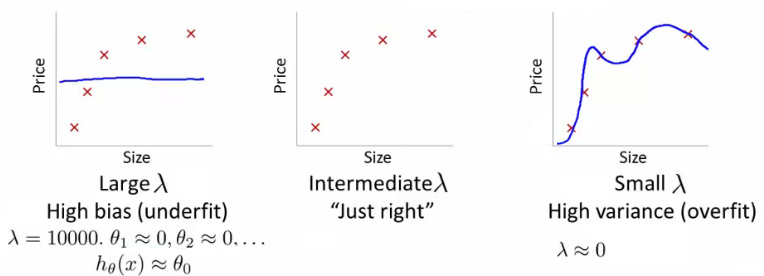

- How can we automatically chose a good value for λ?

  - To do this we define another function Jtrain(θ) which is the optimization function *without* the regularization term (average squared errors)
    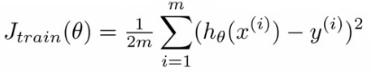
  - Define cross validation error and test set errors as before (i.e. without regularization term)
    - So they are 1/2 average squared error of various sets

- **Choosing λ**
  - Have a set or range of values to use
  - Often increment by factors of 2 so
    - model(1)= λ = 0
    - model(2)= λ = 0.01
    - model(3)= λ = 0.02
    - model(4) = λ = 0.04
    - model(5) = λ = 0.08  
      .  
      .  
      .
    - model(p) = λ = 10
  - This gives a number of models which have different λ
  - With these models
    - Take each one (pth)
    - Minimize the cost function
    - This will generate some parameter vector
      - Call this θ(p)
    - So now we have a set of parameter vectors corresponding to models with different λ values
  - Take all of the hypothesis and use the cross validation set to validate them
    - Measure average squared error on cross validation set
    - Pick the model which gives the lowest error
    - Say we pick θ(5)
  - Finally, take the one we've selected (θ(5)) and test it with the test set
- **Bias/variance as a function of λ**
  - Plot λ vs.
    - Jtrain
      - When λ is small you get a small value (regularization basically goes to 0)
      - When λ is large you get a large vale corresponding to high bias
    - Jcv
      - When λ is small we see high variance
        - Too small a value means we over fit the data
      - When λ is large we end up underfitting, so this is bias
        - So cross validation error is high
  - Such a plot can help show you you're picking a good value for λ

## Learning curves

- A learning curve is often useful to plot for algorithmic sanity checking or improving performance
- What is a learning curve?
  - Plot Jtrain (average squared error on training set) or Jcv (average squared error on cross validation set)
  - Plot against m (number of training examples)
    - m is a constant
    - So artificially reduce m and recalculate errors with the smaller training set sizes
  - Jtrain
    - Error on smaller sample sizes is smaller (as less variance to accommodate)
    - So as m grows error grows
  - Jcv
    - Error on cross validation set
    - When you have a tiny training set your generalize badly
    - But as training set grows your hypothesis generalize better
    - So cv error will decrease as m increases

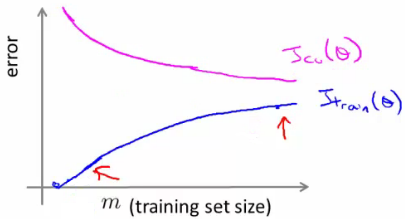

- What do these curves look like if you have
  - **High bias**
    - e.g. setting straight line to data
    - Jtrain
      - Training error is small at first and grows
      - Training error becomes close to cross validation
      - So the performance of the cross validation and training set end up being similar (but very poor)
    - Jcv
      - Straight line fit is similar for a few vs. a lot of data
      - So it doesn't generalize any better with lots of data because the function just doesn't fit the data
        - No increase in data will help it fit
    - The problem with high bias is because cross validation and training error are both high
    - Also implies that if a learning algorithm as high bias as we get more examples the cross validation error doesn't decrease
      - **So if an algorithm is already suffering from high bias, more data does not help**
      - So knowing if you're suffering from high bias is good!
      - In other words, high bias is a problem with the underlying way you're modeling your data
        - So more data won't improve that model
        - It's too simplistic
  - **High variance**
    - e.g. high order polynomial
    - Jtrain
      - When set is small, training error is small too
      - As training set sizes increases, value is still small
      - But slowly increases (in a near linear fashion)
      - Error is still low
    - Jcv
      - Error remains high, even when you have a moderate number of examples
      - Because the problem with high variance (overfitting) is your model doesn't generalize
    - An indicative diagnostic that you have high variance is that there's a big gap between training error and cross validation error
    - If a learning algorithm is suffering from high variance, more data is probably going to help  
      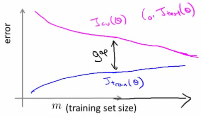
      - **So if an algorithm is already suffering from high variance, more data will probably help**
        - Maybe
  - These are clean curves
  - In reality the curves you get are far dirtier
  - But, learning curve plotting can help diagnose the problems your algorithm will be suffering from

## What to do next (revisited)

- How do these ideas help us chose how we approach a problem?

  - Original example
    - Trained a learning algorithm (regularized linear regression)
    - But, when you test on new data you find it makes unacceptably large errors in its predictions
    - What should try next?
  - How do we decide what to do?

    - **Get more examples** \--> helps to fix high variance
      - Not good if you have high bias
    - **Smaller set of features** --> fixes high variance (overfitting)
      - Not good if you have high bias
    - **Try adding additional features** --> fixes high bias (because hypothesis is too simple, make hypothesis more specific)

    - **Add polynomial terms** --> fixes high bias problem

    - **Decreasing** **λ** --> fixes high bias

    - **Increases** **λ** --> fixes high variance

- Relating it all back to neural networks - selecting a network architecture
  - One option is to use a small neural network
    - Few (maybe one) hidden layer and few hidden units
    - Such networks are prone to under fitting
    - But they are computationally cheaper
  - Larger network
    - More hidden layers
      - How do you decide that a larger network is good?
  - Using a single hidden layer is good default
    - Also try with 1, 2, 3, see which performs best on cross validation set
    - So like before, take three sets (training, cross validation)
  - More units
    - This is computational expensive
    - Prone to over-fitting
      - Use regularization to address over fitting
