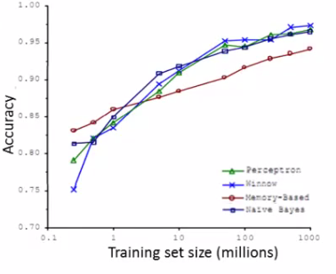

# 11: Machine Learning System Design

[Previous](10_Advice_for_applying_machine_learning.md) [Next](12_Support_Vector_Machines.md) [Index](README.md)

## Machine learning systems design

- In this section we'll touch on how to put together a system
- Previous sections have looked at a wide range of different issues in significant focus
- This section is less mathematical, but material will be very useful non-the-less
  - Consider the system approach
  - You can understand all the algorithms, but if you don't understand how to make them work in a complete system that's no good!

## Prioritizing what to work on - spam classification example

- The idea of prioritizing what to work on is perhaps the most important skill programmers typically need to develop

  - It's so easy to have many ideas you want to work on, and as a result do none of them well, because doing one well is harder than doing six superficially
    - So you need to make sure you complete projects
    - Get something "shipped" - even if it doesn't have all the bells and whistles, that final 20% getting it ready is often the toughest
    - If you only release when you're totally happy you rarely get practice doing that final 20%
  - So, back to machine learning...

- Building a spam classifier

- Spam is email advertising

  

- What kind of features might we define

  - Spam (1)
    - Misspelled word
  - Not spam (0)
    - Real content

- How do we build a classifier to distinguish between the two
  - Feature representation
    - How do represent x (features of the email)?
      - y = spam (1) or not spam (0)

**One approach - choosing your own features**

- Chose 100 words which are indicative of an email being spam or not spam

  - Spam --> e.g. buy, discount, deal
  - Non spam --> Andrew, now
  - All these words go into one long vector

- Encode this into a **reference vector**

  - See which words appear in a message

- Define a feature vector x

  - Which is 0 or 1 if a word corresponding word in the reference vector is present or not

    - This is a bitmap of the word content of your email

- i.e. don't recount if a word appears more than once
  

  - In practice its more common to have a training set and pick the most frequently n words, where n is 10 000 to 50 000

    - So here you're not specifically choosing your own features, but you are choosing *how* you select them from the training set data

**What's the best use of your time to improve system accuracy?**

- Natural inclination is to collect lots of data
  - Honey pot anti-spam projects try and get fake email addresses into spammers' hands, collect loads of spam
  - This doesn't always help though
- Develop sophisticated features based on email routing information (contained in email header)
  - Spammers often try and obscure origins of email
  - Send through unusual routes
- Develop sophisticated features for message body analysis
  - Discount == discounts?
  - DEAL == deal?
- Develop sophisticated algorithm to detect misspelling

  - Spammers use misspelled word to get around detection systems

- Often a research group **randomly focus on one option**
  - May not be the most fruitful way to spend your time
  - If you brainstorm a set of options this is **really good**
    - Very tempting to just try something

**Error analysis**

- When faced with a ML problem lots of ideas of how to improve a problem
  - Talk about error analysis - how to better make decisions
- If you're building a machine learning system often good to start by building a simple algorithm which you can implement quickly
  - Spend at most 24 hours developing an initially bootstrapped algorithm
    - Implement and test on cross validation data
  - Plot learning curves to decide if more data, features etc will help algorithmic optimization
    - Hard to tell in advance what is important
    - Learning curves really help with this
    - Way of avoiding **premature optimization**
      - We should let evidence guide decision making regarding development trajectory
  - **Error analysis**
    - Manually examine the samples (in cross validation set) that your algorithm made errors on
    - See if you can work out why
      - Systematic patterns - help design new features to avoid these shortcomings
    - e.g.
      - Built a spam classifier with 500 examples in CV set
        - Here, error rate is high - gets 100 wrong
      - Manually look at 100 and categorize them depending on features
        - e.g. type of email
      - Looking at those email
        - May find **most common type** of spam emails are pharmacy emails, phishing emails
          - See which type is most common - focus your work on those ones
        - What **features would have helped** classify them correctly
          - e.g. deliberate misspelling
          - Unusual email routing
          - Unusual punctuation
          - May fine some "spammer technique" is causing a lot of your misses
            - Guide a way around it
  - Importance of **numerical evaluation**
    - Have a way of numerically evaluated the algorithm
    - If you're developing an algorithm, it's really good to have some performance calculation which gives a single real number to tell you how well its doing
    - e.g.
      - Say were deciding if we should treat a set of similar words as the same word
      - This is done by stemming in NLP (e.g. "Porter stemmer" looks at the etymological stem of a word)
      - This may make your algorithm better or worse
        - Also worth consider weighting error (false positive vs. false negative)
          - e.g. is a false positive really bad, or is it worth have a few of one to improve performance a lot
      - Can use numerical evaluation to compare the changes
        - See if a change improves an algorithm or not
    - A single real number may be hard/complicated to compute
      - But makes it much easier to evaluate how changes impact your algorithm
  - You should do error analysis on the cross validation set instead of the test set

## Error metrics for skewed analysis

- Once case where it's hard to come up with good error metric - skewed classes
- Example
  - Cancer classification
    - Train logistic regression model hθ(x) where
      - Cancer means y = 1
      - Otherwise y = 0
    - Test classifier on test set
      - Get 1% error
        - So this looks pretty good..
      - But only 0.5% have cancer
        - Now, 1% error looks very bad!
  - So when one number of examples is very small this is an example of skewed classes
    - LOTS more of one class than another
    - So standard error metrics aren't so good
- Another example
  - Algorithm has 99.2% accuracy
  - Make a change, now get 99.5% accuracy
    - Does this really represent an improvement to the algorithm?
  - Did we do something useful, or did we just create something which predicts y = 0 more often
    - Get very low error, but classifier is still not great

**Precision and recall**

- Two new metrics - **precision** and **recall**
  - Both give a value between 0 and 1
  - Evaluating classifier on a test set
  - For a test set, the actual class is 1 or 0
  - Algorithm predicts some value for class, predicting a value for each example in the test set
    - Considering this, classification can be
      - **True positive (we guessed 1, it was 1)**
      - **False positive (we guessed 1, it was 0)**
      - **True negative (we guessed 0, it was 0)**
      - **False negative (we guessed 0, it was 1)**
  - **Precision**
    - _How often does our algorithm cause a false alarm?_
    - Of all patients we predicted have cancer, what fraction of them _actually_ have cancer
      - = true positives / # predicted positive
      - = true positives / (true positive + false positive)
    - High precision is good (i.e. closer to 1)
      - You want a big number, because you want false positive to be as close to 0 as possible
  - **Recall**
    - _How sensitive is our algorithm?_
    - Of all patients in set that actually have cancer, what fraction did we correctly detect
      - = true positives / # actual positives
      - = true positive / (true positive + false negative)
    - High recall is good (i.e. closer to 1)
      - You want a big number, because you want false negative to be as close to 0 as possible
  - By computing precision and recall get a better sense of how an algorithm is doing
    - This can't really be gamed
    - Means we're much more sure that an algorithm is good
  - Typically we say the presence of a rare class is what we're trying to determine (e.g. positive (1) is the existence of the rare thing)

## Trading off precision and recall

- For many applications we want to control the trade-off between precision and recall
- Example
  - Trained a logistic regression classifier
    - Predict 1 if hθ(x) >= 0.5
    - Predict 0 if hθ(x) < 0.5
  - This classifier may give some value for precision and some value for recall
  - Predict 1 only if very confident
    - One way to do this modify the algorithm we could modify the prediction threshold
      - Predict 1 if hθ(x) >= 0.8
      - Predict 0 if hθ(x) < 0.2
    - Now we can be more confident a 1 is a true positive
    - But classifier has lower recall - predict y = 1 for a smaller number of patients
      - Risk of false negatives
  - Another example - avoid false negatives
    - This is probably worse for the cancer example
      - Now we may set to a lower threshold
        - Predict 1 if hθ(x) >= 0.3
          - Predict 0 if hθ(x) < 0.7
      - i.e. 30% chance they have cancer
      - So now we have have a higher recall, but lower precision
        - Risk of false positives, because we're less discriminating in deciding what means the person has cancer
- This threshold defines the trade-off

  - We can show this graphically by plotting precision vs. recall  
    
  - This curve can take many different shapes depending on classifier details
  - Is there a way to automatically chose the threshold
    - Or, if we have a few algorithms, how do we compare different algorithms or parameter sets? 
  - How do we decide which of these algorithms is best?

  - We spoke previously about using a single real number evaluation metric

    - By switching to precision/recall we have two numbers
    - Now comparison becomes harder

    - Better to have just one number

  - How can we convert P & R into one number?
    - One option is the average - (P + R)/2
      - This is not such a good solution
        - Means if we have a classifier which predicts y = 1 all the time you get a high recall and low precision
        - Similarly, if we predict Y rarely get high precision and low recall
        - So averages here would be 0.45, 0.4 and 0.51
          - 0.51 is best, despite having a recall of 1 - i.e. predict y=1 for everything
      - So average isn't great
    - **F1Score** (**fscore**)
      - = 2 \* (PR/ \[P + R\])
      - Fscore is like taking the average of precision and recall giving a higher weight to the lower value
    - Many formulas for computing comparable precision/accuracy values
      - If P = 0 or R = 0 the Fscore = 0
      - If P = 1 and R = 1 then Fscore = 1
      - The remaining values lie between 0 and 1

- Threshold offers a way to control trade-off between precision and recall
- Fscore gives a single real number evaluation metric
  - If you're trying to automatically set the threshold, one way is to try a range of threshold values and evaluate them on your cross validation set
    - Then pick the threshold which gives the best fscore.

## Data for machine learning

- Now switch tracks and look at how much data to train on
- On early videos caution on just blindly getting more data
  - Turns out under certain conditions getting more data is a very effective way to improve performance

**Designing a high accuracy learning system**

- There have been studies of using different algorithms on data

  - Data - confusing words (e.g. two, to or too)
  - Algorithms
    - Perceptron (logistic regression)
    - Winnow
      - Like logistic regression
      - Used less now
    - Memory based
      - Used less now
      - Talk about this later
    - Naive Bayes
      - Cover later
  - Varied training set size and tried algorithms on a range of sizes  
    
  - What can we conclude
    - Algorithms give remarkably similar performance
    - As training set sizes increases accuracy increases
    - Take an algorithm, give it more data, should beat a "better" one with less data
    - Shows that
      - Algorithm choice is pretty similar
      - More data helps

- When is this true and when is it not?
  - If we can correctly assume that features _x_ have enough information to predict _y_ accurately, then more data will probably help
    - A useful test to determine if this is true can be, "given _x_, can a human expert predict _y_?"
  - So lets say we use a learning algorithm with many parameters such as logistic regression or linear regression with many features, or neural networks with many hidden features
    - These are powerful learning algorithms with many parameters which can fit complex functions
      - Such algorithms are low bias algorithms
        - Little systemic bias in their description - flexible
    - Use a small training set
      - Training error should be small
    - Use a very large training set
      - If the training set error is close to the test set error
      - Unlikely to over fit with our complex algorithms
      - So the test set error should also be small
  - Another way to think about this is we want our algorithm to have low bias and low variance
    - Low bias --> use complex algorithm
    - Low variance --> use large training set
