# 12: Support Vector Machines (SVMs)

[Previous](11_Machine_Learning_System_Design.md) [Next](13_Clustering.md) [Index](README.md)

## Support Vector Machine (SVM) - Optimization objective

- So far, we've seen a range of different algorithms
  - With supervised learning algorithms - performance is pretty similar
    - What matters more often is;
      - The amount of training data
      - Skill of applying algorithms
- One final supervised learning algorithm that is widely used - **support vector machine (SVM)**
  - Compared to both logistic regression and neural networks, a SVM sometimes gives a cleaner way of learning non-linear functions
  - Later in the course we'll do a survey of different supervised learning algorithms

**An alternative view of logistic regression**

- Start with logistic regression, see how we can modify it to get the SVM
  - As before, the logistic regression hypothesis is as follows 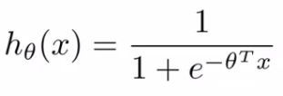
  - And the sigmoid activation function looks like this 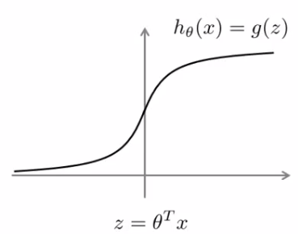
  - In order to explain the math, we use z as defined above
- What do we want logistic regression to do?
  - We have an example where y = 1
    - Then we hope hθ(x) is close to 1
    - With hθ(x) close to 1, (θ_T_ x) must be **much larger** than 0 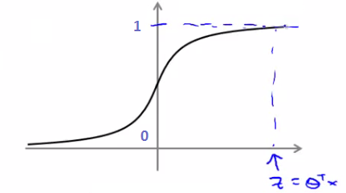
  - Similarly, when y = 0
    - Then we hope hθ(x) is close to 0
    - With hθ(x) close to 0, (θ_T_ x) must be **much less** than 0
  - This is our classic view of logistic regression
    - Let's consider another way of thinking about the problem
- Alternative view of logistic regression
  - If you look at cost function, each example contributes a term like the one below to the overall cost function
    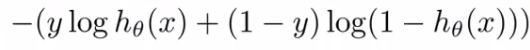
    - For the overall cost function, we sum over all the training examples using the above function, and have a 1/m term
- If you then plug in the hypothesis definition (hθ(x)), you get an expanded cost function equation;
  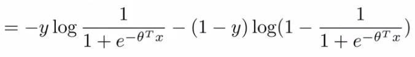
- So each training example contributes that term to the cost function for logistic regression

- If y = 1 then only the first term in the objective matters
  - If we plot the functions vs. z we get the following graph
    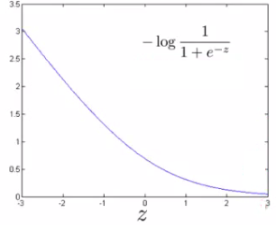
    - This plot shows the cost contribution of an example when y = 1 given z
      - So if z is big, the cost is low - this is good!
      - But if z is 0 or negative the cost contribution is high
      - This is why, when logistic regression sees a positive example, it tries to set θ_T_ x to be a very large term
- If y = 0 then only the second term matters
  - We can again plot it and get a similar graph  
    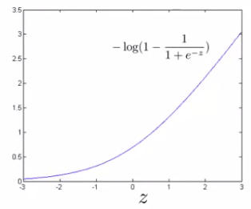
    - Same deal, if z is small then the cost is low
      - But if s is large then the cost is massive

**SVM cost functions from logistic regression cost functions**

- To build a SVM we must redefine our cost functions

  - When y = 1
    - Take the y = 1 function and create a new cost function
    - Instead of a curved line create two straight lines (magenta) which acts as an approximation to the logistic regression y = 1 function
      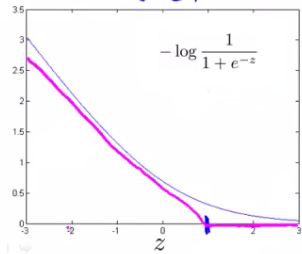
      - Take point (1) on the z axis
        - Flat from 1 onwards
        - Grows when we reach 1 or a lower number
      - This means we have two straight lines
        - Flat when cost is 0
        - Straight growing line after 1
    - So this is the new y=1 cost function
      - Gives the SVM a computational advantage and an easier optimization problem
      - We call this function **cost1(z)**

- Similarly

  - When y = 0

    - Do the equivalent with the y=0 function plot
      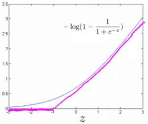

    - We call this function **cost0(z)**

- So here we define the two cost function terms for our SVM graphically
  - How do we implement this?

**The complete SVM cost function**

- As a comparison/reminder we have logistic regression below
  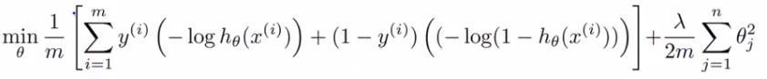
  - If this looks unfamiliar its because we previously had the - sign outside the expression
- For the SVM we take our two logistic regression y=1 and y=0 terms described previously and replace with
  - cost1(θ_T_ x)
  - cost0(θ_T_ x)
- So we get
  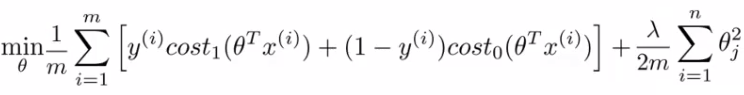

**SVM notation is slightly different**

- In convention with SVM notation we rename a few things here
- <u>1. Get rid of the 1/m terms</u>
  - This is just a slightly different convention
  - By removing 1/m we should get the same optimal values for
    - 1/m is a constant, so should get same optimization
    - e.g. say you have a minimization problem which minimizes to u = 5
      - If your cost function \* by a constant, you still generates the minimal value
      - That minimal value is different, but that's irrelevant
- <u>2. For logistic regression we had two terms</u>
  - Training data set term (i.e. that we sum over m) = **A**
  - Regularization term (i.e. that we sum over n) = **B**
    - So we could describe it as A + λB
    - Need some way to deal with the trade-off between regularization and data set terms
    - Set different values for λ to parametrize this trade-off
  - Instead of parameterization this as A + λB
    - For SVMs the convention is to use a different parameter called C
    - So do CA + B
    - If C were equal to 1/λ then the two functions (CA + B and A + λB) would give the same value
- So, our overall equation is
  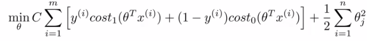

- Unlike logistic, hθ(x) doesn't give us a probability, but instead we get a direct prediction of 1 or 0
  - So if θ_T_ x is equal to or greater than 0 --> hθ(x) = 1
  - Else --> hθ(x) = 0

## Large margin intuition

- Sometimes people refer to SVM as **large margin classifiers**
  - We'll consider what that means and what an SVM hypothesis looks like
  - The SVM cost function is as above, and we've drawn out the cost terms below
    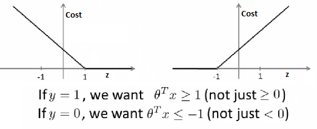
  - Left is cost1 and right is cost0
  - What does it take to make terms small
    - If y =1
      - cost1(z) = 0 only when z >= 1
    - If y = 0
      - cost0(z) = 0 only when z <= -1
  - Interesting property of SVM
    - If you have a positive example, you only really _need_ z to be greater or equal to 0
      - If this is the case then you predict 1
    - SVM wants a bit more than that - doesn't want to \*just\* get it right, but have the value be quite a bit bigger than zero
      - Throws in an extra safety margin factor
- Logistic regression does something similar
- What are the consequences of this?
  - Consider a case where we set C to be huge
    - C = 100,000
    - So considering we're minimizing CA + B
      - If C is huge we're going to pick an A value so that A is equal to zero
      - What is the optimization problem here - how do we make A = 0?
    - Making A = 0
      - If y = 1
        - Then to make our "A" term 0 need to find a value of θ so (θ_T_ x) is greater than or equal to 1
      - Similarly, if y = 0
        - Then we want to make "A" = 0 then we need to find a value of θ so (θ_T_ x) is equal to or less than -1
    - So - if we think of our optimization problem a way to ensure that this first "A" term is equal to 0, we re-factor our optimization problem into just minimizing the "B" (regularization) term, because
      - When A = 0 --> A\*C = 0
    - So we're minimizing B, under the constraints shown below
      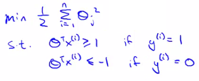
  - Turns out when you solve this problem you get interesting decision boundaries
    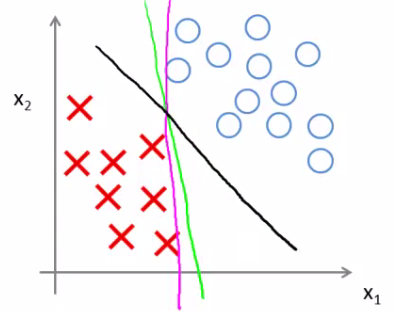
  - The green and magenta lines are functional decision boundaries which could be chosen by logistic regression
    - But they probably don't generalize too well
  - The black line, by contrast is the the chosen by the SVM because of this safety net imposed by the optimization graph
    - More robust separator
  - Mathematically, that black line has a larger minimum distance (margin) from any of the training examples
    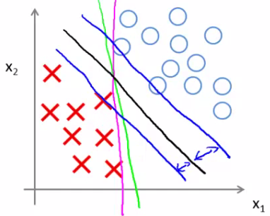
  - By separating with the largest margin you incorporate robustness into your decision making process
- We looked at this at when C is very large
  - SVM is more sophisticated than the large margin might look
    - If you were just using large margin then SVM would be very sensitive to outliers
      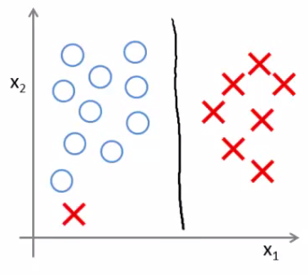
    - You would risk making a ridiculous hugely impact your classification boundary
      - A single example might not represent a good reason to change an algorithm
      - If C is very large then we *do* use this quite naive maximize the margin approach
        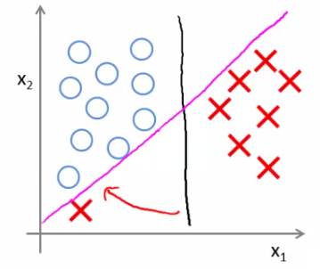
      - So we'd change the black to the magenta
    - But if C is reasonably small, or a not too large, then you stick with the black decision boundary
  - What about non-linearly separable data?
    - Then SVM still does the right thing if you use a normal size C
    - So the idea of SVM being a large margin classifier is only really relevant when you have no outliers and you can easily linearly separable data
  - Means we ignore a few outliers

## Large margin classification mathematics (optional)

**Vector inner products**

- Have two (2D) vectors u and v - what is the inner product (_uT v_)?
  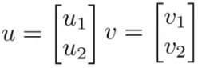
  - Plot _u_ on graph
    - i.e *u1* vs. _u2_
      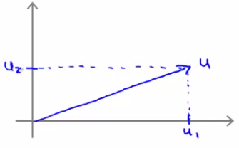
  - One property which is good to have is the **norm** of a vector
    - Written as ‖u‖
      - This is the euclidean length of vector u
    - So ‖u‖ = SQRT(_u12_ + _u22_ ) = real number
      - i.e. length of the arrow above
      - Can show via Pythagoras
  - For the inner product, take *v* and orthogonally project down onto u
    - First we can plot v on the same axis in the same way (_v1_ vs *v1*)
    - Measure the length/magnitude of the projection
      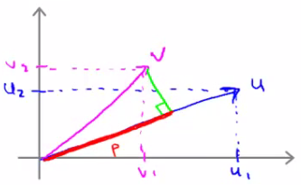
    - So here, the green line is the projection
      - p = length along u to the intersection
      - p is the magnitude of the projection of vector _v_ onto vector _u_
  - Possible to show that
    - _uTv_ = p \* ‖u‖
      - So this is one way to compute the inner product
    - _uTv_ = _u1v1_ + _u2v2_
    - So therefore
      - **p \* ‖u‖ = _u1v1_ + _u2v2_**
      - This is an important rule in linear algebra
    - We can reverse this too
      - So we could do
        - _vTu_ = *v1u1 + v2u2*
        - Which would obviously give you the same number
  - p can be negative if the angle between them is 90 degrees or more  
    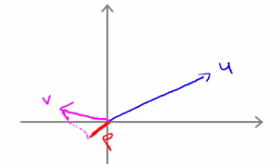
    - So here p is negative
- Use the vector inner product theory to try and understand SVMs a little better

**SVM decision boundary**  
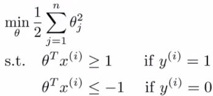

- For the following explanation - two simplification
  - Set θ0= 0 (i.e. ignore intercept terms)
  - Set n = 2 - (x1, x2)
    - i.e. each example has only 2 features
- Given we only have two parameters we can simplify our function to
  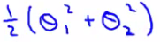
- And, can be re-written as
  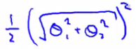
  - Should give same thing
- We may notice that
  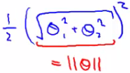
  - The term in red is the norm of θ
    - If we take θ as a 2x1 vector
    - If we assume θ0 = 0 its still true
- So, finally, this means our optimization function can be re-defined as
  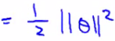
- So the SVM is minimizing the squared norm

- Given this, what are the (θ_T_ x) parameters doing?
  - Given θ and given example x what is this equal to
    - We can look at this in a comparable manner to how we just looked at u and v
  - Say we have a single positive training example (red cross below)
    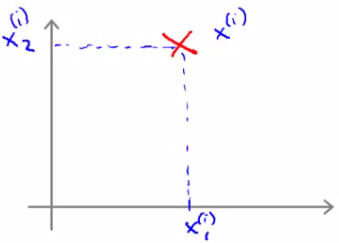
  - Although we haven't been thinking about examples as vectors it can be described as such
    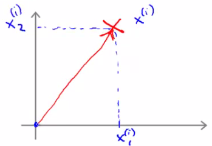
  - Now, say we have our parameter vector θ and we plot that on the same axis
    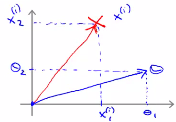
  - The next question is what is the inner product of these two vectors
    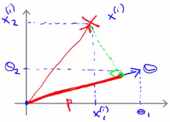
    - p, is in fact pi, because it's the length of p for example i
      - Given our previous discussion we know
        (θ_T_ xi ) = pi \* ‖θ‖
                   = θ1xi1 + θ2xi2
      - So these are both equally valid ways of computing θ_T_ xi
- What does this mean?

  - The constraints we defined earlier
    - (θ_T_ x) >= 1 if y = 1
    - (θ_T_ x) <= -1 if y = 0
  - Can be replaced/substituted with the constraints
    - pi \* ‖θ‖ \>= 1 if y = 1
    - pi \* ‖θ‖ <= -1 if y = 0
  - Writing that into our optimization objective
    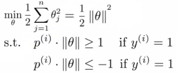

- So, given we've redefined these functions let us now consider the training example below  
  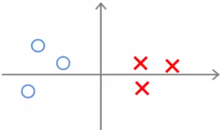
  - Given this data, what boundary will the SVM choose? Note that we're still assuming θ0 = 0, which means the boundary has to pass through the origin (0,0)
    - Green line - small margins
      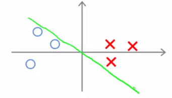
      - SVM would not chose this line
        - Decision boundary comes very close to examples
        - Lets discuss *why* the SVM would **not** chose this decision boundary
  - Looking at this line
    - We can show that θ is at 90 degrees to the decision boundary  
      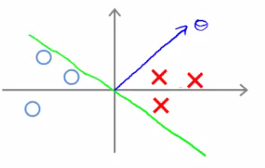
      - **θ is always at 90 degrees to the decision boundary** (can show with linear algebra, although we're not going to!)
- So now lets look at what this implies for the optimization objective

  - Look at first example (x1)
    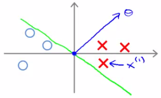

  - Project a line from x1 on to to the θ vector (so it hits at 90 degrees)
    - The distance between the intersection and the origin is (**p1**)
  - Similarly, look at second example (x2)
    - Project a line from x2 into to the θ vector
    - This is the magenta line, which will be **negative** (**p2**)
  - If we overview these two lines below we see a graphical representation of what's going on;
    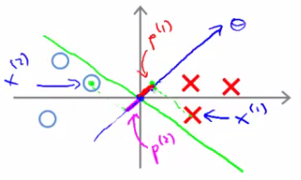
  - We find that both these p values are going to be pretty small
  - If we look back at our optimization objective
    - We know we need p1 \* ‖θ‖ to be bigger than or equal to 1 for positive examples
      - If p is small
        - Means that ‖θ‖ must be pretty large
    - Similarly, for negative examples we need p2 \* ‖θ‖ to be smaller than or equal to -1
      - We saw in this example p2 is a small negative number
        - So ‖θ‖ must be a large number
  - Why is this a problem?
    - The optimization objective is trying to find a set of parameters where the norm of theta is small
      - So this doesn't seem like a good direction for the parameter vector (because as p values get smaller ‖θ‖ must get larger to compensate)
        - So we should make p values larger which allows ‖θ‖ to become smaller

- So lets chose a different boundary
  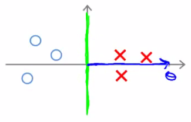

  - Now if you look at the projection of the examples to θ we find that p1 becomes large and ‖θ‖ can become small

  - So with some values drawn in
    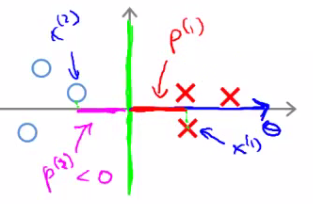
  - This means that by choosing this second decision boundary we can make ‖θ‖ smaller
    - Which is why the SVM choses this hypothesis as better
    - This is how we generate the large margin effect
      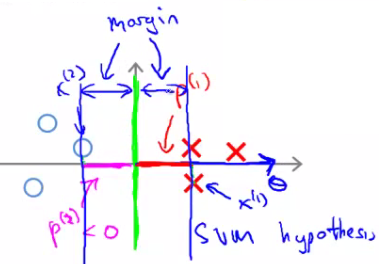
    - The magnitude of this margin is a function of the p values
      - So by maximizing these p values we minimize ‖θ‖

- Finally, we did this derivation assuming θ0 = 0,
  - If this is the case we're entertaining only decision boundaries which pass through (0,0)
  - If you allow θ0 to be other values then this simply means you can have decision boundaries which cross through the x and y values at points other than (0,0)
  - Can show with basically same logic that this works, and even when θ0 is non-zero when you have optimization objective described above (when C is very large) that the SVM is looking for a large margin separator between the classes

## Kernels I: Adapting SVM to non-linear classifiers

- What are kernels and how do we use them

  - We have a training set

  - We want to find a non-linear boundary
    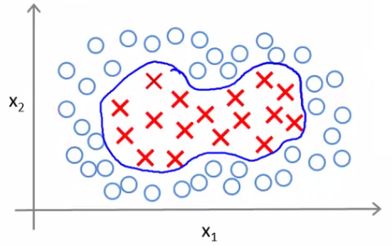
  - Come up with a complex set of polynomial features to fit the data
    - Have hθ(x) which
      - Returns 1 if the combined weighted sum of vectors (weighted by the parameter vector) is less than or equal to 0
      - Else return 0
    - Another way of writing this (new notation) is
      - That a hypothesis computes a decision boundary by taking the sum of the parameter vector multiplied by a **new feature vector f**, which simply contains the various high order x terms
      - e.g.
        - hθ(x) = θ0+ θ1f1+ θ2f2 + θ3f3
        - Where
          - f1= x1
          - f2 = x1x2
          - f3 = ...
          - i.e. not specific values, but each of the terms from your complex polynomial function
    - Is there a better choice of feature f than the high order polynomials?
      - As we saw with computer imaging, high order polynomials become computationally expensive

- New features
  - Define three features in this example (ignore x0)
  - Have a graph of x1 vs. x2 (don't plot the values, just define the space)
  - Pick three points in that space
    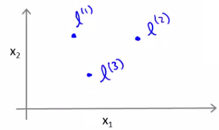
  - These points l1, l2, and l3, were chosen manually and are called **landmarks**
    - Given x, define f1 as the similarity between (x, l1)
      - = exp(- (‖ x - l1 ‖2 ) / 2σ2)
        = 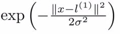
      - **‖ x - l1‖** is the euclidean distance between the point x and the landmark l1
      - squared
      - Disussed more later
      - If we remember our statistics, we know that
        - σ is the **standard** **deviation**
        - σ2 is commonly called the **variance**
    - Remember, that as discussed  
      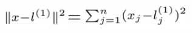
  - So, f2 is defined as
    - f2 = similarity(x, l1) = exp(- (‖ x - l2‖2 ) / 2σ2)
  - And similarly
    - f3 = similarity(x, l2) = exp(- (‖ x - l1‖2 ) / 2σ2)
  - This similarity function is called a **kernel**
    - This function is a **Gaussian Kernel**
  - So, instead of writing similarity between x and l we might write
    - f1 = k(x, l1)

**Diving deeper into the kernel**

- So lets see what these kernels do and why the functions defined make sense
  - Say x is close to a landmark
    - Then the squared distance will be ~0
      - So
        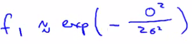
        - Which is basically e\-0
          - Which is close to 1
    - Say x is far from a landmark
      - Then the squared distance is big
        - Gives e\-large number
          - Which is close to zero
    - Each landmark defines a new features
- If we plot f1 vs the kernel function we get a plot like this
  - Notice that when x = \[3,5\] then f1 = 1
  - As x moves away from \[3,5\] then the feature takes on values close to zero
  - So this measures how close x is to this landmark
    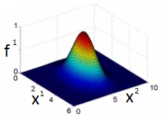

**What does σ do?**

- **σ2** is a parameter of the Gaussian kernel
  - Defines the steepness of the rise around the landmark
- Above example σ2 = 1
- Below σ2 = 0.5  
  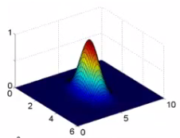
  - We see here that as you move away from 3,5 the feature f1 falls to zero much more rapidly
- The inverse can be seen if σ2 = 3  
  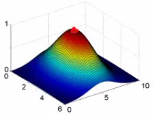

* Given this definition, what kinds of hypotheses can we learn?
  - With training examples x we predict "1" when
  - θ0+ θ1f1+ θ2f2 + θ3f3 >= 0
    - For our example, lets say we've already run an algorithm and got the
      - θ0 = -0.5
      - θ1 = 1
      - θ2 = 1
      - θ3 = 0
    - Given our placement of three examples, what happens if we evaluate an example at the **magenta dot** below?  
      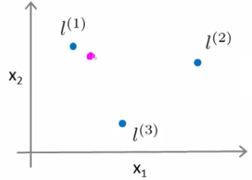
    - Looking at our formula, we know f1 will be close to 1, but f2 and f3 will be close to 0
      - So if we look at the formula we have
        - θ0+ θ1f1+ θ2f2 + θ3f3 >= 0
        - \-0.5 + 1 + 0 + 0 = 0.5
          - 0.5 is greater than 1
    - If we had **another point** far away from all three  
      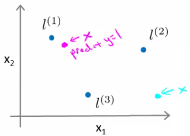
      - This equates to -0.5
        - So we predict 0
  - Considering our parameter, for points near l1 and l2 you predict 1, but for points near l3 you predict 0
  - Which means we create a non-linear decision boundary that goes a lil' something like this;  
    
    - Inside we predict y = 1
    - Outside we predict y = 0
* So this show how we can create a non-linear boundary with landmarks and the kernel function in the support vector machine
  - But
    - How do we get/chose the landmarks
    - What other kernels can we use (other than the Gaussian kernel)

## Kernels II

- Filling in missing detail and practical implications regarding kernels
- Spoke about picking landmarks manually, defining the kernel, and building a hypothesis function
  - Where do we get the landmarks from?
  - For complex problems we probably want lots of them

**Choosing the landmarks**

- Take the training data
- For each example place a landmark at exactly the same location
- So end up with m landmarks
  - One landmark per location per training example
  - Means our features measure how close to a training set example something is
- Given a new example, compute all the f values
  - Gives you a feature vector f (f0 to fm)
    - f0 = 1 always
- A more detailed look at generating the f vector

  - If we had a training example - features we compute would be using (xi, yi)

    - So we just cycle through each landmark, calculating how close to that landmark actually xi is
      - f1i, = k(xi, l1)
      - f2i, = k(xi, l2)
      - ...
      - fmi, = k(xi, lm)
    - Somewhere in the list we compare x to itself... (i.e. when we're at fii)

      - So because we're using the Gaussian Kernel this evalues to 1

    - Take these m features (f1, f2 ... fm) group them into an \[m+1 x 1\] dimensional vector called f
      - fi is the f feature vector for the ith example
      - And add a 0th term = 1

- Given these kernels, how do we use a support vector machine

**SVM hypothesis prediction with kernels**

- Predict y = 1 if (θ_T_ f) >= 0
  - Because θ = \[m+1 x 1\]
  - And f = \[m+1 x 1\]
- So, this is how you make a prediction assuming you already have θ
  - How do you get θ?

**SVM training with kernels**

- Use the SVM learning algorithm  
  
  - Now, we minimize using f as the feature vector instead of x
  - By solving this minimization problem you get the parameters for your SVM
- In this setup, m = n
  - Because number of features is the number of training data examples we have
- One final mathematic detail (not crucial to understand)
  - If we ignore θ0 then the following is true  
    
  - What many implementations do is   
    
    - Where the matrix M depends on the kernel you use
    - Gives a slightly different minimization - means we determine a rescaled version of θ
    - Allows more efficient computation, and scale to much bigger training sets
    - If you have a training set with 10 000 values, means you get 10 000 features
      - Solving for all these parameters can become expensive
      - So by adding this in we avoid a for loop and use a matrix multiplication algorithm instead
- You can apply kernels to other algorithms
  - But they tend to be very computationally expensive
  - But the SVM is far more efficient - so more practical
- Lots of good off the shelf software to minimize this function

- **SVM parameters (C)**
  - Bias and variance trade off
  - Must chose C
    - C plays a role similar to 1/LAMBDA (where LAMBDA is the regularization parameter)
  - Large C gives a hypothesis of **low bias high variance** --> overfitting
  - Small C gives a hypothesis of **high bias low variance** --> underfitting
- **SVM parameters (σ2)**
  - Parameter for calculating f values
    - Large σ2 - f features vary more smoothly - higher bias, lower variance
    - Small σ2 - f features vary abruptly - low bias, high variance

## SVM - implementation and use

- So far spoken about SVM in a very abstract manner
- What do you need to do this
  - Use SVM software packages (e.g. liblinear, libsvm) to solve parameters θ
  - Need to specify
    - Choice of parameter C
    - Choice of kernel

**Choosing a kernel**

- We've looked at the **Gaussian kernel**
  - Need to define σ (σ2)
    - Discussed σ2
  - When would you chose a Gaussian?
    - If n is small and/or m is large
      - e.g. 2D training set that's large
  - If you're using a Gaussian kernel then you may need to implement the kernel function
    - e.g. a function  
      fi = kernel(x1,x2)
      - Returns a real number
    - Some SVM packages will expect you to define kernel
    - Although, some SVM implementations include the Gaussian and a few others
      - Gaussian is probably most popular kernel
  - NB - make sure you perform **feature scaling** before using a Gaussian kernel
    - If you don't features with a large value will dominate the f value
- Could use no kernel - **linear kernel**
  - Predict y = 1 if (θ_T_ x) >= 0
    - So no f vector
    - Get a standard linear classifier
  - Why do this?
    - If n is large and m is small then
      - Lots of features, few examples
      - Not enough data - risk overfitting in a high dimensional feature-space
- Other choice of kernel
  - Linear and Gaussian are most common
  - Not all similarity functions you develop are valid kernels
    - Must satisfy **Merecer's Theorem**
    - SVM use numerical optimization tricks
      - Mean certain optimizations can be made, but they must follow the theorem
  - **Polynomial Kernel**
    - We measure the similarity of x and l by doing one of
      - (x_T_l)2
      - (x_T_l)3
      - (x_T_l + 1)3
    - General form is
      - (x_T_ l + Con)D
    - If they're similar then the inner product tends to be large
    - Not used that often
    - Two parameters
      - Degree of polynomial (D)
      - Number you add to l (Con)
    - Usually performs worse than the Gaussian kernel
    - Used when x and l are both non-negative
  - **String kernel**
    - Used if input is text strings
    - Use for text classification
  - **Chi-squared kernel**
  - **Histogram intersection kernel**

**Multi-class classification for SVM**

- Many packages have built in multi-class classification packages
- Otherwise use one-vs all method
- Not a big issue

**Logistic regression vs. SVM**

- When should you use SVM and when is logistic regression more applicable
- If n (features) is large vs. m (training set)
  - e.g. text classification problem
    - Feature vector dimension is 10 000
    - Training set is 10 - 1000
    - Then use logistic regression or SVM with a linear kernel
- If n is small and m is intermediate
  - n = 1 - 1000
  - m = 10 - 10 000
  - Gaussian kernel is good
- If n is small and m is large
  - n = 1 - 1000
  - m = 50 000+
    - SVM will be slow to run with Gaussian kernel
  - In that case
    - Manually create or add more features
    - Use logistic regression of SVM with a linear kernel
- Logistic regression and SVM with a linear kernel are pretty similar
  - Do similar things
  - Get similar performance
- A lot of SVM's power is using diferent kernels to learn complex non-linear functions
- For all these regimes a well designed NN should work
  - But, for some of these problems a NN might be slower - SVM well implemented would be faster
- SVM has a convex optimization problem - so you get a global minimum
- It's not always clear how to chose an algorithm
  - Often more important to get enough data
  - Designing new features
  - Debugging the algorithm
- SVM is widely perceived a very powerful learning algorithm
