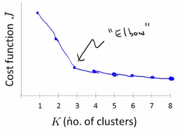

# 13: Clustering

[Previous](12_Support_Vector_Machines.md) [Next](14_Dimensionality_Reduction.md) [Index](README.md)

## Unsupervised learning - introduction

- Talk about **clustering**
  - **Learning from unlabeled data**
- Unsupervised learning
  - Useful to contras with supervised learning
- Compare and contrast
  - Supervised learning
    - Given a set of labels, fit a hypothesis to it
  - Unsupervised learning
    - Try and determining structure in the data
    - Clustering algorithm groups data together based on data features
- What is clustering good for
  - **Market segmentation** - group customers into different market segments
  - **Social network analysis** - Facebook "smartlists"
  - **Organizing computer clusters** and data centers for network layout and location
  - **Astronomical data analysis** - Understanding galaxy formation

## K-means algorithm

- Want an algorithm to automatically group the data into coherent clusters
- K-means is **by far** the most widely used clustering algorithm

**Overview  
**

- Take unlabeled data and group into two clusters  
  
- Algorithm overview
  - 1. Randomly allocate two points as the **cluster centroids**
    - Have as many cluster centroids as clusters you want to do (*K* cluster centroids, in fact)
    - In our example we just have two clusters
  - 2. Cluster assignment step
    - Go through each example and depending on if it's closer to the red or blue centroid assign each point to one of the two clusters
    - To demonstrate this, we've gone through the data and "colour" each point red or blue  
      
  - 3. Move centroid step
    - Take each centroid and move to the average of the correspondingly assigned data-points   
      
    - Repeat 2) and 3) until convergence
- More formal definition
  - **Input:**
    - K (number of clusters in the data)
    - Training set {x1, x2, x3, ..., xn)
  - **Algorithm:**
    - Randomly initialize K cluster centroids as {μ1, μ2, μ3, ... μK}  
      
      - Loop 1
        - This inner loop repeatedly sets the c(i) variable to be the index of the closes variable of cluster centroid closes to xi
        - i.e. take ith example, measure squared distance to each cluster centroid, assign c(i)to the cluster closest  
          
      - Loop 2
        - Loops over each centroid calculate the average mean based on all the points associated with each centroid from c(i)
    - What if there's a centroid with no data
      - Remove that centroid, so end up with K-1 classes
      - Or, randomly reinitialize it
        - Not sure when though...

**K-means for non-separated clusters**

- So far looking at K-means where we have well defined clusters
- But often K-means is applied to datasets where there aren't well defined clusters
  - e.g. T-shirt sizing  
    
- Not obvious discrete groups
- Say you want to have three sizes (S,M,L) how big do you make these?

  - One way would be to run K-means on this data
  - May do the following  
    
  - So creates three clusters, even though they aren't really there
  - Look at first population of people

    - Try and design a small T-shirt which fits the 1st population
    - And so on for the other two

  - This is an example of market segmentation
    - Build products which suit the needs of your subpopulations

## K-means optimization objective

- Supervised learning algorithms have an optimization objective (cost function)

  - K-means does too

- K-means has an optimization objective like the supervised learning functions we've seen

  - Why is this good?

- > - Knowing this is useful because it helps for debugging
  > - Helps find better clusters

- While K-means is running we keep track of two sets of variables
  - ci is the index of clusters {1,2, ..., K} to which xi is currently assigned
    - i.e. there are *m* ci values, as each example has a ci value, and that value is one the the clusters (i.e. can only be one of K different values)
  - μk, is the cluster associated with centroid _k_
    - Locations of cluster centroid k
    - So there are K
    - So these the centroids which exist in the training data space
  - μci, is the cluster centroid of the cluster to which example xi has been assigned to
    - This is more for convenience than anything else
      - You could look up that example i is indexed to cluster j (using the c vector), where j is between 1 and K
      - Then look up the value associated with cluster j in the μ vector (i.e. what are the features associated with μj)
      - But instead, for easy description, we have this variable which gets exactly the same value
    - Lets say xi as been assigned to cluster 5
      - Means that
        - ci = 5
        - μci, = μ5
- Using this notation we can write the optimization objective;  
  
  - i.e. squared distances between training example xi and the cluster centroid to which xi has been assigned to
    - This is just what we've been doing, as the visual description below shows;  
      
    - The red line here shows the distances between the example xi and the cluster to which that example has been assigned
      - Means that when the example is very close to the cluster, this value is small
      - When the cluster is very far away from the example, the value is large
  - This is sometimes called the **distortion** (or **distortion cost function**)
  - So we are finding the values which minimizes this function;  
    
- If we consider the k-means algorithm
  - The **cluster assigned step** is minimizing J(...) with respect to c1, c2 ... ci
    - i.e. find the centroid closest to each example
    - Doesn't change the centroids themselves
  - The **move centroid step**
    - We can show this step is choosing the values of μ which minimizes J(...) with respect to μ
  - So, we're partitioning the algorithm into two parts
    - First part minimizes the c variables
    - Second part minimizes the J variables
- We can use this knowledge to help debug our K-means algorithm

**Random initialization**

- How we initialize K-means
  - And how avoid local optimum
- Consider clustering algorithm
  - Never spoke about how we initialize the centroids
    - A few ways - one method is most recommended
- Have number of centroids set to less than number of examples (K < m) (if K > m we have a problem)0
  - Randomly pick K training examples
  - Set μ1 up to μk to these example's values
- K means can converge to different solutions depending on the initialization setup
  - Risk of local optimum  
    
  - The local optimum are valid convergence, but local optimum not global ones
- If this is a concern
  - We can do multiple random initializations
    - See if we get the same result - many same results are likely to indicate a global optimum
- Algorithmically we can do this as follows;  
  
  - A typical number of times to initialize K-means is 50-1000
  - Randomly initialize K-means
    - For each 100 random initialization run K-means
    - Then compute the distortion on the set of cluster assignments and centroids at convergent
    - End with 100 ways of cluster the data
    - Pick the clustering which gave the lowest distortion
- If you're running K means with 2-10 clusters can help find better global optimum
  - If K is larger than 10, then multiple random initializations are less likely to be necessary
  - First solution is probably good enough (better granularity of clustering)

## How do we choose the number of clusters?

- Choosing K?
  - Not a great way to do this automatically
  - Normally use visualizations to do it manually
- What are the intuitions regarding the data?
- Why is this hard
  - Sometimes very ambiguous
    - e.g. two clusters or four clusters
    - Not necessarily a correct answer
  - This is why doing it automatic this is hard

**Elbow method**

- Vary K and compute cost function at a range of K values
- As K increases J(...) minimum value should decrease (i.e. you decrease the granularity so centroids can better optimize)
  - Plot this (K vs J())
- Look for the "elbow" on the graph  
  
- Chose the "elbow" number of clusters
- If you get a nice plot this is a reasonable way of choosing K
- Risks
  - Normally you don't get a a nice line -> no clear elbow on curve
  - Not really that helpful

**Another method for choosing K**

- Using K-means for market segmentation
- Running K-means for a later/downstream purpose
  - See how well different number of clusters serve you later needs
- e.g.
  - T-shirt size example
    - If you have three sizes (S,M,L)
    - Or five sizes (XS, S, M, L, XL)
    - Run K means where K = 3 and K = 5
  - How does this look  
    
  - This gives a way to chose the number of clusters
    - Could consider the cost of making extra sizes vs. how well distributed the products are
    - How important are those sizes though? (e.g. more sizes might make the customers happier)
    - So applied problem may help guide the number of clusters
