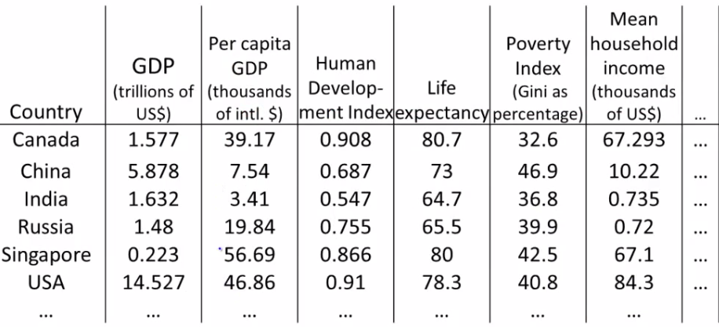
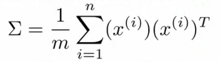
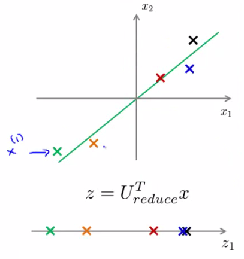
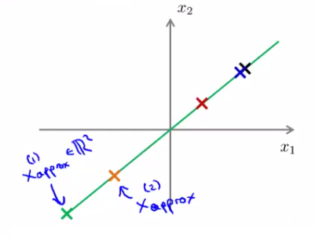

# 14: Dimensionality Reduction (PCA)

[Previous](13_Clustering.md) [Next](15_Anomaly_Detection.md) [Index](README.md)

## Motivation 1: Data compression

- Start talking about a second type of unsupervised learning problem - **dimensionality reduction**
  - Why should we look at dimensionality reduction?

**Compression**

- Speeds up algorithms
- Reduces space used by data for them
- What is dimensionality reduction?

  - So you've collected many features - maybe more than you need
    - Can you "simply" your data set in a rational and useful way?
  - Example
    - Redundant data set - different units for same attribute
    - Reduce data to 1D (2D->1D)  
      
      - Example above isn't a perfect straight line because of round-off error
  - Data redundancy can happen when different teams are working independently
    - Often generates redundant data (especially if you don't control data collection)
  - Another example
    - Helicopter flying - do a survey of pilots (x1 = skill, x2 = pilot enjoyment)
      - These features may be highly correlated
      - This correlation can be combined into a single attribute called aptitude (for example)

- What does dimensionality reduction mean?
  - In our example we plot a line
  - Take exact example and record position on that line  
    
  - So before x(1) was a 2D feature vector (X and Y dimensions)
  - Now we can represent x(1) as a 1D number (Z dimension)
- So we approximate original examples
  - Allows us to half the amount of storage
  - Gives lossy compression, but an acceptable loss (probably)
    - The loss above comes from the rounding error in the measurement, however
- Another example 3D -> 2D
  - So here's our data  
    
  - Maybe all the data lies in one plane
    - This is sort of hard to explain in 2D graphics, but that plane may be aligned with one of the axis
      - Or or may not...
      - Either way, the plane is a small, a constant 3D space
    - In the diagram below, imagine all our data points are sitting "inside" the blue tray (has a dark blue exterior face and a light blue inside)  
      
    - Because they're all in this relative shallow area, we can basically ignore one of the dimension, so we draw two new lines (z1 and z2) along the x and y planes of the box, and plot the locations in that box
    - i.e. we loose the data in the z-dimension of our "shallow box" (NB "z-dimensions" here refers to the dimension relative to the box (i.e it's depth) and NOT the z dimension of the axis we've got drawn above) but because the box is shallow it's OK to lose this. Probably....
  - Plot values along those projections  
    
  - So we've now reduced our 3D vector to a 2D vector
- In reality we'd normally try and do 1000D -> 100D

## Motivation 2: Visualization

- It's hard to visualize highly dimensional data
  - Dimensionality reduction can improve how we display information in a tractable manner for human consumption
  - Why do we care?
    - Often helps to develop algorithms if we can understand our data better
    - Dimensionality reduction helps us do this, see data in a helpful
    - Good for explaining something to someone if you can "show" it in the data
- Example;
  - Collect a large data set about many facts of a country around the world  
    
    - So
      - x1 = GDP
      - ...
      - x6 = mean household
    - Say we have 50 features per country
    - How can we understand this data better?
      - Very hard to plot 50 dimensional data
  - Using dimensionality reduction, instead of each country being represented by a 50-dimensional feature vector
    - Come up with a different feature representation (z values) which summarize these features  
      
  - This gives us a 2-dimensional vector
    - Reduce 50D -> 2D
    - Plot as a 2D plot
  - Typically you don't generally ascribe meaning to the new features (so we have to determine what these summary values mean)
    - e.g. may find horizontal axis corresponds to overall country size/economic activity
    - and y axis may be the per-person well being/economic activity
  - So despite having 50 features, there may be two "dimensions" of information, with features associated with each of those dimensions
    - It's up to you to asses what of the features can be grouped to form summary features, and how best to do that (feature scaling is probably important)
  - Helps show the two main dimensions of variation in a way that's easy to understand

## Principle Component Analysis (PCA): Problem Formulation

- For the problem of dimensionality reduction the most commonly used algorithm is **PCA**
  - Here, we'll start talking about how we formulate precisely what we want PCA to do
- So
  - Say we have a 2D data set which we wish to reduce to 1D  
    
  - In other words, find a single line onto which to project this data
    - How do we determine this line?
      - The distance between each point and the projected version should be small (blue lines below are short)
      - PCA tries to find a lower dimensional surface so the sum of squares onto that surface is minimized
      - The blue lines are sometimes called the **projection error**
        - PCA tries to find the surface (a straight line in this case) which has the minimum projection error  
          
      - As an aside, you should normally do **mean normalization** and **feature scaling** on your data before PCA
- A more formal description is
  - For 2D-1D, we must find a vector u(1), which is of some dimensionality
  - Onto which you can project the data so as to minimize the projection error  
    
  - u(1) can be positive or negative (-u(1)) which makes no difference
    - Each of the vectors define the same red line
- In the more general case
  - To reduce from nD to kD we
    - Find *k* vectors (u(1), u(2), ... , u(k)) onto which to project the data to minimize the projection error
    - So lots of vectors onto which we project the data
    - Find a set of vectors which we project the data onto the linear subspace spanned by that set of vectors
      - We can define a point in a plane with k vectors
  - e.g. 3D->2D
    - Find pair of vectors which define a 2D plane (surface) onto which you're going to project your data
    - Much like the "shallow box" example in compression, we're trying to create the shallowest box possible (by defining two of it's three dimensions, so the box' depth is minimized)  
      
- How does PCA relate to linear regression?
  - PCA is **not** linear regression
    - Despite cosmetic similarities, very different
  - For linear regression, fitting a straight line to minimize the **straight line** between a point and a squared line
    - NB - **VERTICAL distance** between point
  - For PCA minimizing the magnitude of the shortest **orthogonal distance**
    - Gives very different effects
  - More generally
    - With linear regression we're trying to predict "y"
    - With PCA there is no "y" - instead we have a list of features and all features are treated equally
      - If we have 3D dimensional data 3D->2D
        - Have 3 features treated symmetrically

## PCA Algorithm

- Before applying PCA must do data preprocessing
  - Given a set of m unlabeled examples we must do
    - **Mean normalization**
      - Replace each xji with xj - μj,
        - In other words, determine the mean of each feature set, and then for each feature subtract the mean from the value, so we re-scale the mean to be 0
    - **Feature scaling (depending on data)**
      - If features have very different scales then scale so they all have a comparable range of values
        - e.g. xji is set to (xj - μj) / sj
          - Where sj is some measure of the range, so could be
            - Biggest - smallest
            - Standard deviation (more commonly)
- With preprocessing done, PCA finds the lower dimensional sub-space which minimizes the sum of the square

  - In summary, for 2D->1D we'd be doing something like this;  
    

  - Need to compute two things;
    - Compute the **u vectors**
      - The new planes
    - Need to compute the **z vectors**
      - z vectors are the new, lower dimensionality feature vectors

- A mathematical derivation for the u vectors is very complicated
  - But once you've done it, the procedure to find each u vector is not that hard

**Algorithm description**

- Reducing data from _n_\-dimensional to k-dimensional
  - Compute the covariance matrix  
    
    - This is commonly denoted as Σ (greek upper case sigma) - NOT summation symbol
    - Σ = sigma
      - This is an \[n x n\] matrix
        - Remember than xi is a \[n x 1\] matrix
    - In MATLAB or octave we can implement this as follows;  
      
  - Compute eigenvectors of matrix Σ
    - **\[U,S,V\] = svd(sigma)**
      - svd = singular value decomposition
        - More numerically stable than **eig**
      - **eig** = also gives eigenvector
  - U,S and V are matrices
    - U matrix is also an \[n x n\] matrix
    - Turns out the columns of U are the u vectors we want!
    - So to reduce a system from n-dimensions to k-dimensions
      - Just take the first _k-vectors_ from U (first k columns)  
        
- Next we need to find some way to change x (which is n dimensional) to z (which is k dimensional)

  - (reduce the dimensionality)
  - Take first k columns of the u matrix and stack in columns
    - n x k matrix - call this Ureduce
  - We calculate z as follows
    - z = (Ureduce)_T_ \* x
      - So \[k x n\] \* \[n x 1\]
      - Generates a matrix which is
        - k \* 1
      - If that's not witchcraft I don't know what is!

- Exactly the same as with supervised learning except we're now doing it with unlabeled data
- So in summary
  - Preprocessing
  - Calculate sigma (covariance matrix)
  - Calculate eigenvectors with **svd**
  - Take k vectors from U (Ureduce= U(:,1:k);)
  - Calculate z (z =Ureduce' \* x;)
- No mathematical derivation
  - Very complicated
  - But it works

## Reconstruction from Compressed Representation

- Earlier spoke about PCA as a compression algorithm
  - If this is the case, is there a way to **decompress** the data from low dimensionality back to a higher dimensionality format?
- Reconstruction
  - Say we have an example as follows  
    
  - We have our examples (x1, x2 etc.)
  - Project onto z-surface
  - Given a point z1, how can we go back to the 2D space?
- Considering
  - z (vector) = (Ureduce)_T_ \* x
- To go in the opposite direction we must do
  - Xapprox = Ureduce \* z
    - To consider dimensions (and prove this really works)
      - Ureduce = \[n x k\]
      - z \[k \* 1\]
    - So
      - Xapprox = \[n x 1\]
- So this creates the following representation  
  
- We lose some of the information (i.e. everything is now perfectly on that line) but it is now projected into 2D space

## Choosing the number of Principle Components

- How do we chose _k_ ?
  - k = number of **principle components**
  - Guidelines about how to chose k for PCA
- To chose k think about how PCA works
  - PCA tries to minimize averaged squared projection error  
    
  - Total variation in data can be defined as the average over data saying how far are the training examples from the origin  
    
- When we're choosing k typical to use something like this  
  
  - Ratio between averaged squared projection error with total variation in data
    - Want ratio to be small - means we retain 99% of the variance
  - If it's small (0) then this is because the numerator is small
    - The numerator is small when xi = Xapproxi
      - i.e. we lose very little information in the dimensionality reduction, so when we decompress we regenerate the same data
- So we chose k in terms of this ratio
- Often can significantly reduce data dimensionality while retaining the variance
- How do you do this  
  

## Advice for Applying PCA

- Can use PCA to speed up algorithm running time
  - Explain how
  - And give general advice

**Speeding up supervised learning algorithms**

- Say you have a supervised learning problem
  - Input x and y
    - x is a 10 000 dimensional feature vector
    - e.g. 100 x 100 images = 10 000 pixels
    - Such a huge feature vector will make the algorithm slow
  - With PCA we can reduce the dimensionality and make it tractable
  - How
    - 1. Extract xs
      - So we now have an unlabeled training set
    - 2. Apply PCA to x vectors
      - So we now have a reduced dimensional feature vector z
    - 3. This gives you a new training set
      - Each vector can be re-associated with the label
    - 4. Take the reduced dimensionality data set and feed to a learning algorithm
      - Use y as labels and z as feature vector
    - 5. If you have a new example map from higher dimensionality vector to lower dimensionality vector, then feed into learning algorithm
- PCA maps one vector to a lower dimensionality vector
  - x -> z
  - Defined by PCA **only** on the training set
  - The mapping computes a set of parameters
    - Feature scaling values
    - Ureduce
      - Parameter learned by PCA
      - Should be obtained only by determining PCA on your training set
  - So we use those learned parameters for our
    - Cross validation data
    - Test set
- Typically you can reduce data dimensionality by 5-10x without a major hit to algorithm

## Applications of PCA

- **Compression**
  - Why
    - Reduce memory/disk needed to store data
    - Speed up learning algorithm
  - How do we chose k?
    - % of variance retained
- **Visualization**
  - Typically chose k =2 or k = 3
  - Because we can plot these values!
- One thing often done wrong regarding PCA
  - A bad use of PCA: Use it to prevent over-fitting
    - Reasoning
      - If we have xi we have n features, zi has k features which can be lower
      - If we _only_ have k features then maybe we're less likely to over fit...
    - This doesn't work
      - BAD APPLICATION
      - Might work OK, but not a good way to address over fitting
      - Better to use regularization
    - PCA throws away some data without knowing what the values it's losing
      - Probably OK if you're keeping most of the data
      - But if you're throwing away some crucial data bad
      - So you have to go to like 95-99% variance retained
        - So here regularization will give you AT LEAST as good a way to solve over fitting
- A second PCA myth
  - Used for compression or visualization - good
  - Sometimes used
    - Design ML system with PCA from the outset
      - But, what if you did the whole thing without PCA
    - See how a system performs without PCA
      - ONLY if you have a reason to believe PCA will help should you then add PCA
    - PCA is easy enough to add on as a processing step
      - Try without first!
