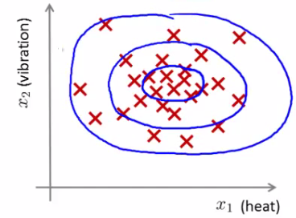
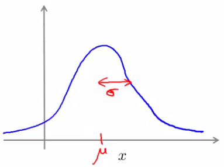
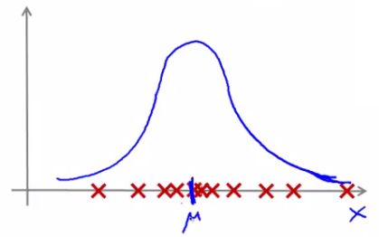
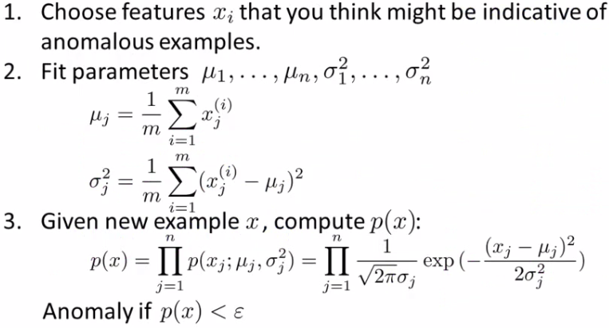
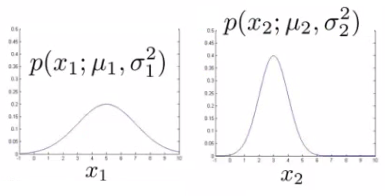
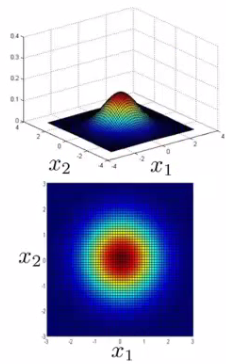
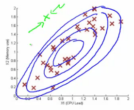

# 15: Anomaly Detection

[Previous](14_Dimensionality_Reduction.md) [Next](16_Recommender_Systems.md) [Index](README.md)

## Anomaly detection - problem motivation

- Anomaly detection is a reasonably commonly used type of machine learning application
  - Can be thought of as a solution to an unsupervised learning problem
  - But, has aspects of supervised learning
- What is anomaly detection?

  - Imagine you're an aircraft engine manufacturer
  - As engines roll off your assembly line you're doing QA
    - Measure some features from engines (e.g. heat generated and vibration)
  - You now have a dataset of **x1 to** **xm (i.e. _m_ engines were tested)**
  - Say we plot that dataset
    
  - **Next day you have a new engine**
    - **An anomaly detection method is used to see if the new engine is** anomalous (when compared to the previous engines)
  - **If the new engine looks like this;  
    
    **
    - **Probably OK - looks like the ones we've seen before**
  - **But if the engine looks like this  
    
    **
    - Uh oh! - this looks like an **anomalous** **data-point**

- More formally
  - We have a dataset which contains **normal** (data)
    - How we ensure they're normal is up to us
    - In reality it's OK if there are a few which aren't actually normal
  - Using that dataset as a reference point we can see if other examples are **anomalous**
- How do we do this?
  - First, using our training dataset we build a model
    - We can access this model using **p(x)**
      - This asks, "What is the probability that example x is normal"
  - Having built a model
    - if p(xtest) < ε --> flag this as an anomaly
    - if p(xtest) >= ε --> this is OK
    - ε is some threshold probability value which we define, depending on how sure we need/want to be
  - We expect our model to (graphically) look something like this;  
    
    - i.e. this would be our model if we had 2D data

**Applications**

- <u>Fraud detection</u>
  - Users have activity associated with them, such as
    - Length on time on-line
    - Location of login
    - Spending frequency
  - Using this data we can build a model of what normal users' activity is like
  - What is the probability of "normal" behavior?
  - Identify unusual users by sending their data through the model
    - Flag up anything that looks a bit weird
    - Automatically block cards/transactions
- <u>Manufacturing</u>
  - Already spoke about aircraft engine example
- <u>Monitoring computers in data center</u>
  - If you have many machines in a cluster
  - Computer features of machine
    - **x1** = memory use
    - **x2** = number of disk accesses/sec
    - **x3** = CPU load
  - In addition to the measurable features you can also define your own complex features
    - **x4** = CPU load/network traffic
  - If you see an anomalous machine
    - Maybe about to fail
    - Look at replacing bits from it

## The Gaussian distribution (optional)

- Also called the **normal distribution**
- Example

  - Say x (data set) is made up of real numbers
    - Mean is μ
    - Variance is σ2
      - σ is also called the **standard** **deviation** - specifies the width of the Gaussian probability
    - The data has a Gaussian distribution
  - Then we can write this ~ *N(*μ,σ2 )

    - ~ means = is distributed as
    - *N* (should really be "script" N (even curlier!) -> means normal distribution
    - μ, σ2 represent the mean and variance, respectively

      - These are the two parameters a Gaussian means

  - Looks like this;  
    
  - This specifies the probability of x taking a value
    - As you move away from μ

- Gaussian equation is
  - P(x : μ , σ2) (probability of x, parameterized by the mean and squared variance)  
    
- Some examples of Gaussians below
  - Area is always the same (must = 1)
  - But width changes as standard deviation changes

**Parameter estimation problem**

- What is it?
  - Say we have a data set of m examples
  - Give each example is a real number - we can plot the data on the x axis as shown below   
    
  - Problem is - say you suspect these examples come from a Gaussian
    - Given the dataset can you estimate the distribution?
  - Could be something like this  
    
  - Seems like a reasonable fit - data seems like a higher probability of being in the central region, lower probability of being further away
- Estimating μ and σ2
  - μ = average of examples
  - σ2 = standard deviation squared  
    
  - As a side comment
    - These parameters are the maximum likelihood estimation values for μ and σ2
    - You can also do 1/(m) or 1/(m-1) doesn't make too much difference
      - Slightly different mathematical problems, but in practice it makes little difference

## Anomaly detection algorithm

- Unlabeled training set of m examples
  - Data = {x1, x2, ..., xm }
    - Each example is an n-dimensional vector (i.e. a feature vector)
    - We have n features!
  - Model P(x) from the data set
    - What are high probability features and low probability features
    - x is a vector
    - So model p(x) as
      - = p(x1; μ1, σ12) \* p(x2; μ2, σ22) \* ... p(xn; μn, σn2)
    - Multiply the probability of each features by each feature
      - We model each of the features by assuming each feature is distributed according to a Gaussian distribution
      - p(xi; μi, σi2)
        - The probability of feature xi given μi and σi2, using a Gaussian distribution
  - As a side comment
    - Turns out this equation makes an **independence assumption** for the features, although algorithm works if features are independent or not
      - Don't worry too much about this, although if you're features are tightly linked you should be able to do some dimensionality reduction anyway!
  - We can write this chain of multiplication more compactly as follows;  
    
    - Capital PI (Π) is the product of a set of values
  - The problem of estimation this distribution is sometimes call the problem of **density estimation**

**Algorithm**

- **1 - Chose features**
  - Try to come up with features which might help identify something anomalous - may be unusually large or small values
  - More generally, chose features which describe the general properties
  - This is nothing unique to anomaly detection - it's just the idea of building a sensible feature vector
- **2 - Fit parameters**
  - Determine parameters for each of your examples μi and σi2
    - Fit is a bit misleading, really should just be "Calculate parameters for 1 to n"
  - So you're calculating standard deviation and mean for each feature
  - You should of course used some vectorized implementation rather than a loop probably
- **3 - compute p(x)**
  - You compute the formula shown (i.e. the formula for the Gaussian probability)
  - If the number is very small, very low chance of it being "normal"

**Anomaly detection example**

- **x1**
  - Mean is about 5
  - Standard deviation looks to be about 2
- **x2**
  - Mean is about 3
  - Standard deviation about 1
- So we have the following system  
  
- If we plot the Gaussian for **x1** and **x2** we get something like this  
  
- If you plot the product of these things you get a surface plot like this  
  
  - With this surface plot, the height of the surface is the probability - p(x)
  - We can't always do surface plots, but for this example it's quite a nice way to show the probability of a 2D feature vector
- Check if a value is anomalous
  - Set epsilon as some value
  - Say we have two new data points new data-point has the values
    - x1test
    - x2test
  - We compute
    - p(x1test) = 0.436 >= epsilon (~40% chance it's normal)
      - Normal
    - p(x2test) = 0.0021 < epsilon (~0.2% chance it's normal)
      - Anomalous
  - What this is saying is if you look at the surface plot, all values above a certain height are normal, all the values below that threshold are probably anomalous

## Developing and evaluating and anomaly detection system

- Here talk about developing a system for anomaly detection
  - How to evaluate an algorithm
- Previously we spoke about the importance of real-number evaluation
  - Often need to make a lot of choices (e.g. features to use)
    - Easier to evaluate your algorithm if it returns a **single number** to show if changes you made improved or worsened an algorithm's performance
  - To develop an anomaly detection system quickly, would be helpful to have a way to evaluate your algorithm
- Assume we have some labeled data
  - So far we've been treating anomalous detection with unlabeled data
  - If you have labeled data allows evaluation
    - i.e. if you think something iss anomalous you can be sure if it is or not
- So, taking our engine example

  - You have some labeled data
    - Data for engines which were non-anomalous -> y = 0
    - Data for engines which were anomalous -> y = 1
  - Training set is the collection of normal examples
    - OK even if we have a few anomalous data examples
  - Next define
    - Cross validation set
    - Test set
    - For both assume you can include a few examples which have anomalous examples
  - Specific example

    - Engines
      - Have 10 000 good engines
        - OK even if a few bad ones are here...
        - LOTS of y = 0
      - 20 flawed engines
        - Typically when y = 1 have 2-50
    - Split into

      - Training set: 6000 good engines (y = 0)
      - CV set: 2000 good engines, 10 anomalous

      - Test set: 2000 good engines, 10 anomalous
      - Ratio is 3:1:1

    - Sometimes we see a different way of splitting
      - Take 6000 good in training
      - Same CV and test set (4000 good in each) different 10 anomalous,
      - Or even 20 anomalous (same ones)
      - This is bad practice - should use different data in CV and test set

  - Algorithm evaluation
    - Take trainings set { x1, x2, ..., xm }
      - Fit model p(x)
    - On cross validation and test set, test the example x
      - y = 1 if p(x) < epsilon (anomalous)
      - y = 0 if p(x) >= epsilon (normal)
    - Think of algorithm a trying to predict if something is anomalous
      - But you have a label so can check!
      - Makes it look like a supervised learning algorithm

- What's a good metric to use for evaluation
  - y = 0 is very common
    - So classification would be bad
  - Compute fraction of true positives/false positive/false negative/true negative
  - Compute precision/recall
  - Compute F1-score
- Earlier, also had **epsilon** (the threshold value)
  - Threshold to show when something is anomalous
  - If you have CV set you can see how varying epsilon effects various evaluation metrics
    - Then pick the value of epsilon which maximizes the score on your CV set
  - Evaluate algorithm using cross validation
  - Do final algorithm evaluation on the test set

## Anomaly detection vs. supervised learning

- If we have labeled data, we not use a supervised learning algorithm?
  - Here we'll try and understand when you should use supervised learning and when anomaly detection would be better

**Anomaly detection**

- **Very small number of positive** **examples**
  - Save positive examples just for CV and test set
  - Consider using an anomaly detection algorithm
  - Not enough data to "learn" positive examples
- **Have a very large number of negative examples**
  - Use these negative examples for p(x) fitting
  - Only need negative examples for this
- **Many "types" of anomalies**

  - Hard for an algorithm to learn from positive examples when anomalies may look nothing like one another
    - So anomaly detection doesn't know what they look like, but knows what they *don't* look like
  - When we looked at SPAM email,

    - Many types of SPAM

    - For the spam problem, usually enough positive examples
    - So this is why we usually think of SPAM as supervised learning

- Application and why they're anomaly detection
  - **Fraud detection**
    - Many ways you may do fraud
    - If you're a major on line retailer/very subject to attacks, sometimes might shift to supervised learning
  - **Manufacturing**
    - If you make HUGE volumes maybe have enough positive data -> make supervised
      - Means you make an assumption about the kinds of errors you're going to see
      - It's the unknown unknowns we don't like!
  - **Monitoring machines in data**

**Supervised learning**

- **Reasonably large number of positive and negative examples**
- Have enough positive examples to give your algorithm the opportunity to see what they look like
  - If you expect anomalies to look anomalous in the same way
- Application
  - Email/SPAM classification
  - Weather prediction
  - Cancer classification

## Choosing features to use

- One of the things which has a huge effect is which features are used
- **Non-Gaussian features**
  - Plot a histogram of data to check it has a Gaussian description - nice sanity check
    - Often still works if data is non-Gaussian
    - Use **hist** command to plot histogram
  - Non-Gaussian data might look like this  
    
  - Can play with different transformations of the data to make it look more Gaussian
  - Might take a log transformation of the data
    - i.e. if you have some feature x1, replace it with log(x1)  
      
      - This looks much more Gaussian
    - Or do log(x1+c)
      - Play with c to make it look as Gaussian as possible
    - Or do x1/2
    - Or do x1/2

**Error analysis for anomaly detection**

- Good way of coming up with features
- Like supervised learning error analysis procedure
  - Run algorithm on CV set
  - See which one it got wrong
  - Develop new features based on trying to understand *why* the algorithm got those examples wrong
- Example
  - p(x) large for normal, p(x) small for abnormal
  - e.g.  
    
  - Here we have one dimension, and our anomalous value is sort of buried in it (in green - Gaussian superimposed in blue)
    - Look at data - see what went wrong
    - Can looking at that example help develop a new feature (x2) which can help distinguish further anomalous
- Example - data center monitoring
  - Features
    - x1 = memory use
    - x2 = number of disk access/sec
    - x3 = CPU load
    - x4 = network traffic
  - We suspect CPU load and network traffic grow linearly with one another
    - If server is serving many users, CPU is high and network is high
    - Fail case is infinite loop, so CPU load grows but network traffic is low
      - New feature - CPU load/network traffic
      - May need to do feature scaling

## Multivariate Gaussian distribution

- Is a slightly different technique which can sometimes catch some anomalies which non-multivariate Gaussian distribution anomaly detection fails to

  - Unlabeled data looks like this   
    
  - Say you can fit a Gaussian distribution to CPU load and memory use
  - Lets say in the test set we have an example which looks like an anomaly (e.g. x1 = 0.4, x2 = 1.5)
    - Looks like most of data lies in a region far away from this example
      - Here memory use is high and CPU load is low (if we plot x1 vs. x2 our green example looks miles away from the others)
  - Problem is, if we look at each feature individually they may fall within acceptable limits - the issue is we know we shouldn't don't get those kinds of values **together**
    - But individually, they're both acceptable  
      
  - This is because our function makes probability prediction in concentric circles around the the means of both  
    

    - Probability of the two red circled examples is basically the same, even though we can clearly see the green one as an outlier

      - Doesn't understand the meaning

**Multivariate Gaussian distribution model**

- To get around this we develop the **multivariate Gaussian distribution**

  - Model p(x) all in one go, instead of each feature separately
    - What are the parameters for this new model?
      - μ - which is an *n* dimensional vector (where n is number of features)
      - Σ - which is an \[n x n\] matrix - the **covariance matrix**

- For the sake of completeness, the formula for the multivariate Gaussian distribution is as follows  
  
  - NB don't memorize this - you can always look it up
  - What does this mean?
    -  = absolute value of Σ (determinant of sigma)
      - This is a mathematic function of a matrix
      - You can compute it in MATLAB using **det(sigma)**
- More importantly, what does this p(x) look like?
  - 2D example  
    
    - Sigma is sometimes call the identity matrix  
      
      - p(x) looks like this
        - For inputs of x1 and x2 the height of the surface gives the value of p(x)
  - What happens if we change Sigma?  
    
  - So now we change the plot to  
    
    - Now the width of the bump decreases and the height increases
  - If we set sigma to be different values this changes the identity matrix and we change the shape of our graph  
    
  - Using these values we can, therefore, define the shape of this to better fit the data, rather than assuming symmetry in every dimension
- One of the cool things is you can use it to model correlation between data
  - If you start to change the off-diagonal values in the covariance matrix you can control how well the various dimensions correlation  
    
    - So we see here the final example gives a very tall thin distribution, shows a strong positive correlation
    - We can also make the off-diagonal values negative to show a negative correlation
- Hopefully this shows an example of the kinds of distribution you can get by varying sigma
  - We can, of course, also move the mean (μ) which varies the peak of the distribution

## Applying multivariate Gaussian distribution to anomaly detection

- Saw some examples of the kinds of distributions you can model
  - Now let's take those ideas and look at applying them to different anomaly detection algorithms
- As mentioned, multivariate Gaussian modeling uses the following equation;  
  
- Which comes with the parameters μ and Σ
  - Where
    - μ - the mean (n-dimenisonal vector)
    - Σ - covariance matrix (\[nxn\] matrix)
- Parameter fitting/estimation problem
  - If you have a set of examples
    - {x1, x2, ..., xm }
  - The formula for estimating the parameters is
    
    
  - Using these two formulas you get the parameters

**Anomaly detection algorithm with multivariate Gaussian distribution**

- **1)** Fit model - take data set and calculate μ and Σ using the formula above
- **2)** We're next given a new example (xtest) - see below  
  
  - For it compute p(x) using the following formula for multivariate distribution  
    
- **3)** Compare the value with ε (threshold probability value)
  - if p(xtest) < ε --> flag this as an anomaly
  - if p(xtest) >= ε --> this is OK
- If you fit a multivariate Gaussian model to our data we build something like this  
  

- Which means it's likely to identify the green value as anomalous

- Finally, we should mention how multivariate Gaussian relates to our original simple Gaussian model (where each feature is looked at individually)
  - Original model corresponds to multivariate Gaussian where the Gaussians' contours are axis aligned
  - i.e. the normal Gaussian model is a special case of multivariate Gaussian distribution
    - This can be shown mathematically
    - Has this constraint that the covariance matrix sigma as ZEROs on the non-diagonal values  
      
    - If you plug your variance values into the covariance matrix the models are actually identical

**Original model vs. Multivariate Gaussian**

**<u>Original Gaussian model</u>**

- Probably used more often
- There is a need to manually create features to capture anomalies where x1 and x2 take unusual combinations of values
  - So **need to make extra features**
  - Might not be obvious what they should be
    - This is always a risk - where you're using your own expectation of a problem to "predict" future anomalies
    - Typically, the things that catch you out aren't going to be the things you though of
      - If you thought of them they'd probably be avoided in the first place
    - Obviously this is a bigger issue, and one which may or may not be relevant depending on your problem space
- Much **cheaper computationally**
- **Scales much better** to very large feature vectors
  - Even if n = 100 000 the original model works fine
- **Works well even with a small training set**
  - e.g. 50, 100
- Because of these factors it's used more often because it really represents a optimized but axis-symmetric specialization of the general model

**<u>Multivariate Gaussian model</u>**

- Used less frequently
- **Can capture feature correlation**
  - So no need to create extra values
- **Less computationally efficient**
  - Must compute inverse of matrix which is \[n x n\]
  - So lots of features is bad - makes this calculation very expensive
  - So if n = 100 000 not very good
- **Needs for m > n**
  - i.e. number of examples must be greater than number of features
  - If this is not true then we have a singular matrix (non-invertible)
  - So should be used only in m >> n
- If you find the matrix is non-invertible, could be for one of two main reasons
  - m < n
    - So use original simple model
  - Redundant features (i.e. linearly dependent)
    - i.e. two features that are the same
    - If this is the case you could use PCA or sanity check your data
