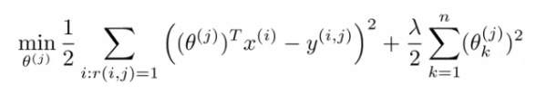
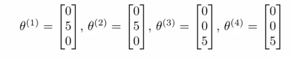
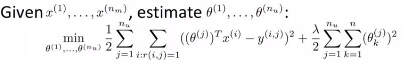
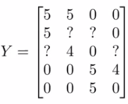
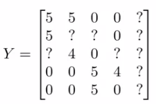

# 16: Recommender Systems

[Previous](15_Anomaly_Detection.md) [Next](17_Large_Scale_Machine_Learning.md) [Index](README.md)

## Recommender systems - introduction

- Two motivations for talking about recommender systems
  - **Important application of ML systems**
    - Many technology companies find recommender systems to be absolutely key
    - Think about websites (amazon, Ebay, iTunes genius)
      - Try and recommend new content for you based on passed purchase
      - Substantial part of Amazon's revenue generation
    - Improvement in recommender system performance can bring in more income
    - Kind of a funny problem
      - In academic learning, recommender systems receives a small amount of attention
      - But in industry it's an absolutely crucial tool
  - Talk about the big ideas in machine learning
    - Not so much a technique, but an idea
    - As soon, features are really important
      - There's a big idea in machine learning that for some problems you can learn what a good set of features are
      - So not select those features but learn them
    - Recommender systems do this - try and identify the crucial and relevant features

**Example - predict movie ratings**

- You're a company who sells movies
  - You let users rate movies using a 1-5 star rating
    - To make the example nicer, allow 0-5 (makes math easier)
- You have five movies
- And you have four users
- Admittedly, business isn't going well, but you're optimistic about the future as a result of your truly outstanding (if limited) inventory  
  
- To introduce some notation
  - nu - Number of users (called ?nu occasionally as we can't subscript in superscript)
  - nm \- Number of movies
  - r(i, j) - 1 if user j has rated movie i (i.e. bitmap)
  - y(i,j) - rating given by user j to move i (defined only if r(i,j) = 1
- So for this example

  - nu = 4
  - nm = 5

  - Summary of scoring
    - Alice and Bob gave good ratings to rom coms, but low scores to action films
    - Carol and Dave game good ratings for action films but low ratings for rom coms
  - We have the data given above
  - The problem is as follows
    - Given r(i,j) and y(i,j) - go through and try and predict missing values (?s)
    - Come up with a learning algorithm that can fill in these missing values

## Content based recommendation

- Using our example above, how do we predict?
  - For each movie we have a feature which measure degree to which each film is a
    - Romance (x1)
    - Action (x2)

- If we have features like these, each film can be recommended by a feature vector
  - Add an extra feature which is x0 = 1 for each film
  - So for each film we have a \[3 x 1\] vector, which for film number 1 ("Love at Last") would be  
    
  - i.e. for our dataset we have
    - {x1, x2, x3, x4, x5}
      - Where each of these is a \[3x1\] vector with an x0 = 1 and then a romance and an action score
  - To be consistent with our notation, n is going to be the number of features NOT counting the x0 term, so n = 2
- We could treat each rating for each user as a separate linear regression problem
  - For each user j we could learn a parameter vector
  - Then predict that user j will rate movie i with
    - (θj)_T_ xi = stars
    - inner product of parameter vector and features
  - So, lets take user 1 (Alice) and see what she makes of the modern classic Cute Puppies of Love (CPOL)
    - We have some parameter vector (θ1) associated with Alice
      - We'll explain later how we derived these values, but for now just take it that we have a vector  
        
    - CPOL has a parameter vector (x3) associated with it  
      
    - Our prediction will be equal to
      - (θ1)_T_ x3 = (0 \* 1) + (5 \* 0.99) + (0 \* 0)
      - = 4.95
        - Which may seem like a reasonable value
  - All we're doing here is applying a linear regression method for each user
    - So we determine a future rating based on their interest in romance and action based on previous films
  - We should also add one final piece of notation
    - mj, - Number of movies rated by the user (j)

**How do we learn (θj)**

- Create some parameters which give values as close as those seen in the data when applied  
  
- Sum over all values of i (all movies the user has used) when r(i,j) = 1 (i.e. all the films that the user has rated)
- This is just like linear regression with least-squared error
- We can also add a regularization term to make our equation look as follows  
  
  - The regularization term goes from k=1 through to m, so (θj) ends up being an n+1 feature vector
    - Don't regularize over the bias terms (0)
- If you do this you get a reasonable value
- We're rushing through this a bit, but it's just a linear regression problem

- To make this a little bit clearer you can get rid of the mj term (it's just a constant so shouldn't make any difference to minimization)
  - So to learn (θj)  
    
  - But for our recommender system we want to learn parameters for *all* users, so we add an extra summation term to this which means we determine the minimum (θj) value for every user  
    
  - When you do this as a function of each (θj) parameter vector you get the parameters for each user
    - So this is our optimization objective -> J(θ1, ..., θnu)
- In order to do the minimization we have the following gradient descent   
  
  - Slightly different to our previous gradient descent implementations
    - k = 0 and k != 0 versions
    - We can define the middle term above as  
      
    - Difference from linear regression
      - No 1/m terms (got rid of the 1/m term)
      - Otherwise very similar
- This approach is called content-based approach because we assume we have features regarding the content which will help us identify things that make them appealing to a user
  - However, often such features are not available - next we discuss a non-contents based approach!

## Collaborative filtering - overview

- The collaborative filtering algorithm has a very interesting property - does feature learning
  - i.e. it can learn for itself what features it needs to learn
- Recall our original data set above for our five films and four raters
  - Here we assume someone had calculated the "romance" and "action" amounts of the films
    - This can be very hard to do in reality
    - Often want more features than just two
- So - let's change the problem and pretend we have a data set where we don't know any of the features associated with the films  
  
  - Now let's make a different assumption
    - We've polled each user and found out how much each user likes
      - Romantic films
      - Action films
    - Which has generated the following parameter set  
      
    - Alice and Bob like romance but hate action
    - Carol and Dave like action but hate romance
- If we can get these parameters from the users we can infer the missing values from our table
  - Lets look at "Love at Last"
    - Alice and Bob loved it
    - Carol and Dave hated it
  - We know from the feature vectors Alice and Bob love romantic films, while Carol and Dave hate them
    - Based on the factor Alice and Bob liked "Love at Last" and Carol and Dave hated it we may be able to (correctly) conclude that "Love at Last" is a romantic film
- This is a bit of a simplification in terms of the maths, but what we're really asking is
  - "What feature vector should x1 be so that
    - (θ1)_T_ x1 is about 5
    - (θ2)_T_ x1 is about 5
    - (θ3)_T_ x1 is about 0
    - (θ4)_T_ x1 is about 0
  - From this we can guess that x1 may be  
    
  - Using that same approach we should then be able to determine the remaining feature vectors for the other films

**Formalizing the collaborative filtering problem**

- We can more formally describe the approach as follows
  - Given (θ1, ..., θnu) (i.e. given the parameter vectors for each users' preferences)
  - We must minimize an optimization function which tries to identify the best parameter vector associated with a film  
    
    - So we're summing over all the indices j for where we have data for movie i
    - We're minimizing this squared error
  - Like before, the above equation gives us a way to learn the features for one film
    - We want to learn all the features for *all* the films - so we need an additional summation term

**How does this work with the previous recommendation system**

- Content based recommendation systems
  - Saw that if we have a set of features for movie rating you can learn a user's preferences
- Now
  - If you have your users preferences you can therefore determine a film's features
- This is a bit of a chicken & egg problem
- What you can do is
  - Randomly guess values for θ
  - Then use collaborative filtering to generate x
  - Then use content based recommendation to improve θ
  - Use that to improve x
  - And so on
- This actually works
  - Causes your algorithm to converge on a reasonable set of parameters
  - This is collaborative filtering
- We call it collaborative filtering because in this example the users are collaborating together to help the algorithm learn better features and help the system and the other users

## Collaborative filtering Algorithm

- Here we combine the ideas from before to build a collaborative filtering algorithm
- Our starting point is as follows

  - If we're given the film's features we can use that to work out the users' preference  
    

  - If we're given the users' preferences we can use them to work out the film's features  
    

- One thing you could do is
  - Randomly initialize parameter
  - Go back and forward
- But there's a more efficient algorithm which can solve θ and x simultaneously
  - Define a new optimization objective which is a function of x and θ

- Understanding this optimization objective
  - The squared error term is the same as the squared error term in the two individual objectives above  
    
    - So it's summing over every movie rated by every users
    - Note the ":" means, "for which"
      - Sum over all pairs (i,j) for which r(i,j) is equal to 1
  - The regularization terms
    - Are simply added to the end from the original two optimization functions
- This newly defined function has the property that
  - If you held x constant and only solved θ then you solve the, "Given x, solve θ" objective above
  - Similarly, if you held θ constant you could solve x
- In order to come up with just one optimization function we treat this function as a function of both film features x and user parameters θ
  - Only difference between this in the back-and-forward approach is that we minimize with respect to both x and θ simultaneously
- When we're learning the features this way
  - Previously had a convention that we have an x0 = 1 term
  - When we're using this kind of approach we have no x0,
    - So now our vectors (both x and θ) are n-dimensional (not n+1)
  - We do this because we are now learning all the features so if the system needs a feature always = 1 then the algorithm can learn one

**Algorithm Structure**

- **1)** Initialize θ1, ..., θnu and x1, ..., xnm to small random values
  - A bit like neural networks - initialize all parameters to small random numbers
- **2)** Minimize cost function (J(x1, ..., xnm, θ1, ...,θnu) using gradient descent
  - We find that the update rules look like this
    
    
  - Where the top term is the partial derivative of the cost function with respect to xki while the bottom is the partial derivative of the cost function with respect to θki
  - So here we regularize EVERY parameters (no longer x0 parameter) so no special case update rule
- **3)** Having minimized the values, given a user (user j) with parameters θ and movie (movie i) with learned features x, we predict a start rating of (θj)_T_ xi
  - This is the collaborative filtering algorithm, which should give pretty good predictions for how users like new movies

## Vectorization: Low rank matrix factorization

- Having looked at collaborative filtering algorithm, how can we improve this?
  - Given one product, can we determine other relevant products?
- We start by working out another way of writing out our predictions
  - So take all ratings by all users in our example above and group into a matrix Y  
    
    - 5 movies
    - 4 users
    - Get a \[5 x 4\] matrix
  - Given \[Y\] there's another way of writing out all the predicted ratings  
    
    - With this matrix of predictive ratings
    - We determine the (i,j) entry for EVERY movie
- We can define another matrix X
  - Just like matrix we had for linear regression
  - Take all the features for each movie and stack them in rows  
    
    - Think of each movie as one example
  - Also define a matrix Θ  
    
    - Take each per user parameter vector and stack in rows
- Given our new matrices X and θ
  - We can have a vectorized way of computing the prediction range matrix by doing X \* θ_T_
- We can given this algorithm another name - **low rank matrix factorization**
  - This comes from the property that the X \* θ_T_ calculation has a property in linear algebra that we create a **low rank** matrix
    - Don't worry about what a low rank matrix is

**Recommending new movies to a user**

- Finally, having run the collaborative filtering algorithm, we can use the learned features to find related films
  - When you learn a set of features you don't know what the features will be - lets you identify the features which define a film
  - Say we learn the following features
    - x1 - romance
    - x2 - action
    - x3 - comedy
    - x4 - ...
  - So we have n features all together
  - After you've learned features it's often very hard to come in and apply a human understandable metric to what those features are
    - Usually learn features which are very meaning full for understanding what users like
- Say you have movie i
  - Find movies j which is similar to i, which you can recommend
  - Our features allow a good way to measure movie similarity
  - If we have two movies xi and xj
    - We want to minimize ‖xi - xj‖
      - i.e. the distance between those two movies
  - Provides a good indicator of how similar two films are in the sense of user perception
    - NB - Maybe ONLY in terms of user perception

## Implementation detail: Mean Normalization

- Here we have one final implementation detail - make algorithm work a bit better
- To show why we might need mean normalization let's consider an example where there's a user who hasn't rated *any* movies  
  

  - Lets see what the algorithm does for this user
    - Say n = 2
    - We now have to learn θ5 (which is an n-dimensional vector)
  - Looking in the first term of the optimization objective
    - There are _no_ films for which r(i,j) = 1
    - So this term places no role in determining θ5
    - So we're just minimizing the final regularization term

- Of course, if the goal is to minimize this term then   
  
  - Why - If there's no data to pull the values away from 0 this gives the min value
- So this means we predict ANY movie to be zero
  - Presumably Eve doesn't hate all movies...
  - So if we're doing this we can't recommend any movies to her either
- Mean normalization should let us fix this problem

**How does mean normalization work?**

- Group all our ratings into matrix Y as before
  - We now have a column of ?s which corresponds to Eves rating  
    
  - Now we compute the average rating each movie obtained and stored in an nm - dimensional column vector  
    
  - If we look at all the movie ratings in \[Y\] we can subtract off the mean rating  
    
    - Means we normalize each film to have an average rating of 0
  - Now, we take the new set of ratings and use it with the collaborative filtering algorithm
    - Learn θj and xi from the mean normalized ratings
- For our prediction of user j on movie i, predict
  - (θj)_T_ xi + μi
    - Where these vectors are the mean normalized values
    - We have to add μ because we removed it from our θ values
  - So for user 5 the same argument applies, so  
    
  - So on any movie i we're going to predict
    - (θ5)_T_ xi + μi
      - Where (θ5)_T_ xi = to 0 (still)
      - But we then add the mean (μi) which means Eve has an average rating assigned to each movie for here
- This makes sense

  - If Eve hasn't rated any films, predict the average rating of the films based on everyone
    - This is the best we can do

- As an aside - we spoke here about mean normalization for users with no ratings
  - If you have some movies with no ratings you can also play with versions of the algorithm where you normalize the columns
  - BUT this is probably less relevant - probably shouldn't recommend an unrated movie
- To summarize, this shows how you do mean normalization preprocessing to allow your system to deal with users who have not yet made any ratings
  - Means we recommend the user we know little about the best average rated products
