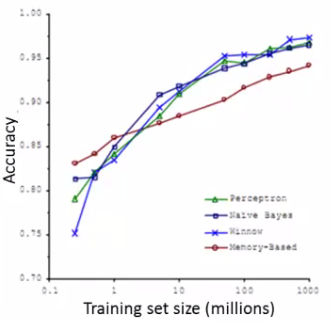
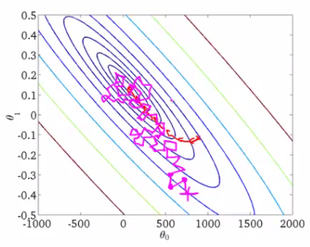

# 17: Large Scale Machine Learning

[Previous](16_Recommender_Systems.md) [Next](18_Application_Example_OCR.md) [Index](README.md)

## Learning with large datasets

- This set of notes look at large scale machine learning - how do we deal with big datasets?
- If you look back at 5-10 year history of machine learning, ML is much better now because we have much more data
  - However, with this increase in data comes great responsibility? No, comes a much more significant computational cost
  - New and exciting problems are emerging that need to be dealt with on both the algorithmic and architectural level

**Why large datasets?**

- One of best ways to get high performance is take a low bias algorithm and train it on a lot of data
  - e.g. Classification between confusable words
  - We saw that so long as you feed an algorithm lots of data they all perform pretty similarly  
    
  - So it's good to learn with large datasets
- But learning with large datasets comes with its own computational problems

**Learning with large datasets**

- For example, say we have a data set where m = 100, 000, 000
  - This is pretty realistic for many datasets
    - Census data
    - Website traffic data
  - How do we train a logistic regression model on such a big system?  
    
    - So you have to sum over 100,000,000 terms per step of gradient descent
- Because of the computational cost of this massive summation, we'll look at more efficient ways around this
  - \- Either using a different approach
  - \- Optimizing to avoid the summation
- First thing to do is ask if we can train on 1000 examples instead of 100 000 000
  - Randomly pick a small selection
  - Can you develop a system which performs as well?
    - Sometimes yes - if this is the case you can avoid a lot of the headaches associated with big data
- To see if taking a smaller sample works, you can sanity check by plotting error vs. training set size
  - If our plot looked like this  
    
  - Looks like a **high variance problem**
    - More examples should improve performance
  - If plot looked like this  
    
  - This looks like a **high bias problem**
    - More examples may not actually help - save a lot of time and effort if we know this _before hand_
    - One natural thing to do here might be to;
      - Add extra features
      - Add extra hidden units (if using neural networks)

## Stochastic Gradient Descent

- For many learning algorithms, we derived them by coming up with an optimization objective (cost function) and using an algorithm to minimize that cost function
  - When you have a large dataset, gradient descent becomes very expensive
  - So here we'll define a different way to optimize for large data sets which will allow us to scale the algorithms
- Suppose you're training a linear regression model with gradient descent
  - **Hypothesis**  
    
  - **Cost function**  
    
  - If we plot our two parameters vs. the cost function we get something like this  
    
  - Looks like this bowl shape surface plot
- **Quick reminder - how does gradient descent work?**  
  
  - In the inner loop we repeatedly update the parameters θ
- We will use linear regression for our algorithmic example here when talking about **stochastic gradient descent**, although the ideas apply to other algorithms too, such as
  - Logistic regression
  - Neural networks
- Below we have a contour plot for gradient descent showing iteration to a global minimum  
  
- As mentioned, if *m* is large gradient descent can be very expensive
- Although so far we just referred to it as gradient descent, this kind of gradient descent is called **batch gradient descent**
  - This just means we look at all the examples at the same time
- Batch gradient descent is not great for huge datasets
  - If you have 300,000,000 records you need to read in all the records into memory from disk because you can't store them all in memory
    - By reading all the records, you can move one step (iteration) through the algorithm
  - Then repeat for EVERY step
    - This means it takes a LONG time to converge
    - Especially because disk I/O is typically a system bottleneck anyway, and this will inevitably require a *huge* number of reads
- What we're going to do here is come up with a different algorithm which only needs to look at single example at a time

**Stochastic gradient descent**

- Define our cost function slightly differently, as  
  
  - So the function represents the cost of θ with respect to a specific example (xi,yi)
    - And we calculate this value as one half times the squared error on that example
  - Measures how well the hypothesis works on a single example
- The overall cost function can now be re-written in the following form;  
  
  - This is equivalent to the batch gradient descent cost function
- With this slightly modified (but equivalent) view of linear regression we can write out how stochastic gradient descent works

- **<u>1) - Randomly shuffle</u>**
  
- **<u>2) - Algorithm body</u>**  
  

- _So what's going on here?_
  - The term  
    
  - Is the same as that found in the summation for batch gradient descent
  - It's possible to show that this term is equal to the partial derivative with respect to the parameter θj of the cost (θ, (xi,yi))  
    
- What stochastic gradient descent algorithm is doing is scanning through each example
  - The inner for loop does something like this...
    - Looking at example 1, take a step with respect to the cost of just the 1st training example
      - Having done this, we go on to the second training example
    - Now take a second step in parameter space to try and fit the second training example better
      - Now move onto the third training example
    - And so on...
    - Until it gets to the end of the data
  - We may now repeat this who procedure and take multiple passes over the data
- The **randomly shuffling** at the start means we ensure the data is in a random order so we don't bias the movement
  - Randomization should speed up convergence a little bit
- Although stochastic gradient descent is a lot like batch gradient descent, rather than waiting to sum up the gradient terms over all _m_ examples, we take just one example and make progress in improving the parameters already
  - Means we update the parameters on EVERY step through data, instead of at the end of each loop through all the data
- What does the algorithm do to the parameters?
  - As we saw, batch gradient descent does something like this to get to a global minimum  
    
  - With stochastic gradient descent every iteration is much faster, but every iteration is flitting a single example  
    
    - What you find is that you "generally" move in the direction of the global minimum, but not always
    - You never actually converges like batch gradient descent does, but ends up wandering around some region close to the global minimum
      - In practice, this isn't a problem - as long as you're close to the minimum that's probably OK
- One final implementation note
  - May need to loop over the entire dataset 1-10 times
  - If you have a truly massive dataset it's possible that by the time you've taken a first pass through the dataset you may already have a perfectly good hypothesis
    - In which case the inner loop might only need to happen once if *m* is very very large
- If we contrast this to batch gradient descent
  - We have to make k passes through the entire dataset, where k is the number of steps needed to move through the data<

## Mini Batch Gradient Descent

- **Mini-batch gradient descent** is an additional approach which can work even faster than stochastic gradient descent
- To summarize our approaches so far
  - Batch gradient descent: Use all *m* examples in each iteration
  - Stochastic gradient descent: Use 1 example in each iteration
  - Mini-batch gradient descent: Use *b* examples in each iteration
    - *b* = mini-batch size
- So just like batch gradient descent, except we use tiny batches
  - Typical range for *b* = 2-100 (10 maybe)
- For example
  - *b* = 10
  - Get 10 examples from training set
  - Perform gradient descent update using the ten examples

**Mini-batch algorithm**

- We for-loop through _b-\_size batches of \_m_
- Compared to batch gradient descent this allows us to get through data in a much more efficient way<
  - After just *b* examples we begin to improve our parameters
  - Don't have to update parameters after *every* example, and don't have to wait until you cycled through all the data

**Mini-batch gradient descent vs. stochastic gradient descent**

- Why should we use mini-batch?
  - Allows you to have a vectorized implementation
  - Means implementation is much more efficient
  - Can partially parallelize your computation (i.e. do 10 at once)
- A disadvantage of mini-batch gradient descent is the optimization of the parameter _b_
  - But this is often worth it!
- To be honest, stochastic gradient descent and batch gradient descent are just specific forms of batch-gradient descent

- For mini-batch gradient descent, b is somewhere in between 1 and m and you can try to optimize for it!

## Stochastic gradient descent convergence

- We now know about stochastic gradient descent
  - But how do you know when it's done!?
  - How do you tune learning rate alpha (α)?

**Checking for convergence**

- With batch gradient descent, we could plot cost function vs number of iterations
  - Should decrease on every iteration
  - This works when the training set size was small because we could sum over all examples
    - Doesn't work when you have a massive dataset
  - With stochastic gradient descent
    - We don't want to have to pause the algorithm periodically to do a summation over all data
    - Moreover, the whole point of stochastic gradient descent is to *avoid* those whole-data summations
- For stochastic gradient descent, we have to do something different
  - Take cost function definition  
    
    - One half the squared error on a single example
  - While the algorithm is looking at the example (xi,yi) but *before* it has updated θ we can compute the cost of the example (cost(θ,(xi,yi)
    - i.e. we compute how well the hypothesis is working on the training example
      - Need to do this before we update θ because if we did it after θ was updated the algorithm would be performing a bit better (because we'd have just used (xi,yi) to improve θ)
  - To check for the convergence, every 1000 iterations we can plot the costs averaged over the last 1000 examples
    - Gives a running estimate of how well we've done on the last 1000 estimates
    - By looking at the plots we should be able to check convergence is happening
- What do these plots look like

  - In general
    - Might be a bit noisy (1000 examples isn't that much)
  - If you get a figure like this  
    
    - That's a pretty decent run
    - Algorithm may have convergence
  - If you use a smaller learning rate you may get an even better final solution  
    
    - This is because the parameter oscillate around the global minimum
    - A smaller learning rate means smaller oscillations
  - If you average over 1000 examples and 5000 examples you may get a smoother curve  
    
    - This disadvantage of a larger average means you get less frequent feedback
  - Sometimes you may get a plot that looks like this  
    
    - Looks like cost is not decreasing at all
    - But if you then increase to averaging over a larger number of examples you do see this general trend
      - Means the blue line was too noisy, and that noise is ironed out by taking a greater number of entires per average
    - Of course, it may not decrease, even with a large number
  - If you see a curve the looks like its increasing then the algorithm may be displaying divergence  
    

  * Should use a smaller learning rate

**Learning rate**

- We saw that with stochastic gradient descent we get this wandering around the minimum
  - In most implementations the learning rate is held constant
- However, if you want to converge to a minimum you can slowly decrease the learning rate over time
  - A classic way of doing this is to calculate α as follows  
    α = const1/(iterationNumber + const2)
  - Which means you're guaranteed to converge somewhere
    - You also need to determine const1 and const2
  - BUT if you tune the parameters well, you can get something like this  
    

## Online learning

- New setting
  - Allows us to model problems where you have a continuous stream of data you want an algorithm to learn from
  - Similar idea of stochastic gradient descent, in that you do slow updates
  - Web companies use various types of online learning algorithms to learn from traffic
    - Can (for example) learn about user preferences and hence optimize your website
- Example - Shipping service
  - Users come and tell you origin and destination
  - You offer to ship the package for some amount of money ($10 - $50)
  - Based on the price you offer, sometimes the user uses your service (y = 1), sometimes they don't (y = 0)
  - Build an algorithm to optimize what price we offer to the users
    - Capture
      - Information about user
      - Origin and destination
    - Work out
      - What the probability of a user selecting the service is
    - We want to optimize the price
  - To model this probability we have something like
    - p(y = 1|x; θ)
      - Probability that y =1, given x, parameterized by θ
    - Build this model with something like
      - Logistic regression
      - Neural network
  - If you have a website that runs continuously an online learning algorithm would do something like this
    - User comes - is represented as an (x,y) pair where
      - x - feature vector including price we offer, origin, destination
      - y - if they chose to use our service or not
    - The algorithm updates θ using just the (x,y) pair  
      
    - So we basically update all the θ parameters every time we get some new data
  - While in previous examples we might have described the data example as (xi,yi), for an online learning problem we discard this idea of a data "set" - instead we have a continuous stream of data so indexyxing is largely irrelevant as you're not storing the data (although presumably you could store it) /font>
- If you have a major website where you have a massive stream of data then this kind of algorithm is pretty reasonable
  - You're free of the need to deal with all your training data
- If you had a small number of users you could save their data and then run a normal algorithm on a dataset
- An online algorithm can adapt to changing user preferences

- So over time users may become more price sensitive
- The algorithm adapts and learns to this
- So your system is dynamic

**Another example - product search**

- Run an online store that sells cellphones
  - You have a UI where the user can type in a query like, "Android phone 1080p camera"
  - We want to offer the user 10 phones per query
- How do we do this
  - For each phone and given a specific user query, we create a feature vector (x) which has data like features of the phone, how many words in the user query match the name of the phone, how many words in user query match description of phone
    - Basically how well does the phone match the user query
  - We want to estimate the probability of a user selecting a phone
  - So define
    - y = 1 if a user clicks on a link
    - y = 0 otherwise
  - So we want to learn
    - p(y = 1|x ; θ) <- this is the problem of learning the predicted **click through rate** (CTR)
  - If you can estimate the CTR for any phone we can use this to show the highest probability phones first
  - If we display 10 phones per search, it means for each search we generate 10 training examples of data
    - i.e. user can click through one or more, or none of them, which defines how well the prediction performed
- Other things you can do
  - Special offers to show the user
  - Show news articles - learn what users like
  - Product recommendation
- These problems could have been formulated using standard techniques, but they are the kinds of problems where you have so much data that this is a better way to do things

## Map reduce and data parallelism

- Previously spoke about stochastic gradient descent and other algorithms

- These could be run on one machine
- Some problems are just too big for one computer
- Talk here about a different approach called Map Reduce

- Map reduce example
  - We want to do batch gradient descent  
    
    - Assume m = 400
      - Normally m would be more like 400 000 000
      - If m is large this is really expensive
  - Split training sets into different subsets
    - So split training set into 4 pieces
  - **Machine 1:** use (x1, y1), ..., (x100, y100)
    - Uses first quarter of training set
    - Just does the summation for the first 100  
      
      
  - So now we have these four temp values, and each machine does 1/4 of the work
  - Once we've got our temp variables
    - Send to to a centralized master server
    - Put them back together
    - Update θ using  
      
      - This equation is doing the same as our original batch gradient descent algorithm
- More generally map reduce uses the following scheme (e.g. where you split into 4)  
  
- The bulk of the work in gradient descent is the summation
  - Now, because each of the computers does a quarter of the work at the same time, you get a 4x speedup
  - Of course, in practice, because of network latency, combining results, it's slightly less than 4x, but still good!
- Important thing to ask is
  - "Can algorithm be expressed as computing sums of functions of the training set?"
    - Many algorithms can!
- Another example
  - Using an advanced optimization algorithm with logistic regression
  - 
    - Need to calculate cost function - see we sum over training set
    - So split training set into x machines, have x machines compute the sum of the value over 1/xth of the data
  - 
    - These terms are also a sum over the training set
    - So use same approach
- So with these results send temps to central server to deal with combining everything
- More broadly, by taking algorithms which compute sums you can scale them to very large datasets through parallelization
  - Parallelization can come from
    - Multiple machines
    - Multiple CPUs
    - Multiple cores in each CPU
  - So even on a single compute can implement parallelization
- The advantage of thinking about Map Reduce here is because you don't need to worry about network issues
  - It's all internal to the same machine
- Finally caveat/thought
  - Depending on implementation detail, certain numerical linear algebra libraries can automatically parallelize your calculations across multiple cores
  - So, if this is the case and you have a good vectorization implementation you can not worry about local parallelization and the local libraries sort optimization out for you

**Hadoop**

- Hadoop is a good open source Map Reduce implementation
- Represents a top-level Apache project develop by a global community of developers
  - Large developer community all over the world
- Written in Java
- Yahoo has been the biggest contributor
  - Pushed a lot early on
- Support now from Cloudera

## Interview with Cloudera CEO Mike Olson (2010)

- Seeing a change in big data industry (Twitter, Facebook etc) - relational databases can't scale to the volumes of data being generated
  - _**Q: Where the tech came from?**_
    - Early 2000s - Google had too much data to process (and index)
      - Designed and built Map Reduce
        - Buy and mount a load of rack servers
        - Spread the data out among these servers (with some duplication)
        - Now you've stored the data and you have this processing infrastructure spread among the data
          - Use local CPU to look at local data
          - Massive data parallelism
        - Published as a paper in 2004
          - At the time wasn't obvious why it was necessary - didn't support queries, transactions, SQL etc
      - When data was at "human" scale relational databases centralized around a single server was fine
      - But now we're scaling by Moore's law in two ways
        - More data
        - Cheaper to store
- **Q: How do people approach the issues in big data?**

- People still use relational databases - great if you have predictable queries over structured data
  - Data warehousing still used - long term market
- But the data people want to work with is becoming more complex and bigger
  - Free text, unstructured data doesn't fit will into tables
  - Do sentiment analysis in SQL isn't really that good
  - So to do new kinds of processing need a new type of architecture
- Hadoop lets you do *data* processing - not transactional processing - on the big scale
- Increasingly things like NoSQL is being used
- Data centers are starting to chose technology which is aimed at a specific problem, rather than trying to shoehorn problems into an ER issue
- Open source technologies are taking over for developer facing infrastructures and platforms

- **Q: What is Hadoop?**
  - Open source implementation of Map reduce (Apache software)
  - Yahoo invested a lot early on - developed a lot the early progress
  - Is two things
    - **HDFS**
      - Disk on ever server
      - Software infrastructure to spread data
    - **Map reduce**
      - Lets you push code down to the data in parallel
  - As size increases you can just add more servers to scale up
- **Q: What is memcached?**
  - Ubiquitous invisible infrastructure that makes the web run
  - You go to a website, see data being delivered out of a MySQL database
    - BUT, when infrastructure needs to scale querying a disk EVERY time is too much
  - Memcache is a memory layer between disk and web server
    - Cache reads
    - Push writes through incrementally
    - Is the glue that connects a website with a disk-backend
  - Northscale is commercializing this technology
  - New data delivery infrastructure which has pretty wide adoption
- **Q: What is Django?**
  - Open source tool/language
  - Written in Python, uses MVC design and is basically a framework for hosting webpages - think Rails in Python (where Rails is in Ruby)
- **Q: What are some of the tool sets being used in data management? What is MySQL drizzle?**
  - Drizzle is a re-implementation of MySQL
    - Team developing Drizzle feels they learned a lot of lessons when building MySQL
    - More modern architecture better targeted at web applications
  - NoSQL
    - Distributed hash tables
    - Idea is instead of a SQL query and fetching a record, go look up something from a store by name
      - Go pull a record by name from a store
    - So now systems being developed to support that, such as
      - MongoDB
      - CouchDB
  - Hadoop companion projects
    - Hive
      - Lets you use SQL to talk to a Hadoop cluster
    - HBase
      - Sits on top of HDFS
      - Gives you key-value storage on top of HDFS - provides abstraction from distributed system
  - Good time to be working in big data
    - Easy to set up small cluster through cloud system
    - Get a virtual cluster through Rackspace or Cloudera
