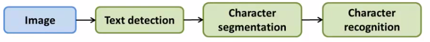

# 18: Application Example OCR

[Previous](17_Large_Scale_Machine_Learning.md) [Next](19_Course_Summary.md) [Index](README.md)

## Problem description and pipeline

- Case study focused around photo OCR
- Three reasons to do this
  - 1. Look at how a **complex system** can be put together
  - 2. The idea of a machine learning **pipeline**
    - What to do next
    - How to do it
  - 3. Some more interesting ideas
    - Applying machine learning to tangible problems
    - **Artificial data synthesis**

**What is the photo OCR problem?**

- Photo OCR = photo optical character recognition

  - With growth of digital photography, lots of digital pictures
  - One idea which has interested many people is getting computers to understand those photos
  - The photo OCR problem is getting computers to read text in an image

    - Possible applications for this would include

      - Make searching easier (e.g. searching for photos based on words in them)

      - Car navigation

- OCR of documents is a comparatively easy problem
  - From photos it's really hard

**OCR pipeline**

- 1. Look through image and find text
- 2. Do character segmentation
- 3. Do character classification
- 4. *Optional* some may do spell check after this too
  - We're not focussing on such systems though

- **Pipelines** are common in machine learning
  - Separate modules which may each be a machine learning component or data processing component
- If you're designing a machine learning system, pipeline design is one of the most important questions
  - Performance of pipeline and each module often has a big impact on the overall performance a problem
  - You would often have different engineers working on each module
    - Offers a natural way to divide up the workload

## Sliding window image analysis

- How do the individual models work?
- Here focus on a sliding windows classifier
- As mentioned, stage 1 is **text detection**

- Unusual problem in computer vision - different rectangles (which surround text) may have different aspect ratios (aspect ratio being height : width)
  - Text may be short (few words) or long (many words)
  - Tall or short font
  - Text might be straight on
  - Slanted  
    
- Let's start with a simpler example

**Pedestrian detection**

- Want to take an image and find pedestrians in the image  
  
- This is a slightly simpler problem because the aspect ration remains pretty constant

- Building our detection system
  - Have 82 x 36 aspect ratio
    - This is a typical aspect ratio for a standing human
  - Collect training set of positive and negative examples  
    
  - Could have 1000 - 10 000 training examples
  - Train a neural network to take an image and classify that image as pedestrian or not
    - Gives you a way to train your system
- Now we have a new image - how do we find pedestrians in it?
  - Start by taking a rectangular 82 x 36 patch in the image  
    
    - Run patch through classifier - hopefully in this example it will return y = 0
  - Next slide the rectangle over to the right a little bit and re-run
    - Then slide again
    - The amount you slide each rectangle over is a parameter called the step-size or stride
      - Could use 1 pixel
        - Best, but computationally expensive
      - More commonly 5-8 pixels used
    - So, keep stepping rectangle along all the way to the right
      - Eventually get to the end
    - Then move back to the left hand side but step down a bit too
    - Repeat until you've covered the whole image
  - Now, we initially started with quite a small rectangle
    - So now we can take a larger image patch (of the same aspect ratio)
    - Each time we process the image patch, we're resizing the larger patch to a smaller image, then running that smaller image through the classifier
  - Hopefully, by changing the patch size and rastering repeatedly across the image, you eventually recognize all the pedestrians in the picture  
    

**Text detection example**

- Like pedestrian detection, we generate a labeled training set with
  - Positive examples (some kind of text)
  - Negative examples (not text)  
    
- Having trained the classifier we apply it to an image

- So, run a sliding window classifier at a fixed rectangle size
- If you do that end up with something like this  
  
- White region show where text detection system thinks text is
  - Different shades of gray correspond to probability associated with how sure the classifier is the section contains text
    - Black - no text
    - White - text
  - For text detection, we want to draw rectangles around all the regions where there is text in the image
- Take classifier output and apply an **expansion algorithm**

- Takes each of white regions and expands it
- How do we implement this

- Say, for every pixel, is it within some distance of a white pixel?
- If yes then colour it white  
  

- Look at connected white regions in the image above
  - Draw rectangles around those which make sense as text (i.e. tall thin boxes don't make sense)  
    
- This example misses a piece of text on the door because the aspect ratio is wrong

- Very hard to read

**Stage two is character segmentation**

- Use supervised learning algorithm
- Look in a defined image patch and decide, is there a split between two characters?
  - So, for example, our first training data item below looks like there is such a split
  - Similarly, the negative examples are either empty or hold a full characters  
    
- We train a classifier to try and classify between positive and negative examples
  - Run that classifier on the regions detected as containing text in the previous section
- Use a 1-dimensional sliding window to move along text regions
  - Does each window snapshot look like the split between two characters?
    - If yes insert a split
    - If not move on
  - So we have something that looks like this  
    

**Character classification**

- Standard OCR, where you apply standard supervised learning which takes an input and identify which character we decide it is

- Multi-class characterization problem

## Getting lots of data: Artificial data synthesis

- We've seen over and over that one of the most reliable ways to get a high performance machine learning system is to take a low bias algorithm and train on a massive data set
  - Where do we get so much data from?
  - In ML we can do artificial data synthesis
    - This doesn't apply to every problem
    - If it applies to your problem, it can be a great way to generate loads of data
- Two main principles

- 1. Creating data from scratch
- 2. If we already have a small labeled training set can we amplify it into a larger training set

**Character recognition as an example of data synthesis**

- If we go and collect a large labeled data set will look like this
  - The goal is to take an image patch and have the system recognize the character
  - Let's treat the images as gray-scale (makes it a bit easer)  
    
- How can we amplify this
  - Modern computers often have a big font library
  - If you go to websites, huge free font libraries
  - For more training data, take characters from different fonts, paste these characters again random backgrounds
- After some work, can build a synthetic training set   
  
  - Random background
  - Maybe some blurring/distortion filters
  - Takes thought and work to make it look realistic
    - If you do a sloppy job this won't help!
    - So unlimited supply of training examples
  - This is an example of creating new data from scratch
- Other way is to introduce distortion into existing data
  - e.g. take a character and warp it  
    
    - 16 new examples
    - Allows you amplify existing training set
  - This, again, takes though and insight in terms of deciding how to amplify

**Another example: speech recognition**

- Learn from audio clip - what were the words
  - Have a labeled training example
  - Introduce audio distortions into the examples
- So only took one example
  - Created lots of new ones!
- When introducing distortion, they should be reasonable relative to the issues your classifier may encounter

**Getting more data**

- Before creating new data, make sure you have a low bias classifier
  - Plot learning curve
- If not a low bias classifier increase number of features
  - Then create large artificial training set
- Very important question: How much work would it be to get 10x data as we currently have?
  - Often the answer is, "Not that hard"
  - This is often a huge way to improve an algorithm
  - Good question to ask yourself or ask the team
- How many minutes/hours does it take to get a certain number of examples
  - Say we have 1000 examples
  - 10 seconds to label an example
  - So we need another 9000 - 90000 seconds
  - Comes to a few days (25 hours!)
- Crowd sourcing is also a good way to get data

- Risk or reliability issues
- Cost
- Example

- E.g. Amazon mechanical turks

## Ceiling analysis: What part of the pipeline to work on next

- Through the course repeatedly said one of the most valuable resources is developer time

- Pick the right thing for you and your team to work on
- Avoid spending a lot of time to realize the work was pointless in terms of enhancing performance

**Photo OCR pipeline**

- Three modules
  - Each one could have a small team on it
  - Where should you allocate resources?
- Good to have a single real number as an evaluation metric
  - So, character accuracy for this example
  - Find that our test set has 72% accuracy

**Ceiling analysis on our pipeline**

- We go to the first module

- Mess around with the test set - manually tell the algorithm where the text is
- Simulate if your text detection system was 100% accurate
  - So we're feeding the character segmentation module with 100% accurate data now
- How does this change the accuracy of the overall system  
  
- Accuracy goes up to 89%

- Next do the same for the character segmentation
  - Accuracy goes up to 90% now
- Finally doe the same for character recognition
  - Goes up to 100%
- Having done this we can qualitatively show what the upside to improving each module would be
  - Perfect text detection improves accuracy by 17%!
    - Would bring the biggest gain if we could improve
  - Perfect character segmentation would improve it by 1%
    - Not worth working on
  - Perfect character recognition would improve it by 10%
    - Might be worth working on, depends if it looks easy or not
- The "ceiling" is that each module has a ceiling by which making it perfect would improve the system overall

**Other example - face recognition**

- NB this is not how it's done in practice  
  
  - Probably more complicated than is used in practice
- How would you do ceiling analysis for this
  - Overall system is 85%
  - \+ Perfect background -> 85.1%
    - Not a crucial step
  - \+ Perfect face detection -> 91%
    - Most important module to focus on
  - \+ Perfect eyes ->95%
  - \+ Perfect nose -> 96%
  - \+ Perfect mouth -> 97%
  - \+ Perfect logistic regression -> 100%
- Cautionary tale
  - Two engineers spent 18 months improving background pre-processing
    - Turns out had no impact on overall performance
    - Could have saved three years of man power if they'd done ceiling analysis
